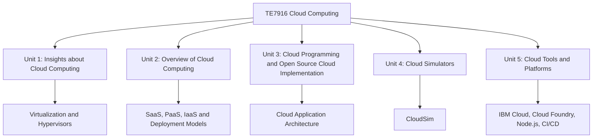

# TE7916 Cloud Computing Tools and Techniques - Obsidian Notes

These notes follow the syllabus hierarchy and use the uploaded reference PDFs as the main source base. The order is optimized for exam revision: fundamentals first, architecture and delivery models next, programming and application design, simulators, then platforms and DevOps tools.

## Unit Map



## Reading Order

1. [[Unit-01 - Insights about Cloud Computing]]
2. [[Unit-02 - Overview of Cloud Computing]]
3. [[Unit-03 - Cloud Programming and Open Source Cloud Implementation]]
4. [[Unit-04 - Cloud Simulators]]
5. [[Unit-05 - Cloud Tools and Platforms]]

## Exam Strategy

Use this structure while revising:

```text
Definition -> Need/Reason -> Working/Architecture -> Example -> Advantages -> Limitations -> Diagram -> 3/5 mark answer
```

For 3-mark answers, write a compact definition plus 3 to 4 important points. For 5-mark answers, include a diagram and explain working, advantages, limitations, and example.

Next: [[Unit-01 - Insights about Cloud Computing]]
