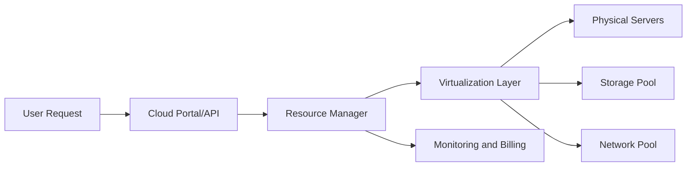
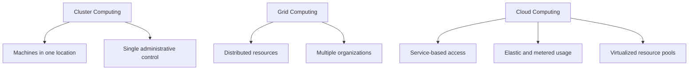
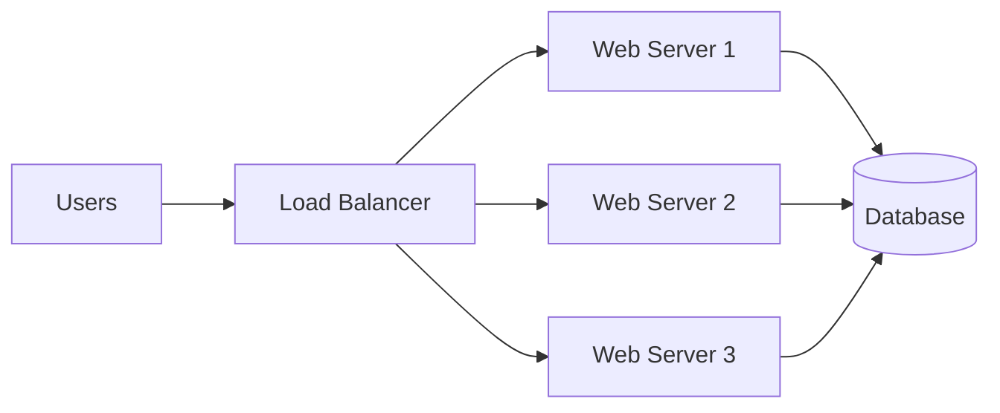
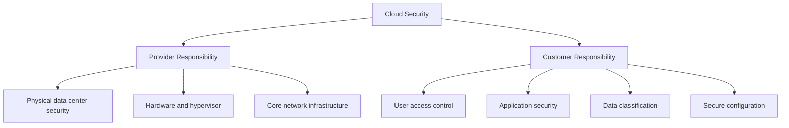
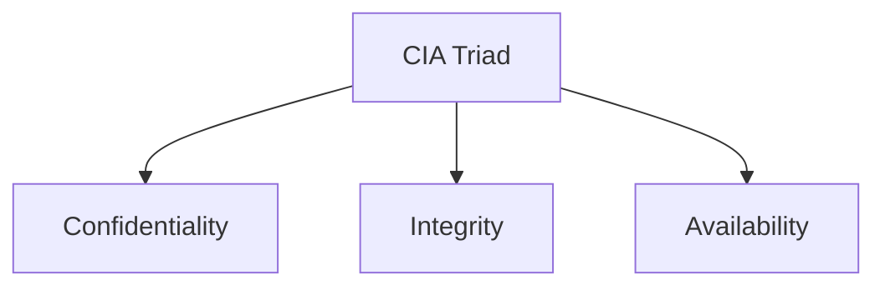
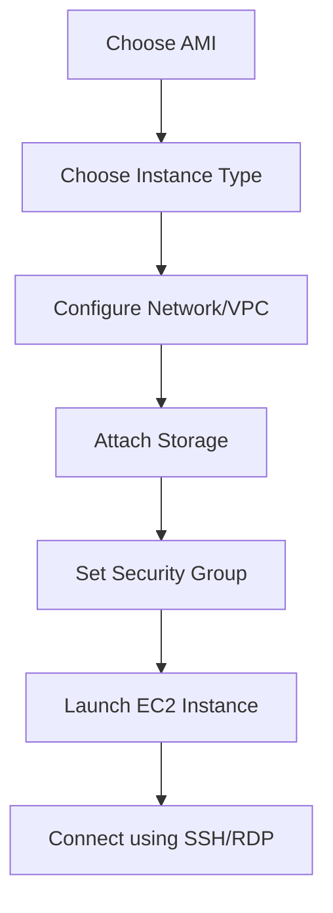
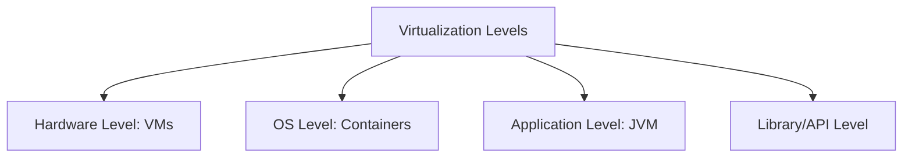
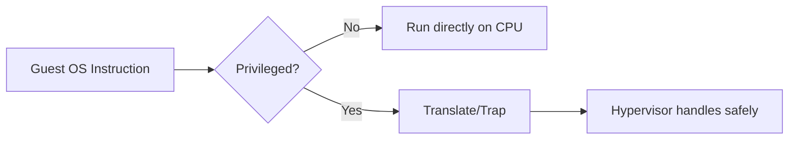
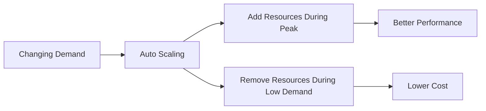

# Unit 1 - Insights about Cloud Computing

## Topics Covered

```text
Unit-1
│── Architectural Principles
│   │── High Performance Computing
│   │── Utility Computing
│   │── Enterprise Grid Computing
│   │── Benefits of Cloud Environments
│   │── Limitations and Security Issues
│   │── Government and Regulatory Issues
│   │── Amazon Web Services and Amazon EC2
│
│── Virtualization
    │── Implementation Levels of Virtualization
    │── Hypervisor and Xen Architecture
    │── Binary Translation with Full Virtualization
    │── Para-virtualization with Compiler/OS Support
```

---

## 1. Architectural Principles of Cloud Computing

Cloud computing is a model where computing resources such as servers, storage, databases, networks, platforms, and software are delivered as services over a network, usually the Internet. Instead of buying and maintaining physical hardware, an organization rents resources from a cloud provider and pays according to usage.

The core architectural idea is abstraction. The user does not need to know the exact physical server, storage disk, or network device being used. The cloud provider hides physical complexity using virtualization, automation, monitoring, resource pooling, and self-service provisioning.

### Why Cloud Architecture Was Needed

Traditional IT requires organizations to purchase hardware before demand is fully known. This creates two problems:

1. **Overprovisioning**: buying more servers than needed, causing low utilization and wasted money.
2. **Underprovisioning**: buying too few servers, causing poor performance when demand increases.

Cloud computing solves this by allowing resources to be provisioned dynamically. A company can start small, increase capacity during peak demand, and release resources when demand falls.



### Architectural Building Blocks

| Building Block | Meaning | Example |
|---|---|---|
| Compute | Processing power delivered through virtual machines or containers | EC2 instance, VM, Kubernetes pod |
| Storage | Data storage service | Object storage, block storage, file storage |
| Network | Connectivity between services and users | VPC, load balancer, DNS |
| Virtualization | Creates logical resources over physical resources | Hypervisor, VM |
| Automation | Automatically provisions, scales, monitors, and heals resources | Auto scaling, orchestration |
| Metering | Measures usage for billing and control | CPU hours, GB-month, network transfer |
| Security | Protects data, identity, access, and network traffic | IAM, encryption, firewall |

---

## 2. High Performance Computing, Utility Computing and Enterprise Grid Computing

### 2.1 High Performance Computing

High Performance Computing, or HPC, uses powerful computers or clusters to solve computation-heavy problems. These problems may involve scientific simulations, weather forecasting, protein modeling, financial risk analysis, or big data analytics.

In HPC, the goal is maximum computational performance. Many processors work together to solve one large problem faster than a single machine.

```text
+--------------------+      +--------------------+      +--------------------+
| Compute Node 1     |      | Compute Node 2     |      | Compute Node 3     |
| CPU/GPU + Memory   |      | CPU/GPU + Memory   |      | CPU/GPU + Memory   |
+---------+----------+      +---------+----------+      +---------+----------+
          \                         |                         /
           \                        |                        /
            +-----------------------+------------------------+
                                    |
                         +----------v----------+
                         | Job Scheduler       |
                         | MPI / Batch System  |
                         +---------------------+
```

#### Cloud and HPC

Cloud computing can provide HPC resources on demand. This is useful when an organization occasionally needs thousands of CPU cores but cannot afford to buy and maintain them permanently.

Example: A research team runs a simulation on 500 cloud VMs for 4 hours. After the computation finishes, the VMs are shut down, so the team only pays for the used time.

### 2.2 Utility Computing

Utility computing means computing resources are consumed like utilities such as electricity or water. The user pays based on measured usage.

Core idea:

$$
\text{Total Cost} = \text{Usage Quantity} \times \text{Rate per Unit}
$$

Example:

$$
\text{Cost} = 50\ \text{VM-hours} \times ₹8/\text{VM-hour} = ₹400
$$

Utility computing is important because it changes IT expenditure from **CapEx** to **OpEx**.

| Term | Meaning | Cloud Example |
|---|---|---|
| CapEx | Capital expenditure, paid before use | Buying servers |
| OpEx | Operational expenditure, paid while using | Renting EC2 instances |

### 2.3 Enterprise Grid Computing

Grid computing connects distributed computing resources from different locations or administrative domains to solve large tasks. It became popular in scientific research where multiple institutions share computing power.

Cloud and grid are related but not identical.

| Feature | Grid Computing | Cloud Computing |
|---|---|---|
| Main goal | Share distributed resources for large jobs | Deliver IT resources as services |
| Control | Often decentralized | Usually provider-controlled data centers |
| Access | Middleware and job submission | Web/API/self-service portal |
| Application style | Batch/scientific jobs | Web apps, databases, analytics, enterprise apps |
| Pricing | Often project/public funded | Pay-as-you-use or subscription |
| Virtualization | Optional | Core enabling technology |

### Tangent Topic: Cluster vs Grid vs Cloud



---

## 3. Benefits of Cloud Environments

### 3.1 Scalability

Scalability is the ability of a system to handle increased workload. In cloud computing, scaling can be done in two ways:

| Type | Meaning | Example |
|---|---|---|
| Vertical scaling | Increase capacity of one machine | Upgrade from 2 vCPU to 8 vCPU |
| Horizontal scaling | Add more machines | Add more web server instances |

Horizontal scaling is preferred in cloud applications because multiple smaller instances can be added or removed automatically.



### 3.2 Affordability

Cloud reduces the need for large upfront investment. Small businesses and students can use powerful infrastructure without purchasing physical servers.

Affordability comes from:

- shared infrastructure,
- pay-as-you-use billing,
- large provider economies of scale,
- reduced maintenance cost,
- reduced need for local IT staff.

### 3.3 Elasticity

Elasticity means resources can be automatically increased or decreased according to workload. It is not only about scaling up; it also includes scaling down to avoid waste.

```text
Demand Low  -> 2 instances running
Demand High -> 10 instances running
Demand Low  -> 2 instances running again
```

### 3.4 Availability and Reliability

Cloud providers use multiple data centers, redundancy, backups, load balancing, and monitoring to improve availability.

Availability is commonly expressed as:

$$
\text{Availability} = \frac{\text{Uptime}}{\text{Uptime} + \text{Downtime}} \times 100
$$

Example: If a service is up for 99 hours and down for 1 hour:

$$
\text{Availability} = \frac{99}{100} \times 100 = 99\%
$$

### 3.5 Security Benefits

Cloud platforms provide security tools like identity management, encryption, firewalls, logging, monitoring, backups, and compliance services. However, security is shared between provider and customer.



---

## 4. Limitations and Challenges of Cloud Computing

Cloud computing is powerful, but it is not perfect. Its limitations are important for exam answers because they show critical understanding.

### 4.1 Sensitive Data

Sensitive data includes financial records, health records, passwords, source code, government data, and customer identity information. Moving such data to cloud creates concerns about confidentiality, ownership, access, and location.

Mitigation techniques:

- encrypt data at rest and in transit,
- use strong access control,
- avoid hardcoding credentials,
- use key management systems,
- maintain audit logs,
- classify data before migration.

### 4.2 Application Development Challenges

Cloud applications should be designed for distributed environments. A traditional monolithic application may not automatically become scalable just because it is hosted on cloud.

Important design concerns:

- stateless service design,
- fault tolerance,
- horizontal scaling,
- distributed database consistency,
- API-based integration,
- monitoring and logging,
- cost-aware architecture.

### 4.3 Third-Party Security Level

In cloud computing, the organization depends on third-party providers. The cloud provider controls the underlying infrastructure, so users must evaluate trust, certifications, service-level agreements, access policies, and incident response procedures.

### 4.4 Regulatory and Government Policy Issues

Data may be stored in different geographical locations. This creates legal issues because different countries have different privacy, surveillance, and data protection laws.

Examples of regulatory concerns:

- where data is stored,
- who can access it,
- how long logs are retained,
- auditability,
- breach notification,
- data deletion policies,
- compliance with sector-specific laws.

### 4.5 Vendor Lock-in

Vendor lock-in happens when an application depends strongly on one cloud provider's proprietary APIs, making migration difficult.

Example: If an application uses a provider-specific database, queue, authentication system, and deployment format, moving to another provider may require major rewriting.

Mitigation:

- use containers,
- use open standards where possible,
- keep data export plans,
- design APIs cleanly,
- avoid unnecessary proprietary dependencies.

### 4.6 Data Transfer Bottlenecks

Large data movement can be slow and expensive. For data-heavy applications, the time and cost of transferring data may become more important than compute cost.

Effective transfer time can be estimated using:

$$
\text{Transfer Time} = \frac{\text{Data Size in bits}}{\text{Bandwidth in bits/second}}
$$

---

## 5. Cloud Security

Cloud security protects systems, applications, data, and users in a cloud environment.

### 5.1 CIA Triad

| Security Goal | Meaning | Cloud Example |
|---|---|---|
| Confidentiality | Data is visible only to authorized users | Encryption, IAM |
| Integrity | Data is not modified without authorization | Hashing, versioning, audit logs |
| Availability | Services remain accessible when needed | Redundancy, load balancing, backup |



### 5.2 Common Cloud Threats

- insecure APIs,
- misconfigured storage buckets,
- weak passwords,
- excessive privileges,
- malicious insiders,
- denial-of-service attacks,
- data leakage,
- shared technology vulnerabilities.

### 5.3 Basic Controls

- Identity and Access Management: define who can do what.
- Encryption: protect data at rest and in transit.
- Network security: use firewalls, security groups, private networks.
- Monitoring: collect logs and detect abnormal behavior.
- Backup and recovery: recover from accidental deletion or failure.
- Patch management: keep OS and applications updated.

---

## 6. Hands-on Amazon Services, AWS and EC2

### 6.1 Amazon Web Services

AWS is a cloud service provider that offers compute, storage, database, networking, analytics, machine learning, security, and deployment services.

Common service categories:

| Category | AWS Example | Purpose |
|---|---|---|
| Compute | EC2, Lambda | Run applications |
| Storage | S3, EBS | Store files and block data |
| Database | RDS, DynamoDB | Store structured or NoSQL data |
| Network | VPC, Route 53 | Isolated networking and DNS |
| Security | IAM, KMS | Access control and encryption |
| Monitoring | CloudWatch | Logs and metrics |

### 6.2 Amazon EC2

Amazon EC2 stands for Elastic Compute Cloud. It provides virtual servers called instances. Users choose an instance type, operating system image, storage, network configuration, and security rules.



### EC2 Core Terms

| Term | Meaning |
|---|---|
| AMI | Amazon Machine Image; template containing OS and software |
| Instance | Virtual server created from an AMI |
| Instance Type | Hardware capacity profile like CPU, RAM, network |
| EBS | Persistent block storage for EC2 |
| Security Group | Virtual firewall controlling inbound and outbound traffic |
| Key Pair | Used for secure SSH access |
| Elastic IP | Static public IP address |

### EC2 Example

A student wants to host a Python Flask web app. Instead of buying a server, they launch an EC2 Linux instance, install Python and Flask, open port 80/443 in the security group, and deploy the app. If traffic increases, they can use multiple EC2 instances behind a load balancer.

---

## 7. Virtualization

Virtualization is the process of creating a virtual version of a computing resource such as a server, storage device, network, or operating system.

In server virtualization, one physical machine can run multiple virtual machines. Each virtual machine behaves like an independent computer with its own OS and applications.

```text
+------------------------------------------------+
| Applications in VM 1 | Applications in VM 2    |
+----------------------+-------------------------+
| Guest OS 1           | Guest OS 2              |
+----------------------+-------------------------+
|             Hypervisor                          |
+------------------------------------------------+
| Physical Hardware: CPU, RAM, Disk, Network      |
+------------------------------------------------+
```

### Why Virtualization is Needed

Virtualization is essential in cloud computing because it enables:

- resource pooling,
- isolation between tenants,
- fast provisioning of VMs,
- live migration,
- better hardware utilization,
- snapshots and cloning,
- flexible scaling.

### Tangent Topic: Virtualization vs Cloud Computing

Virtualization is a technology. Cloud computing is a service model built using virtualization, automation, metering, APIs, and service management.

| Virtualization | Cloud Computing |
|---|---|
| Creates virtual machines/resources | Delivers resources as services |
| Mainly technical abstraction | Technical + business + service model |
| May be manually managed | Usually self-service and automated |
| Does not always include billing | Includes metering and pay-as-use |

---

## 8. Implementation Levels of Virtualization

Virtualization can be implemented at different levels.

| Level | Explanation | Example |
|---|---|---|
| Instruction Set Architecture level | Emulates CPU instruction set | Running ARM software on x86 emulator |
| Hardware level | Hypervisor creates VMs over physical hardware | VMware ESXi, Xen, KVM |
| Operating System level | Multiple isolated user spaces share same kernel | Containers, Docker, LXC |
| Library level | Replaces system libraries/API calls | Wine for Windows apps on Linux |
| Application level | Runtime manages execution | JVM, .NET CLR |

### Hardware-Level Virtualization

This is most relevant to cloud IaaS. A hypervisor controls physical hardware and creates multiple VMs.

### OS-Level Virtualization

Containers are lighter than VMs because they share the host OS kernel. They start faster and consume fewer resources, but isolation is different from full VMs.



---

## 9. Hypervisor and Xen Architecture

A hypervisor, also called Virtual Machine Monitor, is software/firmware that creates and manages virtual machines.

### Type 1 Hypervisor

Runs directly on hardware. It is also called bare-metal hypervisor.

Examples: VMware ESXi, Microsoft Hyper-V, Xen, KVM in common deployment contexts.

```text
+-------------------------------+
| VM 1      | VM 2      | VM 3   |
+-----------+-----------+-------+
|        Type 1 Hypervisor       |
+-------------------------------+
| Physical Hardware              |
+-------------------------------+
```

### Type 2 Hypervisor

Runs on top of a host operating system.

Examples: VirtualBox, VMware Workstation.

```text
+-------------------------------+
| VM 1      | VM 2              |
+-----------+-------------------+
| Type 2 Hypervisor             |
+-------------------------------+
| Host Operating System         |
+-------------------------------+
| Physical Hardware             |
+-------------------------------+
```

### Xen Architecture

Xen is a type-1 hypervisor. It uses the concept of domains.

| Component | Meaning |
|---|---|
| Xen Hypervisor | Thin layer running directly on hardware |
| Domain 0 | Privileged management domain; controls device drivers and VM management |
| Domain U | Unprivileged guest virtual machines |
| Hypercall | Request made by guest OS to hypervisor |
| Event Channel | Communication mechanism between domains |

```text
+----------------------+  +----------------------+  +----------------------+
| Domain U: Guest VM   |  | Domain U: Guest VM   |  | Domain U: Guest VM   |
+----------------------+  +----------------------+  +----------------------+
             \                    |                    /
              +-------------------+-------------------+
                                  |
                       +----------v----------+
                       | Domain 0            |
                       | Management + Drivers|
                       +----------+----------+
                                  |
                       +----------v----------+
                       | Xen Hypervisor      |
                       +----------+----------+
                                  |
                       +----------v----------+
                       | Physical Hardware   |
                       +---------------------+
```

---

## 10. Binary Translation with Full Virtualization

Full virtualization allows an unmodified guest operating system to run inside a VM. The guest OS behaves as if it has full control of the hardware, but actually the hypervisor controls privileged operations.

Some CPU instructions are sensitive or privileged. If the guest OS tries to execute such instructions directly, the hypervisor must intercept or translate them.

Binary translation rewrites sensitive instructions into safe instructions that can be controlled by the hypervisor.



### Advantages

- Guest OS does not need modification.
- Useful for running legacy operating systems.
- Strong isolation between VMs.

### Limitations

- More overhead than hardware-assisted virtualization or para-virtualization.
- Complex hypervisor implementation.

---

## 11. Para-Virtualization with Compiler/OS Support

Para-virtualization requires the guest OS to be aware that it is running inside a virtualized environment. Instead of executing sensitive instructions directly, the guest OS uses hypercalls to communicate with the hypervisor.

```text
Guest OS -> Hypercall -> Hypervisor -> Hardware
```

### Advantages

- Lower overhead than pure binary translation.
- Better performance for I/O operations.
- Useful when guest OS can be modified.

### Limitations

- Requires OS modification or special drivers.
- Not always suitable for closed-source operating systems.

### Full Virtualization vs Para-Virtualization

| Feature | Full Virtualization | Para-Virtualization |
|---|---|---|
| Guest OS modification | Not required | Required or special drivers needed |
| Performance | Good, but may have overhead | Often better due to hypercalls |
| Compatibility | High | Lower |
| Example | VMware-style full virtualization | Xen para-virtualization |

---

## Exam Questions and Answers

### Topic: Architectural Principles

#### 3 Marks: Define cloud computing and mention its key architectural principles.

Cloud computing is a model in which computing resources such as servers, storage, applications, and platforms are delivered as services over a network. Its key architectural principles include resource pooling, virtualization, on-demand self-service, elasticity, metering, and broad network access. It reduces the need for users to own physical infrastructure and allows them to consume resources according to demand.

#### 5 Marks: Explain how cloud computing solves overprovisioning and underprovisioning.

Traditional IT requires organizations to estimate future demand and purchase servers in advance. If the estimate is too high, servers remain idle, causing overprovisioning and wasted cost. If the estimate is too low, the application fails to serve users during peak demand, causing underprovisioning. Cloud computing solves this through elasticity and pay-as-you-use billing. Resources can be added when traffic increases and removed when traffic decreases. This allows better matching between capacity and demand.



### Topic: Virtualization

#### 3 Marks: What is virtualization? Why is it important in cloud computing?

Virtualization is the creation of virtual versions of physical resources such as servers, storage, networks, or operating systems. It is important in cloud computing because it allows multiple virtual machines to run on the same physical server, improves hardware utilization, provides isolation between users, and enables quick provisioning of resources.

#### 5 Marks: Explain hypervisor and its types with diagrams.

A hypervisor is software that creates and manages virtual machines. A Type 1 hypervisor runs directly on hardware and is commonly used in data centers because it gives better performance and control. A Type 2 hypervisor runs above a host operating system and is commonly used on personal computers for testing and learning.

```text
Type 1: Hardware -> Hypervisor -> VMs
Type 2: Hardware -> Host OS -> Hypervisor -> VMs
```

### Topic: Cloud Security

#### 3 Marks: What is the shared responsibility model?

The shared responsibility model means that cloud security responsibilities are divided between the provider and the customer. The provider secures physical data centers, hardware, network foundation, and core virtualization infrastructure. The customer secures applications, data, user access, configurations, and credentials.

#### 5 Marks: Explain major security challenges in cloud computing.

Major security challenges include data confidentiality, insecure APIs, unauthorized access, misconfiguration, insider threats, data loss, and compliance issues. Since data is stored on third-party infrastructure, users must protect sensitive information using encryption, identity management, logging, backup, and access control. Regulatory issues also matter because cloud data may be stored across different geographical regions.

---

Previous: [[00_Index]] | Next: [[Unit-02 - Overview of Cloud Computing]]
