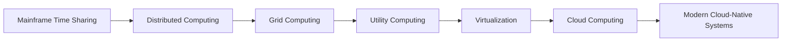
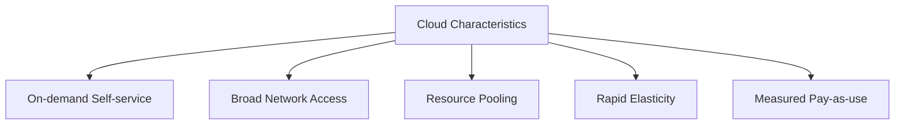
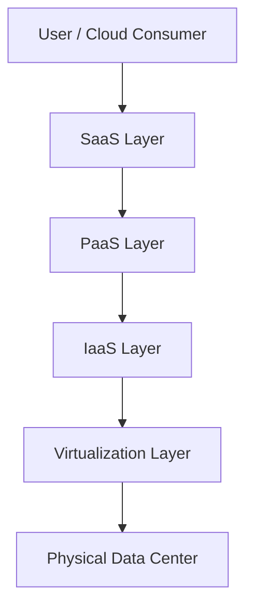
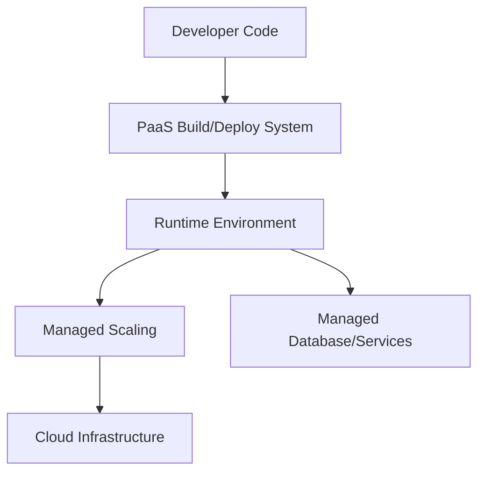
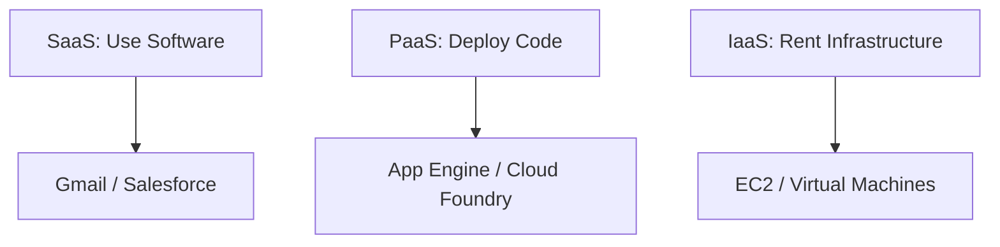
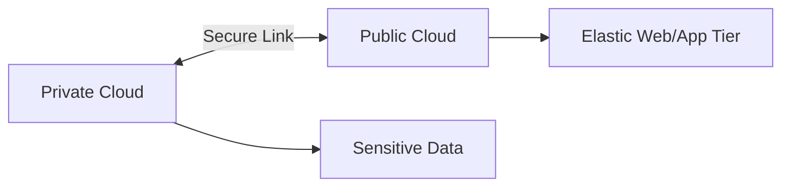
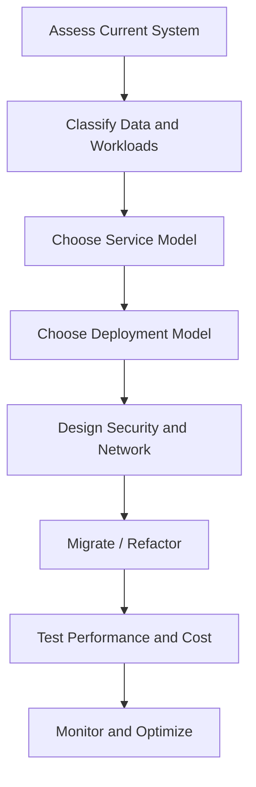

# Unit 2 - Overview of Cloud Computing

## Topics Covered

```text
Unit-2
│── Origins of Cloud Computing
│   │── Cloud Components
│   │── Key Features
│   │── Traditional IT Providers vs Cloud Providers
│   │── Basics of Cloud Computing
│
│── Cloud Architecture
    │── Layers in Cloud Architecture
    │── SaaS
    │── PaaS
    │── IaaS
    │── Service Providers
    │── Challenges and Risks in Cloud Adoption
    │── Public, Private, Community and Hybrid Clouds
```

---

## 1. Origins of Cloud Computing

Cloud computing did not appear from a single invention. It evolved from several earlier ideas in computing: mainframe time-sharing, distributed computing, grid computing, utility computing, virtualization, service-oriented architecture, web services, and large-scale data centers.

The term “cloud” represents the abstraction of complex infrastructure. A user does not need to know where the server is physically located or how many machines are involved. The user only consumes a service.

### Evolution Path



### Why Cloud Computing Became Practical

Cloud computing became practical because of:

- cheap commodity hardware,
- fast Internet connectivity,
- virtualization technologies,
- large data centers,
- automation and orchestration,
- web APIs,
- service-based billing,
- demand for scalable web applications.

### Tangent Topic: Time Sharing to Cloud

In time-sharing systems, many users shared one large computer. In cloud computing, many users share large pools of computers. The idea of sharing is old, but cloud computing adds self-service provisioning, elasticity, metering, global access, and provider-managed infrastructure.

---

## 2. Cloud Components

A cloud system contains several components working together.

```text
+------------------------------------------------------------+
| Cloud Consumer                                              |
+---------------------------+--------------------------------+
                            |
+---------------------------v--------------------------------+
| Cloud Interface: Portal, CLI, SDK, API                      |
+---------------------------+--------------------------------+
                            |
+---------------------------v--------------------------------+
| Service Layer: SaaS / PaaS / IaaS                           |
+---------------------------+--------------------------------+
                            |
+---------------------------v--------------------------------+
| Management Layer: Monitoring, Billing, Orchestration        |
+---------------------------+--------------------------------+
                            |
+---------------------------v--------------------------------+
| Virtualization Layer: VMs, Containers, Virtual Networks     |
+---------------------------+--------------------------------+
                            |
+---------------------------v--------------------------------+
| Physical Layer: Servers, Storage, Network, Data Centers     |
+------------------------------------------------------------+
```

### Main Components

| Component | Description |
|---|---|
| Client/User | Person or application consuming cloud service |
| Front-end | Portal, dashboard, API, CLI, SDK |
| Back-end | Servers, storage, databases, services |
| Network | Connects user and cloud resources |
| Virtualization | Abstracts physical resources into logical resources |
| Resource Pool | Shared pool of compute, storage, and network capacity |
| Management System | Provisioning, monitoring, billing, automation |
| Security System | Identity, access control, encryption, policy enforcement |

---

## 3. Key Features of Cloud Computing

### 3.1 On-Demand Self-Service

Users can provision computing resources without human interaction with the service provider. For example, a developer can create a VM, database, or storage bucket using a web console or command-line tool.

### 3.2 Broad Network Connectivity

Cloud services are accessed over a network using standard mechanisms such as browsers, APIs, and mobile applications. This allows users to access services from laptops, smartphones, servers, and IoT devices.

### 3.3 Location-Independent Resource Pooling

The provider pools resources and dynamically assigns them to users. The user generally does not know the exact physical location of the resource, though they may select a broad region such as Mumbai, Singapore, or US-East.

### 3.4 Rapid Flexibility / Elasticity

Resources can be quickly scaled up or down. To the user, cloud resources may appear almost unlimited because new capacity can be requested when needed.

### 3.5 Pay-as-You-Use Service

Cloud usage is measured, and users pay according to actual consumption.

$$
\text{Monthly Cost} = \sum(\text{Resource Usage} \times \text{Unit Price})
$$

For example:

$$
\text{Cost} = \text{Compute Cost} + \text{Storage Cost} + \text{Data Transfer Cost}
$$

### 3.6 Measured Service

The provider tracks CPU usage, storage usage, bandwidth, requests, and other metrics. This enables billing, monitoring, capacity planning, and optimization.



---

## 4. Traditional IT Service Providers vs Cloud Providers

| Aspect | Traditional IT | Cloud Provider |
|---|---|---|
| Hardware ownership | Organization buys servers | Provider owns infrastructure |
| Provisioning time | Days to weeks | Minutes to hours |
| Cost model | Upfront purchase | Usage-based billing |
| Scalability | Manual and slower | Automated and elastic |
| Maintenance | Internal IT team | Provider handles infrastructure |
| Capacity planning | Must predict peak demand | Can scale according to demand |
| Access | Often internal network | Internet/API-based access |
| Risk | Hardware risk with customer | Some infrastructure risk transferred to provider |

### Example

A college wants to host an exam portal for one week. Traditional IT would require purchasing or renting servers for peak exam traffic. Cloud computing allows temporary scaling during exam week and release of servers after exams.

---

## 5. Cloud Architecture: Layers and Models

Cloud architecture can be understood in layers. Each layer hides complexity from the layer above it.



### Layer Explanation

| Layer | Function |
|---|---|
| Physical Layer | Actual servers, disks, switches, routers, power, cooling |
| Virtualization Layer | Converts physical resources into VMs, containers, virtual networks |
| Infrastructure Layer | Compute, storage, network resources as services |
| Platform Layer | Runtime, database, middleware, development tools |
| Application Layer | Complete applications delivered to users |
| Management Layer | Monitoring, metering, orchestration, security, billing |

---

## 6. Software as a Service

Software as a Service, or SaaS, delivers complete software applications over the Internet. The user only uses the application and does not manage servers, OS, runtime, storage, or application code.

Examples: Gmail, Google Docs, Microsoft 365, Salesforce CRM, Dropbox.

### SaaS Working


### Features of SaaS

- browser-based access,
- no local installation needed,
- subscription or usage-based pricing,
- automatic updates,
- multi-tenant architecture,
- provider-managed security and maintenance,
- accessible from multiple devices.

### Benefits of SaaS

SaaS reduces installation effort, supports quick adoption, lowers maintenance burden, and makes collaboration easier. For example, multiple students can edit the same cloud document without installing office software locally.

### Limitations of SaaS

- less customization compared to custom software,
- dependency on Internet connectivity,
- vendor lock-in risk,
- privacy concerns,
- limited control over updates.

---

## 7. Platform as a Service

Platform as a Service, or PaaS, provides a managed platform for developing, deploying, and running applications. The user controls application code and data, while the provider manages operating systems, runtime, middleware, scaling, and infrastructure.

Examples: Google App Engine, Heroku, IBM Cloud Foundry, Azure App Service.

### PaaS Working



### Features of PaaS

- application runtime provided,
- deployment tools and buildpacks,
- managed database integration,
- auto-scaling support,
- developer-friendly APIs,
- less server administration,
- CI/CD integration.

### Benefits of PaaS

PaaS is useful for developers who want to focus on application logic instead of server configuration. It reduces deployment complexity and supports faster development.

### Limitations of PaaS

- less control over OS and runtime internals,
- platform-specific constraints,
- possible vendor lock-in,
- debugging may be harder in managed environments.

---

## 8. Infrastructure as a Service

Infrastructure as a Service, or IaaS, provides virtualized computing resources such as VMs, storage, and networks. The user manages OS, middleware, runtime, and applications.

Examples: AWS EC2, Azure Virtual Machines, Google Compute Engine.

### IaaS Working

```text
User manages:       Applications, Runtime, Middleware, OS
Provider manages:   Virtualization, Servers, Storage, Network, Data Center
```

### Features of IaaS

- virtual machines,
- block/object storage,
- virtual networks,
- firewall/security groups,
- load balancers,
- images/snapshots,
- flexible instance types.

### Benefits of IaaS

IaaS gives high control and flexibility. It is suitable for custom applications, migration of legacy systems, development/testing labs, and scalable infrastructure.

### Limitations of IaaS

- user must manage OS patches and configuration,
- more operational responsibility than SaaS/PaaS,
- cost can increase if resources are not monitored,
- security misconfiguration risk.

---

## 9. SaaS vs PaaS vs IaaS



| Layer | User Manages | Provider Manages | Best For |
|---|---|---|---|
| SaaS | Data and settings | Everything else | End users |
| PaaS | Application code and data | Runtime, OS, servers | Developers |
| IaaS | OS, runtime, app, data | Hardware and virtualization | System admins/devops |

### Analogy

| Model | Food Analogy |
|---|---|
| On-premise | You own kitchen, ingredients, cooking, serving |
| IaaS | Rent kitchen, cook yourself |
| PaaS | Get prepared kitchen and tools, focus on recipe |
| SaaS | Eat ready-made food |

---

## 10. Cloud Deployment Models

### 10.1 Public Cloud

A public cloud is owned and operated by a third-party provider and made available to many customers over the Internet.

Examples: AWS, Microsoft Azure, Google Cloud, IBM Cloud.

Benefits:

- low upfront cost,
- high scalability,
- global availability,
- pay-as-use.

Limitations:

- less direct control,
- data location concerns,
- compliance concerns for sensitive workloads.

### 10.2 Private Cloud

A private cloud is used by a single organization. It may be hosted in the organization’s own data center or managed by a third party.

Benefits:

- more control,
- better customization,
- useful for sensitive workloads.

Limitations:

- higher cost,
- requires skilled administration,
- may not achieve same economies of scale as public cloud.

### 10.3 Community Cloud

A community cloud is shared by organizations with common requirements, such as government departments, universities, or healthcare institutions.

Benefits:

- shared cost,
- common compliance policies,
- collaboration between related organizations.

### 10.4 Hybrid Cloud

A hybrid cloud combines two or more deployment models, commonly private and public cloud. Sensitive data may stay in private cloud while public cloud handles variable workloads.



### Deployment Model Comparison

| Model | Ownership | Users | Control | Cost | Example Use |
|---|---|---|---|---|---|
| Public | Provider | Many customers | Lower | Low upfront | Web apps, startups |
| Private | Single organization | Internal users | High | Higher | Banking, defense |
| Community | Shared group | Similar organizations | Medium | Shared | Universities, healthcare |
| Hybrid | Mixed | Mixed | Flexible | Variable | Cloud bursting |

---

## 11. Service Providers

A cloud service provider offers cloud services to consumers. Providers manage infrastructure, platforms, applications, security tools, billing, and SLAs.

### Examples of Provider Roles

| Provider Role | Description |
|---|---|
| Infrastructure provider | Provides compute, storage, networking |
| Platform provider | Provides development and deployment platform |
| SaaS provider | Provides complete software application |
| Managed service provider | Operates cloud environment for customer |
| Marketplace provider | Offers third-party cloud services and tools |

---

## 12. Challenges and Risks in Cloud Adoption

Cloud adoption means moving systems, applications, or data from local infrastructure to cloud. It requires planning.

### Common Risks

| Risk | Explanation | Mitigation |
|---|---|---|
| Security | Data and systems may be exposed if misconfigured | IAM, encryption, secure design |
| Vendor lock-in | Hard to migrate away from provider | Open standards, containerization |
| Downtime | Provider or network failure can affect service | Multi-region, backup, SLA review |
| Cost overrun | Resources left running increase bills | Budgets, monitoring, auto-shutdown |
| Compliance | Legal restrictions on data handling | Region selection, audit logs |
| Skill gap | Team may not know cloud tools | Training, documentation, labs |
| Migration complexity | Legacy apps may not work directly | Refactoring, phased migration |

### Cloud Adoption Process



---

## Exam Questions and Answers

### Topic: Key Features

#### 3 Marks: Explain any three key features of cloud computing.

On-demand self-service allows users to provision resources without manual provider interaction. Broad network access allows cloud services to be accessed through standard networks and devices. Rapid elasticity allows resources to scale up or down quickly according to workload.

#### 5 Marks: Explain the essential characteristics of cloud computing with examples.

Cloud computing has on-demand self-service, broad network access, resource pooling, rapid elasticity, and measured service. For example, a user can launch a VM from a web console, access it through the Internet, use resources from a shared provider pool, scale it during peak traffic, and pay according to CPU hours, storage, and data transfer. These features make cloud different from traditional hosting.

### Topic: Service Models

#### 3 Marks: Differentiate between SaaS, PaaS and IaaS.

SaaS provides complete software to end users, such as Gmail. PaaS provides a platform where developers deploy applications without managing servers, such as Google App Engine. IaaS provides virtual infrastructure like VMs and storage, such as Amazon EC2, where users manage OS and applications.

#### 5 Marks: Explain IaaS, PaaS and SaaS with a diagram.

IaaS offers infrastructure resources such as virtual machines, storage, and networks. PaaS offers development platforms, runtimes, databases, and deployment tools. SaaS offers complete software applications over the Internet. The main difference is the level of control and responsibility. IaaS gives maximum control but requires more management. SaaS gives least control but is easiest to use.

```text
SaaS -> Ready application
PaaS -> Deploy your code
IaaS -> Configure your virtual server
```

### Topic: Deployment Models

#### 3 Marks: What is hybrid cloud?

Hybrid cloud is a deployment model that combines private cloud and public cloud or multiple cloud environments. It allows organizations to keep sensitive workloads in private infrastructure while using public cloud for scalable or temporary workloads.

#### 5 Marks: Compare public cloud and private cloud.

Public cloud is owned by a provider and shared by many customers. It offers low upfront cost, rapid scalability, and global availability, but gives less direct control. Private cloud is dedicated to one organization and offers better control, customization, and compliance, but it is costlier and requires more management. Public cloud is suitable for scalable web applications, while private cloud is suitable for sensitive enterprise workloads.

---

Previous: [[Unit-01 - Insights about Cloud Computing]] | Next: [[Unit-03 - Cloud Programming and Open Source Cloud Implementation]]
