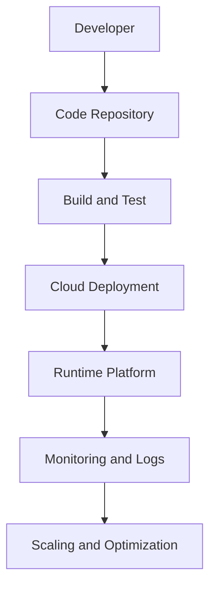
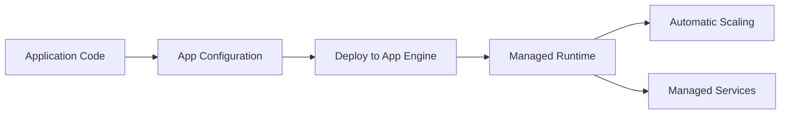
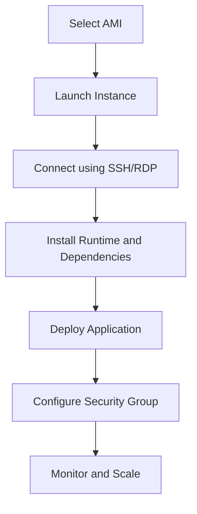
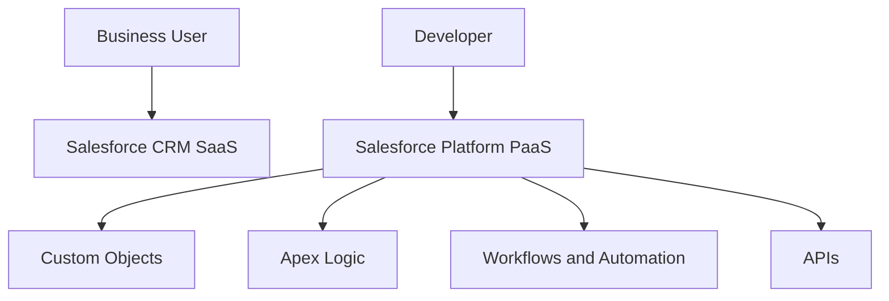
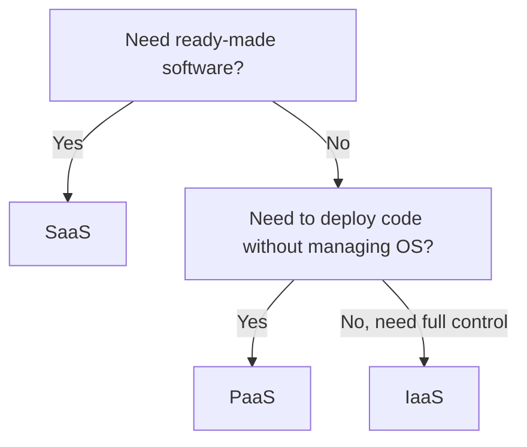
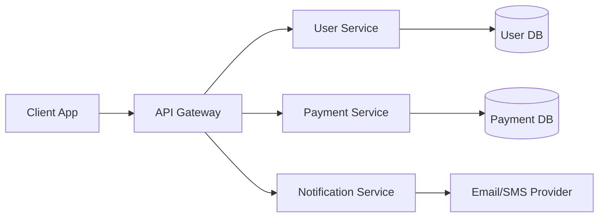
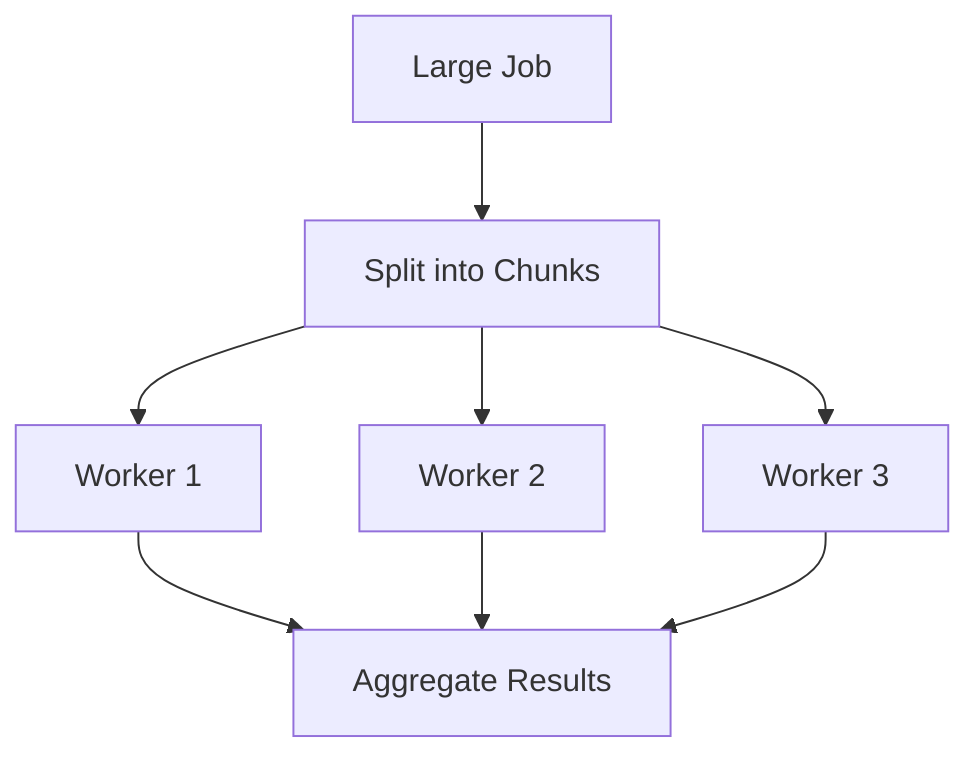
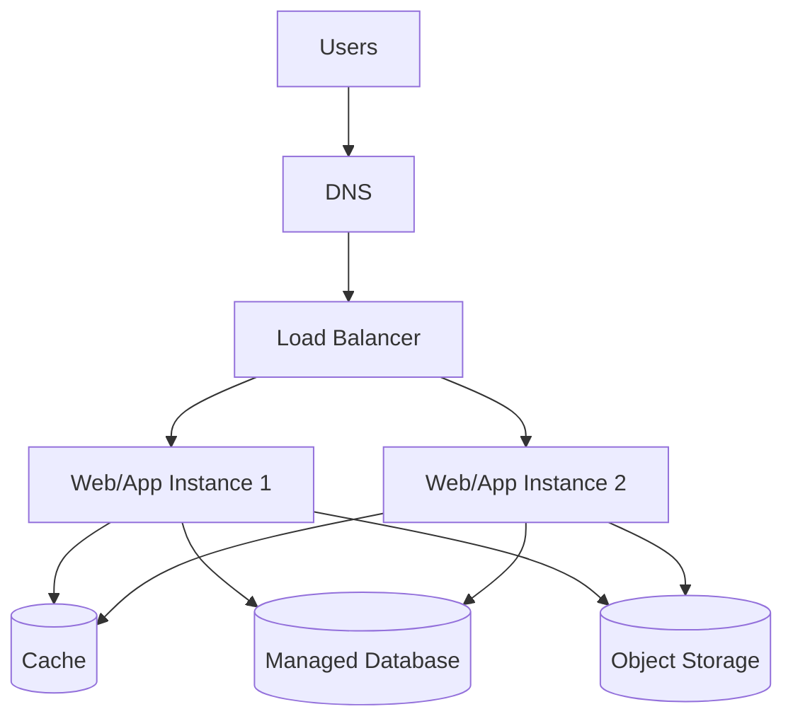
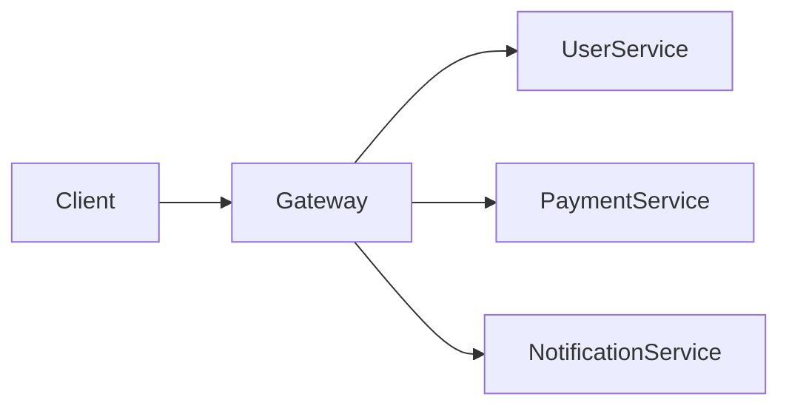

# Unit 3 - Cloud Programming and Open Source Cloud Implementation

## Topics Covered

```text
Unit-3
│── Programming Support
│   │── Google App Engine
│   │── Amazon EC2
│   │── Salesforce Cloud Services
│   │── PaaS, SaaS and IaaS in Programming
│
│── Architecture for Cloud Applications
    │── Cloud Application Requirements
    │── SOA for Cloud Applications
    │── Parallelization within Cloud Applications
    │── Multi-tier Application Architecture
```

---

## 1. Cloud Programming

Cloud programming means designing, developing, deploying, and managing applications that run on cloud infrastructure or platforms. Unlike traditional applications, cloud applications are expected to handle distributed execution, network latency, scalability, failures, security, and cost constraints.

A cloud application is not simply an application installed on a remote server. A good cloud application uses cloud-native ideas such as stateless services, APIs, managed databases, autoscaling, load balancing, monitoring, and automated deployment.



---

## 2. Programming Support for Google App Engine

Google App Engine is a Platform as a Service offering for deploying web applications. It provides managed runtime environments, scaling, load balancing, and integration with Google services.

### How App Engine Works

A developer writes application code, defines configuration, deploys it to App Engine, and the platform manages server provisioning and scaling.



### Important Concepts

| Concept | Explanation |
|---|---|
| Runtime | Language environment such as Python, Java, Node.js, Go |
| App Configuration | Settings for routes, scaling, service behavior |
| Managed Scaling | Platform starts/stops instances based on demand |
| Stateless Design | App instances should not depend on local memory for permanent data |
| Managed Services | Databases, storage, logging, authentication |

### Why App Engine Is PaaS

The user does not manage the operating system, hypervisor, or physical servers. The user focuses mainly on code and application data.

### Example

A college feedback portal can be deployed to App Engine. During normal days, only one instance may run. During feedback week, the platform can automatically increase instances as more students log in.

### Advantages

- fast deployment,
- automatic scaling,
- reduced server management,
- integrated logs and monitoring,
- suitable for web applications.

### Limitations

- platform-specific configuration,
- less control than IaaS,
- application may need to follow platform rules,
- vendor lock-in risk.

---

## 3. Programming Support for Amazon EC2

Amazon EC2 is an IaaS service. It provides virtual machines where users can install an OS, runtime, libraries, and applications.

### EC2 Development Workflow



### What the Developer Controls

In EC2, the developer or administrator controls:

- operating system,
- patches and updates,
- installed libraries,
- web server,
- application runtime,
- database installation if self-managed,
- firewall/security group rules,
- scaling strategy.

### Example

Deploying a Node.js application on EC2:

```bash
# conceptual steps
ssh -i key.pem ubuntu@public-ip
sudo apt update
sudo apt install nodejs npm
npm install
node app.js
```

For production, a process manager like PM2, reverse proxy like Nginx, and load balancer may be used.

### EC2 vs App Engine

| Feature | EC2 | App Engine |
|---|---|---|
| Model | IaaS | PaaS |
| User controls OS | Yes | No |
| Scaling | User configures | Platform-managed |
| Flexibility | High | Medium |
| Operational burden | Higher | Lower |
| Best for | Custom stacks, legacy apps | Web apps with managed runtime |

---

## 4. Salesforce Cloud Computing Services

Salesforce is widely known as a SaaS CRM platform, but it also provides platform capabilities for building business applications. Salesforce platform services support business data models, workflows, automation, APIs, dashboards, and custom logic.

### Salesforce as SaaS

Users consume Salesforce CRM directly through a web interface. The provider manages the application, platform, infrastructure, updates, and availability.

### Salesforce as PaaS

Developers can build custom business applications using Salesforce tools, data objects, workflows, and Apex programming.



### Important Terms

| Term | Meaning |
|---|---|
| CRM | Customer Relationship Management |
| Apex | Salesforce programming language for business logic |
| Object | Database-like entity such as Account, Contact, Lead |
| Workflow | Automation rule for business process |
| Force.com / Salesforce Platform | Platform for building business apps |

### Example

A company can use Salesforce to track customers, leads, sales opportunities, and support tickets. If the company needs a custom approval process, developers can build workflows and Apex logic on the platform.

---

## 5. PaaS, SaaS and IaaS in Cloud Programming

Cloud programming differs depending on the selected service model.

| Model | Programming Focus | Example |
|---|---|---|
| SaaS | Customization, configuration, integration | Automating Salesforce workflows |
| PaaS | Writing application code for managed runtime | Deploying Python app to App Engine |
| IaaS | Full stack setup and deployment | Installing Node.js on EC2 |

### Decision Guide



---

## 6. Cloud Application Requirements

A cloud application should be designed for reliability, scalability, security, and observability.

### 6.1 Scalability

The application should support horizontal scaling. For this, the application layer should usually be stateless.

A stateless service does not store permanent user session data in local memory. Instead, sessions and data are stored in external stores such as databases, caches, or object storage.

```text
Bad design:
User session stored only in Web Server 1 memory.
If request goes to Web Server 2, session is lost.

Good design:
All web servers store session in shared cache/database.
Any server can handle request.
```

### 6.2 Fault Tolerance

Cloud systems fail in small ways frequently: a VM may restart, a disk may fail, a network call may time out. Cloud applications must expect failure and recover gracefully.

Techniques:

- retries with backoff,
- redundancy,
- health checks,
- failover,
- circuit breakers,
- backups,
- queues for asynchronous processing.

### 6.3 Security

Requirements include authentication, authorization, encryption, input validation, secret management, and logging.

### 6.4 Observability

Observability means the system should be understandable from outside through metrics, logs, and traces.

| Signal | Meaning | Example |
|---|---|---|
| Logs | Events and errors | Login failed, payment success |
| Metrics | Numerical measurements | CPU usage, requests/sec |
| Traces | Request journey across services | API call across microservices |

### 6.5 Cost Awareness

Cloud resources cost money continuously. Applications should shut down unused resources, use autoscaling, and choose suitable instance/storage types.

---

## 7. Service-Oriented Architecture for Cloud Applications

Service-Oriented Architecture, or SOA, organizes software as a collection of services that communicate using well-defined interfaces. Each service performs a business function and can be reused by other applications.

### Why SOA Fits Cloud

Cloud applications often need integration between distributed services. SOA helps by separating business capabilities into independent services.



### SOA Components

| Component | Meaning |
|---|---|
| Service | Reusable business function |
| Service Contract | Defines input, output, protocol, rules |
| Service Provider | Hosts the service |
| Service Consumer | Uses the service |
| Service Registry | Directory of available services |
| Enterprise Service Bus | Middleware for routing and integration |

### SOA Principles

- loose coupling,
- reusability,
- abstraction,
- interoperability,
- composability,
- discoverability.

### Tangent Topic: SOA vs Microservices

| SOA | Microservices |
|---|---|
| Often enterprise-wide integration | Smaller independently deployable services |
| May use ESB | Usually lightweight APIs/message queues |
| Service reuse is central | Independent ownership and deployment is central |
| Can be heavier | More cloud-native and DevOps-friendly |

---

## 8. Parallelization within Cloud Applications

Parallelization means dividing a large task into smaller tasks that can run at the same time. Cloud computing supports parallelization because many VMs or containers can be created on demand.

### Types of Parallelism

| Type | Explanation | Example |
|---|---|---|
| Data parallelism | Same operation on different data chunks | Process 100 files on 100 workers |
| Task parallelism | Different tasks run at same time | Resize image and generate thumbnail |
| Pipeline parallelism | Output of one stage becomes input of next | ETL pipeline |

### Parallel Processing Pattern



### Example: Log Analysis

A company has 1 TB of server logs. Instead of one machine reading all logs, the data is split into chunks. Multiple workers process chunks in parallel and send partial results to an aggregator.

### Speedup Formula

A simple ideal speedup approximation:

$$
\text{Speedup} = \frac{\text{Time with 1 worker}}{\text{Time with N workers}}
$$

If one worker takes 100 minutes and 10 workers take 12 minutes:

$$
\text{Speedup} = \frac{100}{12} = 8.33
$$

The speedup is not exactly 10 because splitting, communication, and aggregation add overhead.

### Amdahl's Law

Amdahl's Law shows that speedup is limited by the serial part of a program.

$$
S(N) = \frac{1}{(1-P) + \frac{P}{N}}
$$

Where:

- $S(N)$ is speedup using $N$ processors,
- $P$ is the parallelizable fraction,
- $(1-P)$ is the serial fraction.

If 90% of a task can be parallelized and 10 processors are used:

$$
S(10)=\frac{1}{0.1 + \frac{0.9}{10}}=\frac{1}{0.19}=5.26
$$

---

## 9. Multi-Tier Application Architecture

Multi-tier architecture divides an application into separate layers. This improves scalability, maintainability, and security.

### Common 3-Tier Architecture

```text
+------------------------+
| Presentation Tier      |
| Browser / Mobile UI    |
+-----------+------------+
            |
+-----------v------------+
| Application Tier       |
| Business Logic / API   |
+-----------+------------+
            |
+-----------v------------+
| Data Tier              |
| Database / Storage     |
+------------------------+
```

### Tier Explanation

| Tier | Responsibility |
|---|---|
| Presentation Tier | User interface and request handling |
| Application Tier | Business logic, validation, APIs |
| Data Tier | Persistent data storage |

### Cloud Multi-Tier Architecture



### Why Multi-Tier Is Needed

- presentation, logic, and data can scale separately,
- database can be protected in private network,
- business logic can be updated independently,
- load balancers can distribute traffic,
- failures are easier to isolate.

### Example

An e-commerce website may have:

- web tier for product pages,
- application tier for cart and payment logic,
- database tier for users, orders, and inventory,
- object storage for product images,
- cache for frequently accessed product data.

---

## 10. Open Source Cloud Implementation

Open source cloud implementation refers to using open-source tools to build, manage, or deploy cloud systems.

### Important Open Source Cloud Tools

| Tool | Purpose |
|---|---|
| OpenStack | Build private/public IaaS cloud |
| Cloud Foundry | PaaS for deploying applications |
| Kubernetes | Container orchestration |
| Docker | Containerization |
| Terraform | Infrastructure as Code |
| Prometheus | Monitoring |
| Grafana | Visualization dashboards |
| Jenkins/GitHub Actions | CI/CD automation |

### Why Open Source Matters

Open-source cloud tools reduce vendor lock-in, allow customization, support learning, and enable private cloud deployment.

---

## Exam Questions and Answers

### Topic: Google App Engine and EC2

#### 3 Marks: Differentiate between Google App Engine and Amazon EC2.

Google App Engine is a PaaS where developers deploy application code and the platform manages runtime, scaling, and infrastructure. Amazon EC2 is an IaaS service where users create virtual machines and manage the OS, runtime, software, and application deployment themselves.

#### 5 Marks: Explain programming support for Amazon EC2.

Amazon EC2 provides virtual machines for running applications in the cloud. A developer selects an AMI, launches an instance, connects through SSH or RDP, installs required runtime and dependencies, deploys the application, configures security groups, and monitors performance. EC2 gives high flexibility because users control the operating system and software stack, but it also requires more administration than PaaS.

### Topic: SOA

#### 3 Marks: What is SOA in cloud applications?

Service-Oriented Architecture is an approach where software is divided into reusable services that communicate through standard interfaces. In cloud applications, SOA helps integrate distributed services, improves reusability, and supports flexible application composition.

#### 5 Marks: Explain SOA for cloud applications with a diagram.

SOA divides an application into independent services such as user service, payment service, and notification service. Each service exposes a standard interface and can be consumed by other applications. In cloud environments, SOA helps scalability, interoperability, and reuse. It also supports integration with third-party cloud services.



### Topic: Parallelization and Multi-Tier Architecture

#### 3 Marks: Why is parallelization useful in cloud computing?

Parallelization is useful because cloud platforms can provide many computing resources on demand. A large task can be divided into smaller tasks and processed simultaneously by multiple VMs or containers, reducing execution time for suitable workloads.

#### 5 Marks: Explain multi-tier cloud application architecture.

Multi-tier architecture separates an application into presentation, application, and data tiers. The presentation tier handles user interaction, the application tier handles business logic, and the data tier stores persistent data. In cloud computing, each tier can be scaled and secured separately. Load balancers distribute traffic across application instances, while databases and storage services provide reliable data management.

---

Previous: [[Unit-02 - Overview of Cloud Computing]] | Next: [[Unit-04 - Cloud Simulators]]
