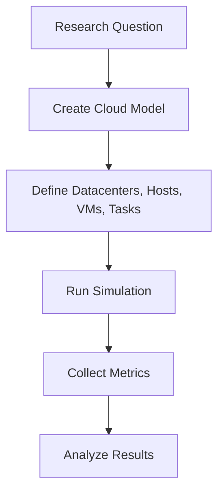
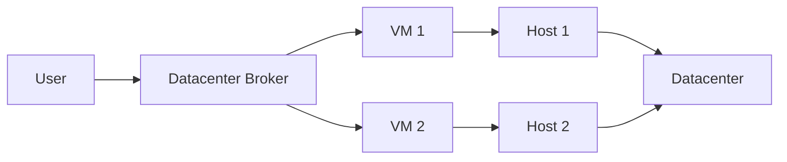
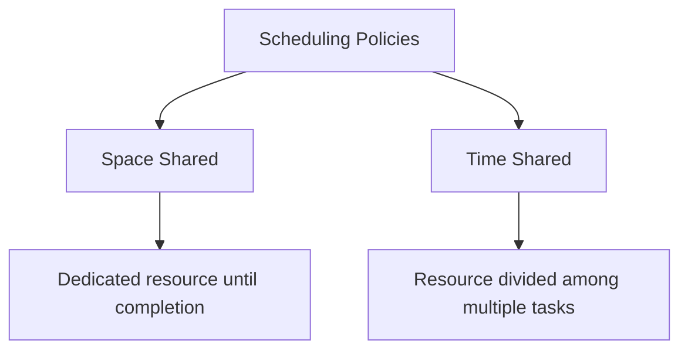
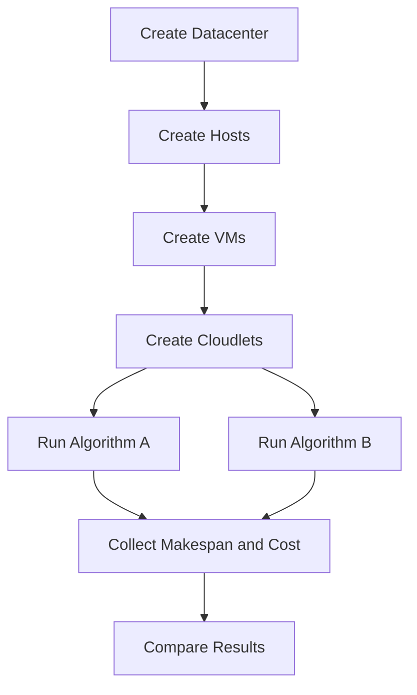

# Unit 4 - Cloud Simulators

## Topics Covered

```text
Unit-4
│── Need for Cloud Simulators
│── Introduction to CloudSim Simulator
│── Architecture of CloudSim
│── Benefits of CloudSim
│── Applications of CloudSim
```

---

## 1. Need for Cloud Simulators

A cloud simulator is a software tool used to model and test cloud computing environments without using real cloud infrastructure. It helps researchers and students study cloud behavior such as resource allocation, scheduling, energy usage, cost, performance, and scalability.

Real cloud experiments can be expensive, time-consuming, and difficult to repeat. Simulators solve this problem by creating a controlled virtual experiment environment.

### Why Simulation Is Needed

| Problem in Real Cloud Testing | How Simulation Helps |
|---|---|
| Cloud resources cost money | Experiments can be run locally without renting resources |
| Large-scale testing is difficult | Thousands of VMs or tasks can be modeled virtually |
| Repeating exact experiments is hard | Same configuration can be repeated many times |
| Failures may affect real users | Failure scenarios can be tested safely |
| New scheduling algorithms need testing | Algorithms can be evaluated before deployment |

### Example

Suppose a researcher designs a new VM scheduling algorithm. Testing it on a real cloud with 1000 hosts and 10,000 tasks would be costly. A simulator can model this scenario and compare the new algorithm with existing algorithms.



---

## 2. What Can Be Simulated?

Cloud simulators can model many parts of a cloud environment.

| Component | What It Represents |
|---|---|
| Datacenter | Collection of hosts and policies |
| Host | Physical machine with CPU, RAM, bandwidth, storage |
| VM | Virtual machine allocated on a host |
| Cloudlet / Task | Workload or job submitted by user |
| Broker | Mediator between user and datacenter |
| Scheduler | Decides allocation of tasks to VMs |
| Network | Communication delay and bandwidth |
| Cost model | Usage charges for CPU, memory, storage, bandwidth |

---

## 3. Introduction to CloudSim Simulator

CloudSim is a simulation toolkit used for modeling and simulating cloud computing infrastructures and services. It allows users to model datacenters, hosts, virtual machines, resource allocation policies, and application workloads.

CloudSim is commonly used in academic research because it provides a repeatable environment for testing scheduling and resource management policies.

### Key Features of CloudSim

- models large-scale cloud data centers,
- supports virtualized server environments,
- models VMs and application workloads,
- allows custom scheduling policies,
- supports resource provisioning experiments,
- helps evaluate performance and cost,
- avoids need for real cloud deployment.

### Basic CloudSim Idea

```text
User submits tasks -> Broker receives tasks -> Broker maps tasks to VMs -> VMs run on hosts -> Hosts belong to datacenters -> Simulation produces results
```



---

## 4. Architecture of CloudSim

CloudSim has a layered architecture. It is built over a simulation engine and provides cloud-specific simulation components.

### Conceptual Architecture

```text
+-------------------------------------------------------------+
| User Simulation Code                                        |
| Defines datacenters, hosts, VMs, cloudlets, policies         |
+-------------------------------------------------------------+
| CloudSim Toolkit Layer                                      |
| Datacenter, Host, VM, Cloudlet, Broker, Schedulers           |
+-------------------------------------------------------------+
| Simulation Engine                                           |
| Event handling, simulation clock, entity communication       |
+-------------------------------------------------------------+
| Java Runtime / Local Machine                                |
+-------------------------------------------------------------+
```

### Main Entities

#### 4.1 Datacenter

A datacenter represents a cloud provider’s infrastructure. It contains hosts and applies policies for allocating VMs to hosts.

#### 4.2 Host

A host represents a physical server. It has CPU cores, RAM, storage, and bandwidth. Hosts run virtual machines.

#### 4.3 Virtual Machine

A VM is a virtual server created on a host. It has processing power, memory, bandwidth, and storage.

#### 4.4 Cloudlet

A cloudlet represents a task or workload. It has length, file size, output size, and number of processing elements required.

#### 4.5 Datacenter Broker

The broker acts on behalf of the cloud user. It submits VMs and cloudlets to datacenters and collects execution results.

#### 4.6 Scheduler

A scheduler decides how tasks are assigned to VMs and how VM resources are shared.

---

## 5. Scheduling in CloudSim

Scheduling is one of the most important uses of CloudSim. It decides how computational tasks are mapped to resources.

### Types of Scheduling

| Scheduling Level | Meaning |
|---|---|
| VM Scheduling | How CPU of host is shared among VMs |
| Cloudlet Scheduling | How tasks are assigned to VM processing capacity |
| Datacenter Broker Scheduling | How broker maps cloudlets to VMs |

### Space-Shared vs Time-Shared

| Policy | Meaning | Example |
|---|---|---|
| Space-shared | A resource is dedicated to one task/VM until completion | One task gets full CPU slot |
| Time-shared | Resource is shared by multiple tasks/VMs using time slicing | Multiple tasks appear to run together |



---

## 6. Metrics in Cloud Simulation

A simulator is useful only if it produces measurable results. Common metrics are:

| Metric | Meaning |
|---|---|
| Makespan | Total time required to finish all tasks |
| Response Time | Time between task submission and result |
| Waiting Time | Time task waits before execution |
| Throughput | Number of tasks completed per unit time |
| Resource Utilization | How much CPU/RAM/storage is used |
| Cost | Simulated monetary cost of resource usage |
| Energy Consumption | Power used by hosts/data center |
| SLA Violation | How often performance requirements are not met |

### Makespan Formula

$$
\text{Makespan} = \max(\text{Finish Time of all tasks}) - \min(\text{Start Time of all tasks})
$$

### Throughput Formula

$$
\text{Throughput} = \frac{\text{Number of Completed Tasks}}{\text{Total Execution Time}}
$$

---

## 7. Benefits of CloudSim

### 7.1 Cost Saving

Experiments can be performed without paying for real cloud resources.

### 7.2 Repeatability

Same configurations can be tested multiple times, making comparison fair.

### 7.3 Scalability Testing

A large number of hosts, VMs, and tasks can be modeled virtually.

### 7.4 Safe Testing

Faults, overloads, and scheduling experiments can be tested without affecting real users.

### 7.5 Algorithm Evaluation

New scheduling, load balancing, VM allocation, or energy-saving algorithms can be evaluated.

---

## 8. Applications of CloudSim

CloudSim can be used for:

- evaluating VM placement algorithms,
- testing load balancing strategies,
- analyzing energy-efficient cloud computing,
- studying cloud cost models,
- comparing task scheduling algorithms,
- studying data center resource utilization,
- simulating SLA violations,
- testing workflow scheduling,
- teaching cloud computing architecture.

### Example Experiment: Comparing Two Scheduling Algorithms



### Example Result Table

| Algorithm | Makespan | Average Waiting Time | Cost | Observation |
|---|---:|---:|---:|---|
| FCFS | 120 sec | 25 sec | ₹50 | Simple but may be slow |
| Min-Min | 90 sec | 18 sec | ₹48 | Better for smaller tasks |
| Round Robin | 100 sec | 20 sec | ₹52 | Fair task distribution |

---

## 9. Limitations of Simulation

Simulation results are useful but not identical to real cloud performance. A simulator uses assumptions, and real cloud systems involve unpredictable network delays, hardware failures, software bugs, and provider-specific optimizations.

Limitations:

- may simplify real infrastructure,
- accuracy depends on model quality,
- real network behavior may differ,
- provider-specific details may not be fully modeled,
- results need validation.

A good exam answer should mention that simulation helps before real deployment, but it does not completely replace real-world testing.

---

## Exam Questions and Answers

### Topic: Need for Cloud Simulators

#### 3 Marks: Why are cloud simulators needed?

Cloud simulators are needed to test cloud environments without using real cloud infrastructure. They reduce cost, allow repeatable experiments, support large-scale testing, and help evaluate scheduling, resource allocation, and performance policies safely.

#### 5 Marks: Explain the need for cloud simulators with examples.

Testing cloud algorithms directly on real infrastructure can be expensive and difficult to repeat. Cloud simulators provide a controlled environment where datacenters, hosts, VMs, and workloads can be modeled. For example, a researcher can compare two VM scheduling algorithms using the same simulated workload and measure makespan, waiting time, cost, and resource utilization. This helps evaluate ideas before real deployment.

### Topic: CloudSim Architecture

#### 3 Marks: What is CloudSim?

CloudSim is a simulation toolkit used to model and simulate cloud computing infrastructures and services. It supports entities such as datacenters, hosts, VMs, cloudlets, brokers, and scheduling policies.

#### 5 Marks: Explain CloudSim architecture.

CloudSim architecture consists of a simulation engine, a cloud simulation toolkit layer, and user-defined simulation code. The simulation engine manages events and simulation time. The toolkit layer provides cloud entities such as datacenter, host, VM, cloudlet, broker, and scheduler. The user defines infrastructure and workloads, runs the simulation, and analyzes metrics such as makespan, throughput, cost, and utilization.

```text
User Code -> CloudSim Entities -> Simulation Engine -> Results
```

### Topic: Benefits and Applications

#### 3 Marks: Mention any three benefits of CloudSim.

CloudSim reduces experiment cost, supports repeatable simulation, and allows testing of large-scale cloud environments without real infrastructure. It is also useful for evaluating scheduling and resource allocation policies.

#### 5 Marks: Explain applications of CloudSim.

CloudSim is used for evaluating VM placement, load balancing, energy-aware scheduling, cost modeling, task scheduling, SLA violation analysis, and resource utilization studies. It is also useful in academic teaching because students can understand cloud datacenter behavior by modeling hosts, VMs, and workloads.

---

Previous: [[Unit-03 - Cloud Programming and Open Source Cloud Implementation]] | Next: [[Unit-05 - Cloud Tools and Platforms]]
