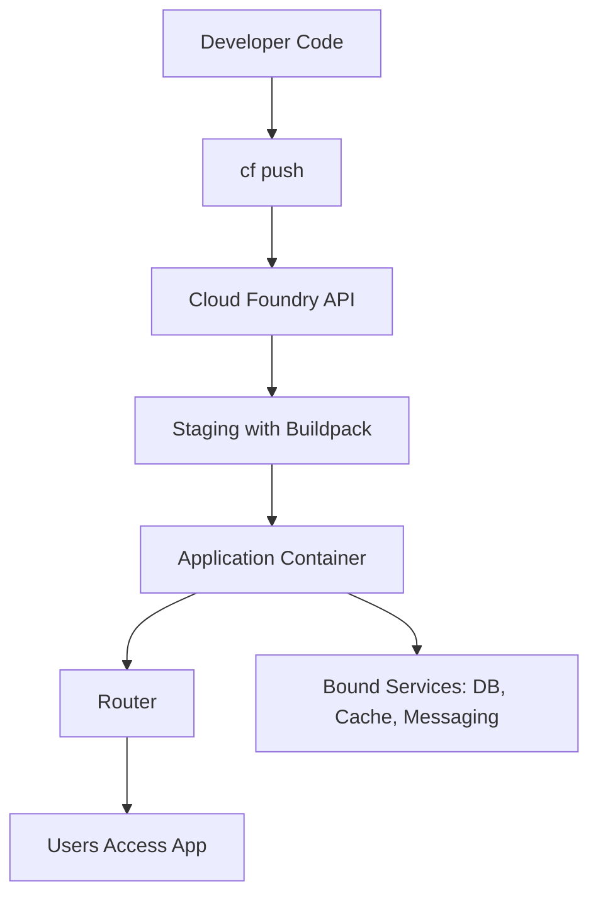
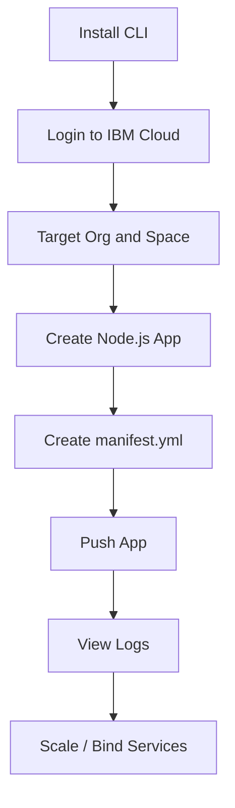
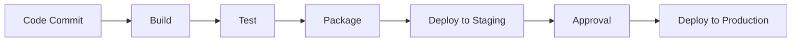
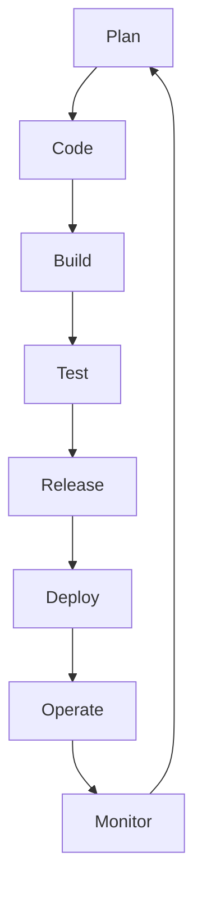
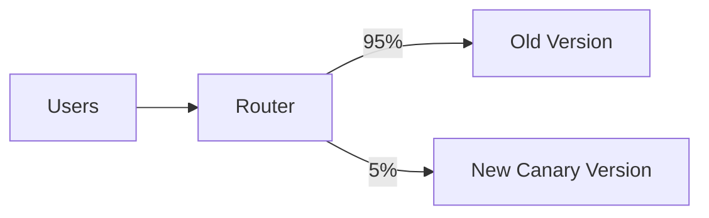

# Unit 5 - Cloud Tools and Platforms

## Topics Covered

```text
Unit-5
│── Overview of IBM Cloud Foundry
│── Cloud PaaS
│── Creating Node.js Application and Hosting on IBM Cloud using CLI
│── Cloud CI/CD
│── Continuous Integration and Continuous Deployment
│── DevOps Toolchain Insights
```

---

## 1. Overview of IBM Cloud Foundry

IBM Cloud Foundry is a Platform as a Service environment based on Cloud Foundry concepts. It allows developers to deploy applications without manually managing servers, operating systems, middleware, or low-level infrastructure.

Cloud Foundry uses the idea of pushing application code to a platform. The platform detects the runtime using buildpacks, stages the application, creates containers, routes traffic, and manages application instances.

### Why Cloud Foundry Is PaaS

A developer focuses on application code and configuration. The platform handles:

- runtime setup,
- dependency installation,
- application staging,
- routing,
- scaling,
- health management,
- logs,
- service binding.



### Important Cloud Foundry Terms

| Term | Meaning |
|---|---|
| Org | Top-level account/group boundary |
| Space | Environment inside org, such as dev/test/prod |
| App | Deployed application |
| Buildpack | Detects language/runtime and prepares app |
| Service | External or managed resource like database |
| Service Binding | Connects app to service and injects credentials |
| Route | URL used to access the application |
| Manifest | YAML file describing app deployment settings |

---

## 2. Cloud PaaS

Cloud PaaS provides a ready platform for application development and deployment. It abstracts the lower layers of cloud infrastructure.

### PaaS Responsibilities

```text
Developer manages: Application code, application data, configuration
Platform manages: Runtime, middleware, OS, scaling, routing, infrastructure
```

### PaaS Benefits

- faster development,
- simplified deployment,
- less server administration,
- automatic runtime setup,
- scaling support,
- integrated services,
- better team productivity.

### PaaS Limitations

- less control over OS internals,
- platform constraints,
- dependency on supported runtimes,
- vendor-specific deployment behavior,
- possible migration complexity.

### PaaS Use Case

A student team building a voting application can deploy a Node.js backend to a PaaS platform and bind it to a managed database. The team focuses on API routes and UI instead of server provisioning.

---

## 3. Creating a Node.js Application and Hosting on IBM Cloud using CLI

The exact command syntax may change across platform versions, but the conceptual workflow remains the same.

### Conceptual Steps



### Minimal Node.js App Structure

```text
node-app/
│── package.json
│── server.js
│── manifest.yml
```

### Example `server.js`

```javascript
const express = require('express');
const app = express();
const port = process.env.PORT || 3000;

app.get('/', (req, res) => {
  res.send('Hello from IBM Cloud Foundry');
});

app.listen(port, () => {
  console.log(`Server running on port ${port}`);
});
```

### Example `package.json`

```json
{
  "name": "node-cloud-demo",
  "version": "1.0.0",
  "main": "server.js",
  "scripts": {
    "start": "node server.js"
  },
  "dependencies": {
    "express": "latest"
  }
}
```

### Example `manifest.yml`

```yaml
applications:
  - name: node-cloud-demo
    memory: 256M
    instances: 1
    command: npm start
```

### Conceptual CLI Commands

```bash
# Login to IBM Cloud
ibmcloud login

# Target Cloud Foundry organization and space
ibmcloud target --cf

# Push the application
ibmcloud cf push

# View application logs
ibmcloud cf logs node-cloud-demo --recent

# Scale the application
ibmcloud cf scale node-cloud-demo -i 2
```

### What Happens During `cf push`

```text
1. Code is uploaded.
2. Platform detects Node.js buildpack.
3. Dependencies are installed.
4. Application is staged into a runnable container.
5. Route is created.
6. Instance is started.
7. Health is checked.
```

### Tangent Topic: Why Use `process.env.PORT`?

In PaaS platforms, the platform decides which port the application should listen on. Hardcoding `3000` may fail because the router expects the app to use the assigned environment port. Therefore, cloud apps should use:

```javascript
const port = process.env.PORT || 3000;
```

---

## 4. Cloud CI/CD

CI/CD automates the software delivery process.

- CI means Continuous Integration.
- CD can mean Continuous Delivery or Continuous Deployment.

### Continuous Integration

Continuous Integration is the practice of frequently merging code changes into a shared repository and automatically building/testing them.

### Continuous Delivery

Continuous Delivery means the application is always in a deployable state, but deployment to production may require manual approval.

### Continuous Deployment

Continuous Deployment means every change that passes tests is automatically deployed to production.



### Why CI/CD Is Needed in Cloud

Cloud applications are updated frequently. Manual deployment is slow and error-prone. CI/CD makes deployment repeatable, testable, and faster.

Benefits:

- faster releases,
- fewer manual errors,
- automated testing,
- quick rollback,
- consistent environments,
- better collaboration.

---

## 5. CI/CD Pipeline Stages

### 5.1 Source Stage

Code is stored in a version control system such as GitHub, GitLab, or Bitbucket.

### 5.2 Build Stage

The application is compiled or dependencies are installed. For Node.js, this may run:

```bash
npm install
```

### 5.3 Test Stage

Automated unit tests, integration tests, security scans, or lint checks are executed.

### 5.4 Package Stage

The application is packaged into an artifact, container image, or deployable bundle.

### 5.5 Deploy Stage

The application is deployed to staging or production.

### 5.6 Monitor Stage

Logs, metrics, errors, and performance are continuously monitored.

```text
Code -> Build -> Test -> Package -> Deploy -> Monitor -> Feedback -> Code
```

---

## 6. DevOps Toolchain Insights

DevOps combines development and operations practices to deliver software faster and more reliably. A DevOps toolchain is a set of tools that automate the software lifecycle from planning to monitoring.

### DevOps Lifecycle



### Common DevOps Toolchain Components

| Stage | Tools/Concepts |
|---|---|
| Plan | Jira, GitHub Issues, agile boards |
| Code | Git, GitHub, GitLab |
| Build | Jenkins, GitHub Actions, IBM Toolchain |
| Test | Unit tests, integration tests, Selenium |
| Package | Docker, artifact repository |
| Deploy | Cloud Foundry CLI, Kubernetes, Terraform |
| Operate | Cloud console, automation scripts |
| Monitor | Logs, metrics, alerts, dashboards |

### Infrastructure as Code

Infrastructure as Code, or IaC, means defining infrastructure using code/configuration files instead of manually clicking in a console.

Benefits:

- repeatable environments,
- version-controlled infrastructure,
- faster disaster recovery,
- reduced configuration drift.

Example tools: Terraform, CloudFormation, Ansible.

### Monitoring and Feedback

Monitoring completes the DevOps loop. It helps teams understand whether the deployed application is healthy.

Important metrics:

- CPU utilization,
- memory usage,
- request latency,
- error rate,
- throughput,
- deployment frequency,
- mean time to recovery.

---

## 7. Deployment Strategies

### 7.1 Rolling Deployment

Updates instances gradually. Some old instances remain active while new ones start.

### 7.2 Blue-Green Deployment

Two environments exist: blue and green. One serves production traffic while the other receives the new version. After testing, traffic switches to the new environment.

```text
Before: Users -> Blue v1
Deploy: Green v2 prepared separately
After:  Users -> Green v2
Rollback: Users -> Blue v1
```

### 7.3 Canary Deployment

New version is released to a small percentage of users first. If stable, traffic is increased gradually.



---

## 8. Practical Cloud Platform Comparison

| Platform Type | Example | User Focus | Best For |
|---|---|---|---|
| IaaS | EC2 | Server and OS control | Custom infrastructure |
| PaaS | IBM Cloud Foundry | Code deployment | Web apps and APIs |
| SaaS | Salesforce | Business usage | CRM and enterprise processes |
| Containers | Kubernetes | Container orchestration | Microservices |
| Serverless | Functions | Event-driven code | Small event-based tasks |

---

## 9. Common Mistakes in Cloud Deployment

- hardcoding port numbers,
- hardcoding credentials,
- not using environment variables,
- no health check endpoint,
- storing uploaded files on temporary local disk,
- no logging strategy,
- no budget alerts,
- giving excessive permissions,
- deploying directly to production without tests,
- not planning rollback.

### Good Practices

- use environment variables for configuration,
- keep secrets in secret managers,
- write logs to standard output for platform collection,
- use managed databases for persistence,
- define manifest/deployment files,
- automate tests,
- monitor after deployment,
- document deployment steps.

---

## Exam Questions and Answers

### Topic: IBM Cloud Foundry

#### 3 Marks: What is IBM Cloud Foundry?

IBM Cloud Foundry is a Platform as a Service environment that allows developers to deploy applications without managing servers and operating systems. It supports application staging, routing, scaling, buildpacks, logs, and service binding.

#### 5 Marks: Explain IBM Cloud Foundry application deployment flow.

In IBM Cloud Foundry, the developer writes application code and pushes it using CLI. The platform receives the code, detects the runtime using a buildpack, installs dependencies, stages the application, creates a runnable container, assigns a route, starts application instances, and monitors health. The developer can then view logs, bind services, and scale instances.

```text
Code -> cf push -> Buildpack -> Container -> Route -> Running App
```

### Topic: Node.js Hosting

#### 3 Marks: Why is `process.env.PORT` used in cloud Node.js apps?

Cloud platforms assign the port dynamically through an environment variable. A Node.js application should listen on `process.env.PORT` so that the platform router can correctly forward traffic to the application.

#### 5 Marks: Explain steps to host a Node.js app on IBM Cloud using CLI.

To host a Node.js app, first create the application with `server.js`, `package.json`, and optionally `manifest.yml`. Install and configure the IBM Cloud CLI, log in, target the Cloud Foundry organization and space, and run `ibmcloud cf push`. The platform stages the app using a Node.js buildpack, installs dependencies, starts the app, and creates a route. Logs can be viewed using CLI, and the app can be scaled by increasing the number of instances.

### Topic: CI/CD and DevOps

#### 3 Marks: What is CI/CD?

CI/CD is an automated software delivery practice. Continuous Integration automatically builds and tests code changes. Continuous Delivery keeps software ready for release, while Continuous Deployment automatically deploys changes that pass tests.

#### 5 Marks: Explain DevOps toolchain in cloud computing.

A DevOps toolchain is a collection of tools used across the software lifecycle: planning, coding, building, testing, releasing, deploying, operating, and monitoring. In cloud computing, DevOps toolchains automate deployment to cloud platforms, improve reliability, reduce manual errors, and enable faster feedback. Common tools include Git, CI/CD pipelines, Docker, Terraform, cloud CLI tools, monitoring dashboards, and logging systems.

---

Previous: [[Unit-04 - Cloud Simulators]] | Back to Index: [[00_Index]]
