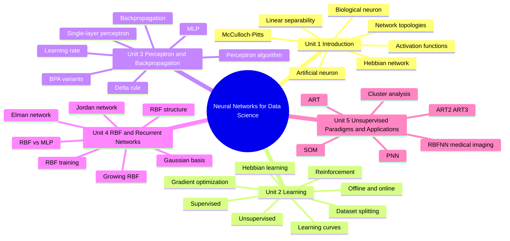

# TEE7157 — Neural Networks for Data Science

> [!info] How to use these notes in Obsidian
> - Each unit is a separate Markdown note.
> - Mermaid diagrams render in Obsidian if Mermaid is enabled.
> - Formulas use LaTeX display blocks with `$$ ... $$`.
> - HTML blocks are used for visual cards and flow diagrams.
> - Use the quick revision tables before exams, then study the detailed sections.

## Course Map

## Files

1. [[Unit 1 - Introduction to Neural Networks]]
2. [[Unit 2 - Learning in Neural Networks]]
3. [[Unit 3 - Perceptron Backpropagation and Variants]]
4. [[Unit 4 - RBF and Recurrent Neural Networks]]
5. [[Unit 5 - Unsupervised Learning Networks and Case Studies]]

## High-Yield Exam Strategy

| Exam Task | What to write |
|---|---|
| Define ANN | Model inspired by biological neurons that learns input-output mapping using weights, bias, activation and learning rule. |
| Draw neuron | Show inputs, weights, summation, bias, activation, output. |
| Compare learning paradigms | Supervised = labelled data, unsupervised = structure discovery, reinforcement = reward-based decisions. |
| Perceptron limitation | Can solve only linearly separable problems, fails on XOR. |
| Backpropagation | Forward pass, error computation, backward gradients, weight update. |
| RBF | Hidden neurons use distance from centers, usually Gaussian basis. |
| SOM | Unsupervised topology-preserving clustering. |
| ART | Stable learning without forgetting using vigilance parameter. |
