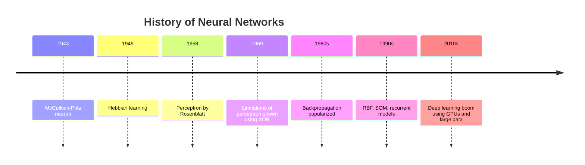
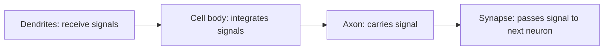
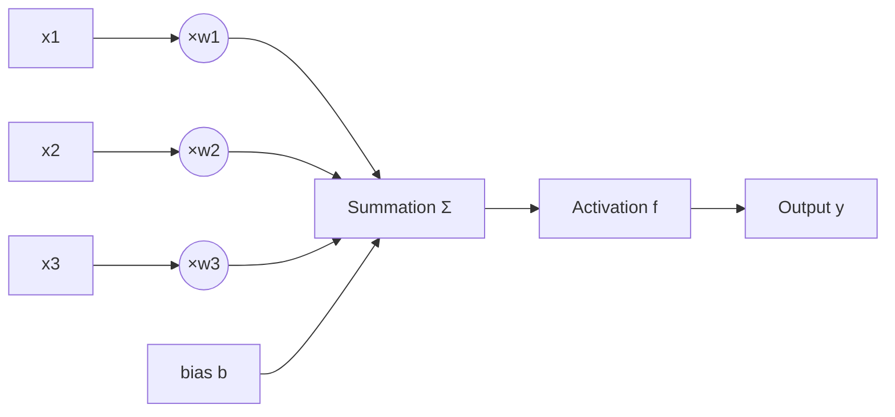
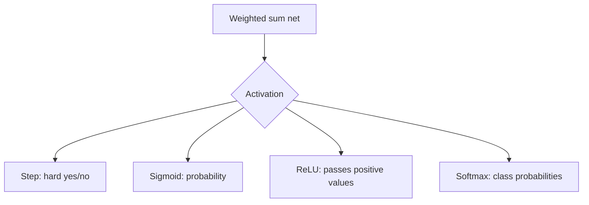
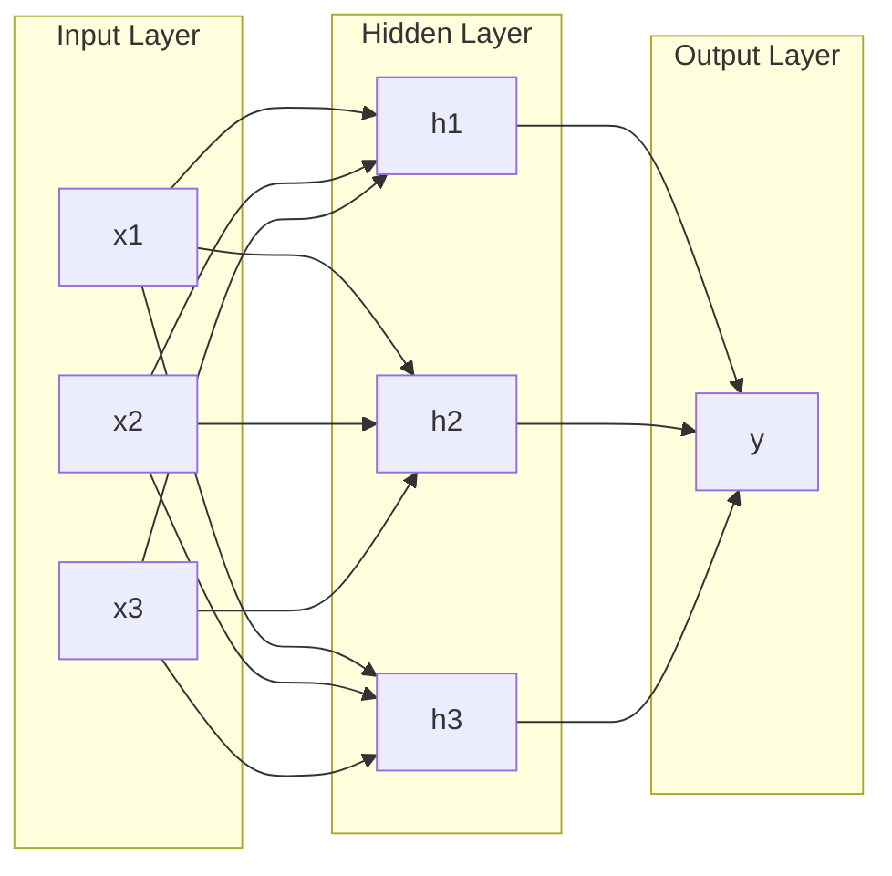
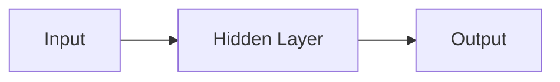
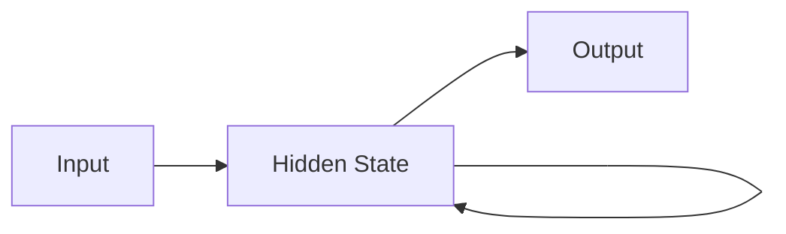
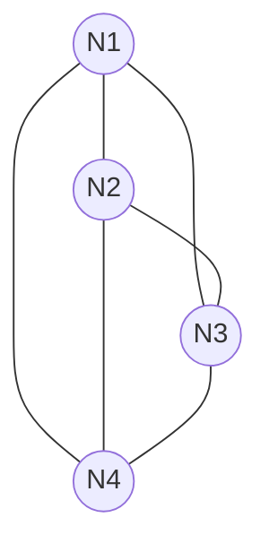
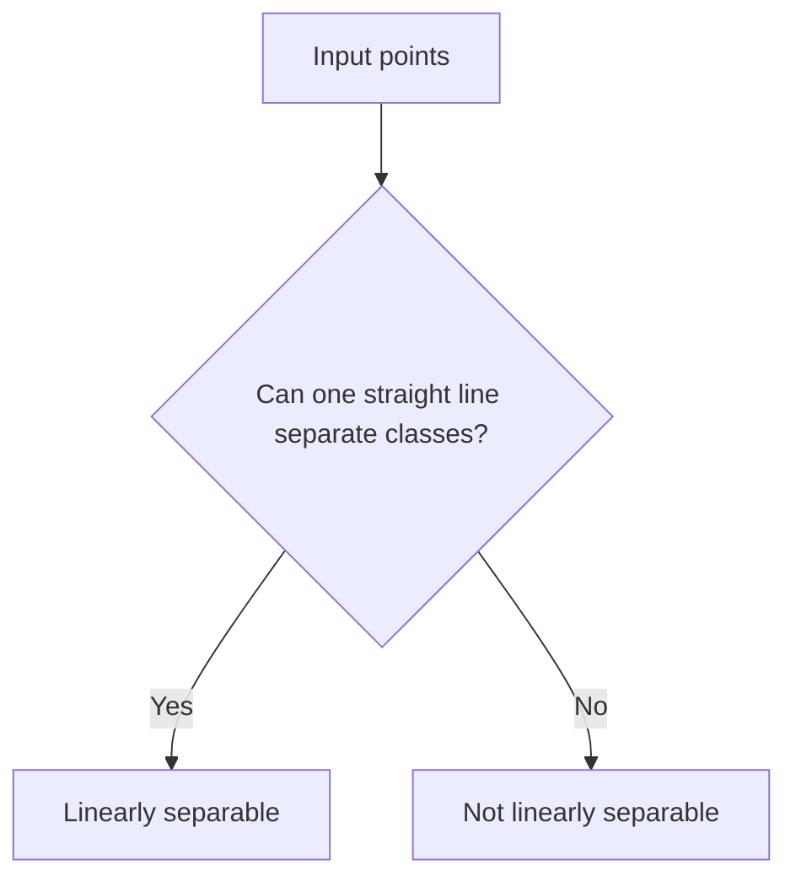

# Unit 1 — Introduction to Neural Networks

## 1. Big Picture

Artificial Neural Networks (ANNs) are computational models inspired by the brain. They learn patterns from examples by adjusting **weights** between connected processing units called **neurons**.

<b>Core idea:</b> A neural network does not usually follow hand-written rules. Instead, it learns a mapping:
  

Input Data → Weighted Processing → Activation → Output / Decision

Example:

| Task | Input | Output |
|---|---|---|
| Email spam detection | Email text features | Spam / Not spam |
| Medical image detection | CT/X-ray image pixels | Nodule / Normal |
| Prediction | Past values | Future value |
| Classification | Feature vector | Class label |

---

## 2. Motivation and History

### Why neural networks?
Traditional programming works well when rules are clear. But many real-world problems are hard to describe using exact rules.

Examples:
- Recognizing handwriting
- Detecting cancer nodules in scans
- Predicting stock or weather patterns
- Understanding speech
- Clustering customers

ANNs are useful because they can:
1. Learn from examples.
2. Generalize to unseen data.
3. Approximate complex non-linear functions.
4. Work with noisy and incomplete data.

### Historical flow

---

## 3. Biological Neuron

A biological neuron is a nerve cell that receives signals, processes them, and transmits output.

### Components

| Biological Part | Meaning | ANN Equivalent |
|---|---|---|
| Dendrites | Receive signals from other neurons | Inputs |
| Synapses | Connection points, strength varies | Weights |
| Cell body / nucleus | Processes incoming signals | Summation unit |
| Axon | Sends output signal | Output line |
| Axon terminals | Transmit to other neurons | Output connections |

<b>Exam line:</b> ANN is inspired by the biological neuron, where dendrites behave like inputs, synapses behave like weighted connections, and the axon behaves like the output pathway.

---

## 4. Artificial Neuron Model

An artificial neuron receives input values, multiplies them by weights, adds bias, applies activation, and produces output.

### Mathematical model

$$
net = \sum_{i=1}^{n} w_i x_i + b
$$

$$
y = f(net)
$$

Where:

| Symbol | Meaning |
|---|---|
| $x_i$ | input feature |
| $w_i$ | weight connected to input |
| $b$ | bias |
| $net$ | total weighted input |
| $f$ | activation function |
| $y$ | neuron output |

### Visual

---

## 5. Important ANN Terminologies

### 5.1 Propagation Function

The propagation function combines all inputs and weights.

Most common propagation function:

$$
net = \sum_{i=1}^{n} w_i x_i + b
$$

It answers: **How much total signal reaches the neuron?**

### 5.2 Activation Function

The activation function decides whether and how strongly a neuron fires.

It introduces **non-linearity**, which allows neural networks to solve complex problems.

### 5.3 Output Function

The output function converts the neuron state into a value sent to the next layer. In many models, the output is simply the activation value:

$$
y = f(net)
$$

---

## 6. Common Activation Functions

| Function | Formula | Range | Use |
|---|---|---|---|
| Binary step | $f(x)=1$ if $x\geq \theta$, else $0$ | 0 or 1 | McCulloch-Pitts, perceptron |
| Linear | $f(x)=x$ | $(-\infty,\infty)$ | Regression output |
| Sigmoid | $f(x)=\frac{1}{1+e^{-x}}$ | 0 to 1 | Binary probability |
| Tanh | $f(x)=\tanh(x)$ | -1 to 1 | Hidden layers, zero-centered |
| ReLU | $f(x)=\max(0,x)$ | 0 to $\infty$ | Deep networks |
| Softmax | $f(z_i)=\frac{e^{z_i}}{\sum_j e^{z_j}}$ | probabilities | Multi-class output |

### Activation visualization

---

## 7. Components of Artificial Neural Network

An ANN has:

1. **Input layer** — receives data.
2. **Hidden layer(s)** — extracts features/patterns.
3. **Output layer** — produces prediction.
4. **Weights** — learnable connection strengths.
5. **Biases** — shift the activation boundary.
6. **Activation functions** — introduce non-linearity.
7. **Learning rule** — updates weights.
8. **Loss/error function** — measures prediction mistake.

---

## 8. Network Topologies

Network topology means the arrangement of neurons and connections.

### 8.1 Feedforward Network

Information flows only in one direction: input to output.

Used for:
- Classification
- Regression
- Pattern recognition

### 8.2 Recurrent Network

Connections form cycles, so the network has memory of previous states.

Used for:
- Sequence prediction
- Time-series data
- Speech/text processing

### 8.3 Completely Linked Network

Each neuron is connected with every other neuron.

Used in associative memory models and some recurrent architectures.

---

## 9. Neuron Activation Order

### 9.1 Synchronous Activation

All neurons update at the same time.

Example:
- At time $t$, all neurons calculate output.
- At time $t+1$, all outputs are updated together.

Useful when the network is simulated in discrete time steps.

### 9.2 Asynchronous Activation

Only one neuron or a subset of neurons updates at a time.

Useful in:
- Recurrent networks
- Hopfield-like networks
- Systems where updates occur gradually

| Type | Meaning | Advantage | Limitation |
|---|---|---|---|
| Synchronous | All neurons update together | Simple and parallel | May cause oscillation |
| Asynchronous | One/few neurons update | More biologically realistic | Slower |

---

## 10. Communication with Outside World

### Input of data
Input values must be converted into numerical form.

Examples:
- Image → pixel values
- Text → token vectors
- Category → one-hot vector
- Sensor data → normalized values

### Output of data
Output depends on task:

| Task | Output format |
|---|---|
| Binary classification | 0/1 or probability |
| Multi-class classification | Softmax probabilities |
| Regression | Continuous number |
| Clustering | Cluster label |
| Detection | Class + bounding box |

---

## 11. McCulloch-Pitts Neuron

The McCulloch-Pitts neuron is an early binary neuron model.

### Features

1. Inputs are binary: 0 or 1.
2. Output is binary: 0 or 1.
3. Uses a threshold.
4. Weights are usually fixed.
5. No learning mechanism.

### Formula

$$
y =
\begin{cases}
1, & \sum x_i \geq \theta \\
0, & \sum x_i < \theta
\end{cases}
$$

Where $\theta$ is threshold.

### Example: AND gate

For AND, output is 1 only when both inputs are 1.

Choose threshold:

$$
\theta = 2
$$

| $x_1$ | $x_2$ | Sum | Output |
|---|---:|---:|---:|
| 0 | 0 | 0 | 0 |
| 0 | 1 | 1 | 0 |
| 1 | 0 | 1 | 0 |
| 1 | 1 | 2 | 1 |

So:

$$
y = 1 \text{ if } x_1+x_2 \geq 2
$$

### Example: OR gate

Choose threshold:

$$
\theta = 1
$$

| $x_1$ | $x_2$ | Sum | Output |
|---|---:|---:|---:|
| 0 | 0 | 0 | 0 |
| 0 | 1 | 1 | 1 |
| 1 | 0 | 1 | 1 |
| 1 | 1 | 2 | 1 |

---

## 12. Linear Separability

A problem is linearly separable if classes can be separated using a straight line, plane, or hyperplane.

For 2D:

$$
w_1x_1 + w_2x_2 + b = 0
$$

This is a decision boundary.

### AND and OR are linearly separable

They can be separated by a straight line.

### XOR is not linearly separable

| $x_1$ | $x_2$ | XOR |
|---|---:|---:|
| 0 | 0 | 0 |
| 0 | 1 | 1 |
| 1 | 0 | 1 |
| 1 | 1 | 0 |

The positive points are diagonal, so no single straight line can separate them.

<b>Exam point:</b> A single-layer perceptron fails on XOR because XOR is not linearly separable.

---

## 13. Hebb Network

Hebbian learning is based on the idea:

> Neurons that fire together wire together.

If input and output are active together, the connection weight between them increases.

### Hebbian learning rule

$$
\Delta w_i = \eta x_i y
$$

$$
w_i(new) = w_i(old) + \eta x_i y
$$

Where:

| Symbol | Meaning |
|---|---|
| $\eta$ | learning rate |
| $x_i$ | input |
| $y$ | output/target signal |
| $\Delta w_i$ | weight change |

### Why it works
If both $x_i$ and $y$ are high, the weight increases. This strengthens useful associations.

---

## 14. Solved Numerical Example 1 — Artificial Neuron Output

### Problem
Given:

$$
x_1=1,\quad x_2=0,\quad x_3=1
$$

$$
w_1=0.5,\quad w_2=-0.4,\quad w_3=0.8,\quad b=-0.2
$$

Use binary step activation with threshold 0.

Find output.

### Step 1: Calculate net input

$$
net = w_1x_1 + w_2x_2 + w_3x_3 + b
$$

$$
net = (0.5)(1) + (-0.4)(0) + (0.8)(1) - 0.2
$$

$$
net = 0.5 + 0 + 0.8 - 0.2 = 1.1
$$

### Step 2: Apply activation

Binary step:

$$
y =
\begin{cases}
1, & net \geq 0\\
0, & net < 0
\end{cases}
$$

Since $1.1 \geq 0$:

$$
y = 1
$$

### Why?
The total weighted signal is positive, so the neuron fires.

---

## 15. Solved Numerical Example 2 — Hebbian Weight Update

### Problem
Initial weights:

$$
w_1=0,\quad w_2=0
$$

Input:

$$
x_1=1,\quad x_2=-1
$$

Target/output:

$$
y=1
$$

Learning rate:

$$
\eta=0.5
$$

Find updated weights.

### Step 1: Use Hebbian rule

$$
\Delta w_i = \eta x_i y
$$

### Step 2: Calculate updates

For $w_1$:

$$
\Delta w_1 = 0.5(1)(1)=0.5
$$

For $w_2$:

$$
\Delta w_2 = 0.5(-1)(1)=-0.5
$$

### Step 3: Update weights

$$
w_1(new)=0+0.5=0.5
$$

$$
w_2(new)=0-0.5=-0.5
$$

### Final answer

$$
w_1=0.5,\quad w_2=-0.5
$$

### Why?
The first input supports the positive output, so its weight increases. The second input is negative, so its connection becomes negative.

---

## 16. Unit 1 Quick Revision

| Concept | One-line meaning |
|---|---|
| ANN | Network of artificial neurons that learns from examples |
| Weight | Strength of connection |
| Bias | Shifts decision boundary |
| Activation | Decides neuron output |
| Feedforward | Data moves input → output only |
| Recurrent | Has feedback/memory |
| McCulloch-Pitts | Binary threshold neuron |
| Linear separability | Classes separable by one hyperplane |
| Hebbian learning | Strengthen connections that activate together |
