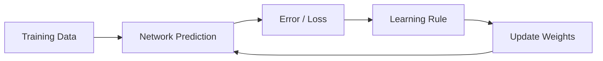
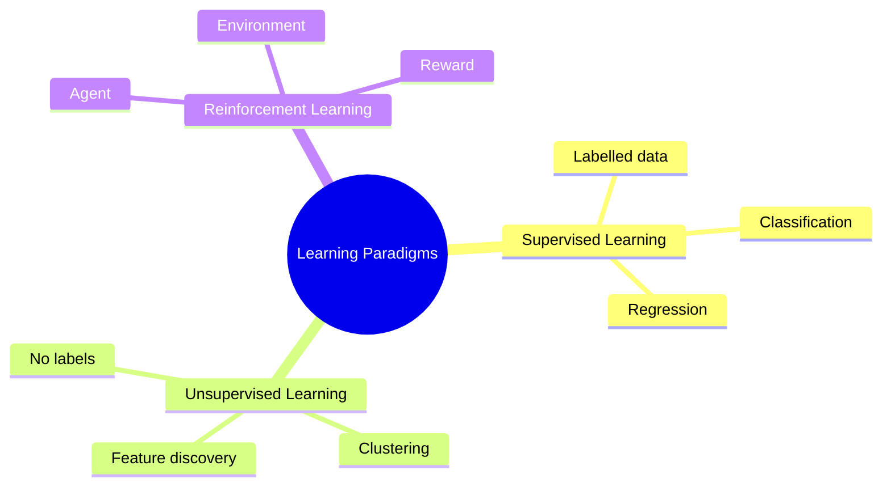
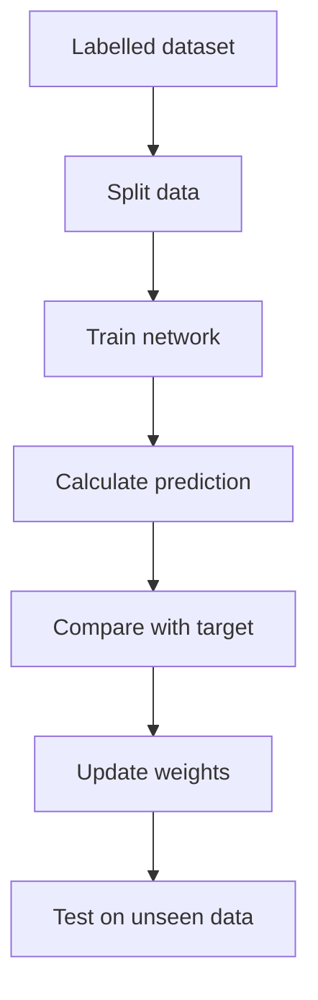
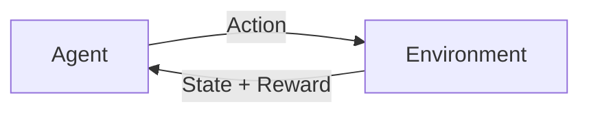
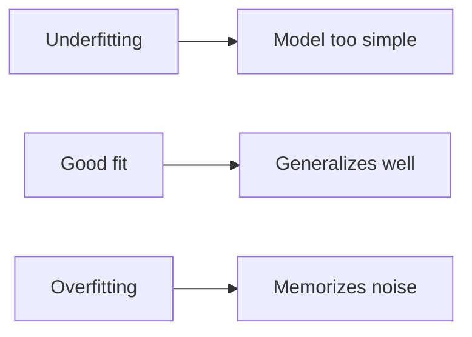
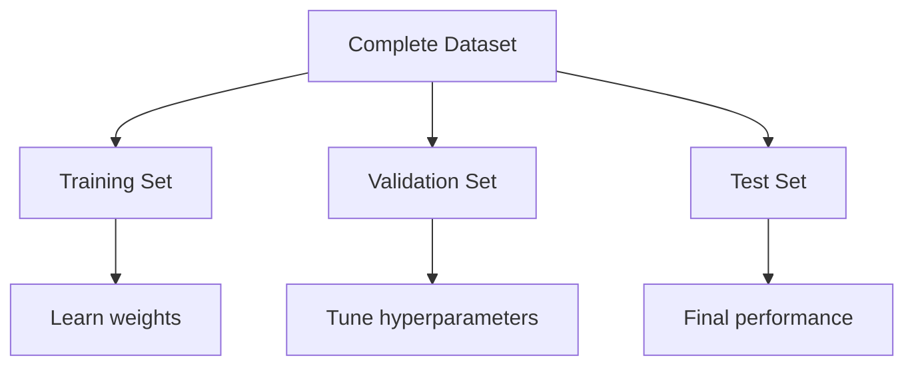
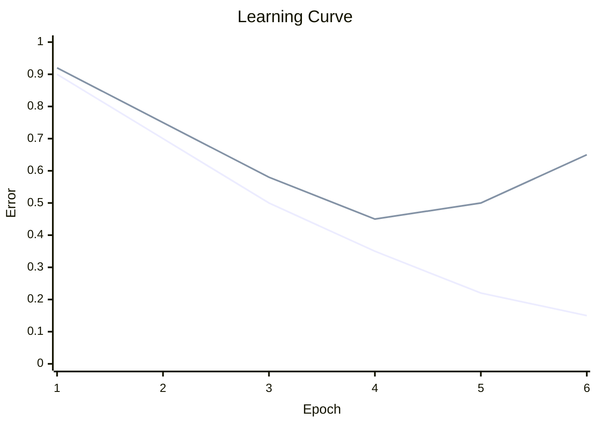
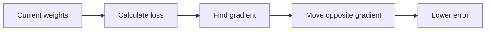
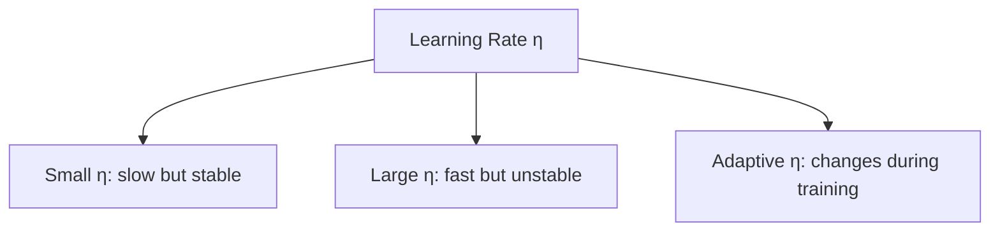

# Unit 2 — Learning in Neural Networks

## 1. Meaning of Learning

In neural networks, learning means **adjusting weights and biases** so that the network gives better outputs.

A network starts with random or zero weights. During training, it observes examples and updates weights using a learning rule.

### General learning equation

$$
w(new) = w(old) + \Delta w
$$

The value of $\Delta w$ depends on the learning rule.

---

## 2. Learning Paradigms

There are three major learning paradigms:

---

## 3. Supervised Learning

Supervised learning uses labelled examples.

Each training sample has:
- Input $x$
- Correct output/target $t$

The network predicts $y$, compares it with $t$, and updates weights.

### Objective

Minimize error:

$$
E = \frac{1}{2}(t-y)^2
$$

For many samples:

$$
E = \frac{1}{2}\sum_{p}(t_p-y_p)^2
$$

### Examples

| Application | Input | Target |
|---|---|---|
| Image classification | Image pixels | Class label |
| Medical diagnosis | Patient/image features | Disease / no disease |
| House price prediction | Area, rooms, location | Price |
| Spam detection | Email features | Spam / not spam |

### Process

---

## 4. Unsupervised Learning

Unsupervised learning uses data without target labels.

The network discovers:
- Groups
- Clusters
- Similarity
- Hidden structure
- Feature patterns

### Examples

| Application | Purpose |
|---|---|
| Customer segmentation | Group similar customers |
| Image compression | Find compact representation |
| Anomaly detection | Detect unusual behavior |
| SOM | Map high-dimensional data to low-dimensional grid |

### Common unsupervised models
- Self Organizing Map (SOM)
- K-means-like competitive networks
- Autoencoders
- ART networks

---

## 5. Reinforcement Learning

Reinforcement learning learns through reward and punishment.

The learner is called an **agent**. It interacts with the environment.

### Terms

| Term | Meaning |
|---|---|
| Agent | Learner/decision-maker |
| Environment | World in which agent acts |
| State | Current situation |
| Action | Choice made by agent |
| Reward | Feedback signal |
| Policy | Strategy for choosing actions |

### Applications
- Robotics
- Game playing
- Autonomous vehicles
- Resource optimization
- Control systems

---

## 6. Offline and Online Learning

### Offline learning / batch learning

The complete dataset is available before training.

Weights are updated after processing a batch or full dataset.

Useful when:
- Dataset is fixed
- Training can be done before deployment
- Accuracy is more important than immediate adaptation

### Online learning

Data arrives continuously, and the model updates as each sample arrives.

Useful when:
- Data distribution changes over time
- Real-time adaptation is needed
- Streaming data is used

| Feature | Offline Learning | Online Learning |
|---|---|---|
| Data availability | Full dataset | One sample/mini-batch at a time |
| Speed | Slower training, stable | Fast adaptation |
| Memory | Needs more storage | Less storage |
| Risk | May become outdated | Sensitive to noisy samples |

---

## 7. Training Patterns and Teaching Inputs

A **training pattern** is one input example used for learning.

For supervised learning:

$$
(x,t)
$$

Where:
- $x$ = input vector
- $t$ = target/teaching input

Example:

$$
x = [age, salary, credit\ score]
$$

$$
t = loan\ approved
$$

For unsupervised learning, only $x$ is available.

---

## 8. Use of Training Samples

Training samples are used to:
1. Estimate network parameters.
2. Learn decision boundaries.
3. Reduce prediction error.
4. Improve generalization.

But if the model memorizes training samples, it overfits.

### Overfitting vs Underfitting

| Case | Training error | Test error | Meaning |
|---|---:|---:|---|
| Underfitting | High | High | Model is too simple |
| Good fit | Low | Low | Learns pattern |
| Overfitting | Very low | High | Memorizes training data |

---

## 9. Dataset Split

A dataset is usually divided into:

1. **Training set** — used to update weights.
2. **Validation set** — used to tune hyperparameters.
3. **Testing set** — used for final unbiased evaluation.

Typical split:

$$
70\% : 15\% : 15\%
$$

or

$$
80\% : 10\% : 10\%
$$

### Why split data?

If we evaluate on the same data used for training, we may get overly optimistic results.

---

## 10. Implication of Splitting Dataset

### Training set
If training set is too small:
- Model may not learn enough patterns.

### Validation set
If validation set is missing:
- Hyperparameters may be selected wrongly.

### Test set
If test set is used repeatedly during tuning:
- It becomes indirectly part of training.
- Final result becomes biased.

<b>Exam point:</b> The test set must be used only after model selection is complete.

---

## 11. Learning Curves

Learning curves show how training and validation error change over epochs.

### Common curve

### Interpretation

| Pattern | Diagnosis |
|---|---|
| Training error high, validation error high | Underfitting |
| Training error low, validation error high | Overfitting |
| Both errors low | Good learning |
| Error oscillates | Learning rate may be too high |
| Error decreases very slowly | Learning rate may be too low |

---

## 12. Gradient Optimization Procedures

Neural networks often learn by minimizing a loss function.

### Gradient

A gradient tells the direction of steepest increase of loss.

To reduce loss, move in the opposite direction.

$$
w(new) = w(old) - \eta \frac{\partial E}{\partial w}
$$

Where:
- $\eta$ = learning rate
- $\frac{\partial E}{\partial w}$ = gradient of error with respect to weight

### Why subtract gradient?
Because the gradient points upward on the error surface. To minimize error, go downward.

---

## 13. Gradient Descent Types

| Type | Weight update after | Advantage | Limitation |
|---|---|---|---|
| Batch Gradient Descent | Whole dataset | Stable | Slow for large data |
| Stochastic Gradient Descent | One sample | Fast, noisy helps escape | Unstable updates |
| Mini-batch Gradient Descent | Small batch | Balanced and common | Needs batch size selection |

### Formula

$$
w_{new} = w_{old} - \eta \nabla E(w)
$$

---

## 14. Learning Rate

The learning rate controls step size during optimization.

| Learning rate | Effect |
|---|---|
| Too small | Very slow learning |
| Good | Smooth convergence |
| Too large | Oscillation/divergence |

---

## 15. Hebbian Learning Rule

Hebbian learning strengthens the connection between neurons that activate together.

$$
\Delta w_i = \eta x_i y
$$

$$
w_i(new) = w_i(old) + \eta x_i y
$$

In vector form:

$$
\Delta W = \eta xy^T
$$

### Algorithm

1. Initialize weights.
2. Present input pattern.
3. Compute or use target output.
4. Update weights using Hebbian rule.
5. Repeat for all patterns.

---

## 16. Solved Example 1 — Dataset Split

### Problem
A dataset has 2000 samples. Split it into 70% training, 15% validation and 15% testing.

### Step 1: Training samples

$$
Training = 0.70 \times 2000 = 1400
$$

### Step 2: Validation samples

$$
Validation = 0.15 \times 2000 = 300
$$

### Step 3: Testing samples

$$
Testing = 0.15 \times 2000 = 300
$$

### Final answer

| Set | Samples |
|---|---:|
| Training | 1400 |
| Validation | 300 |
| Testing | 300 |

### Why?
Training data learns weights, validation tunes hyperparameters, and test data gives final unbiased performance.

---

## 17. Solved Example 2 — One Step of Gradient Descent

### Problem
Given error function:

$$
E(w)=w^2
$$

Initial weight:

$$
w=4
$$

Learning rate:

$$
\eta=0.1
$$

Find new weight after one gradient descent step.

### Step 1: Differentiate error

$$
\frac{dE}{dw}=2w
$$

### Step 2: Substitute $w=4$

$$
\frac{dE}{dw}=2(4)=8
$$

### Step 3: Apply update rule

$$
w_{new}=w_{old}-\eta \frac{dE}{dw}
$$

$$
w_{new}=4-0.1(8)
$$

$$
w_{new}=4-0.8=3.2
$$

### Final answer

$$
w_{new}=3.2
$$

### Why?
The error increases as $w$ moves away from 0. Since gradient is positive, subtracting it moves $w$ closer to 0.

---

## 18. Solved Example 3 — Hebbian Learning with Two Patterns

### Problem
Initial weights:

$$
w_1=0,\quad w_2=0
$$

Learning rate:

$$
\eta=1
$$

Training patterns:

| Pattern | $x_1$ | $x_2$ | $y$ |
|---|---:|---:|---:|
| 1 | 1 | 1 | 1 |
| 2 | 1 | -1 | -1 |

Find final weights.

### Pattern 1 update

$$
\Delta w_1 = \eta x_1 y = 1(1)(1)=1
$$

$$
\Delta w_2 = 1(1)(1)=1
$$

Weights:

$$
w_1=1,\quad w_2=1
$$

### Pattern 2 update

$$
\Delta w_1 = 1(1)(-1)=-1
$$

$$
\Delta w_2 = 1(-1)(-1)=1
$$

Final weights:

$$
w_1=1-1=0
$$

$$
w_2=1+1=2
$$

### Final answer

$$
w_1=0,\quad w_2=2
$$

### Why?
Hebbian rule strengthens weights when input and output signs match, and weakens them when signs differ.

---

## 19. Unit 2 Quick Revision

| Concept | Meaning |
|---|---|
| Supervised learning | Learns from labelled data |
| Unsupervised learning | Finds hidden structure without labels |
| Reinforcement learning | Learns actions from rewards |
| Offline learning | Learns from stored full dataset |
| Online learning | Learns continuously from incoming data |
| Training set | Updates weights |
| Validation set | Tunes model/hyperparameters |
| Test set | Final evaluation |
| Learning curve | Error vs epoch diagnostic graph |
| Gradient descent | Moves weights opposite gradient |
| Hebbian learning | Neurons firing together strengthen connection |
