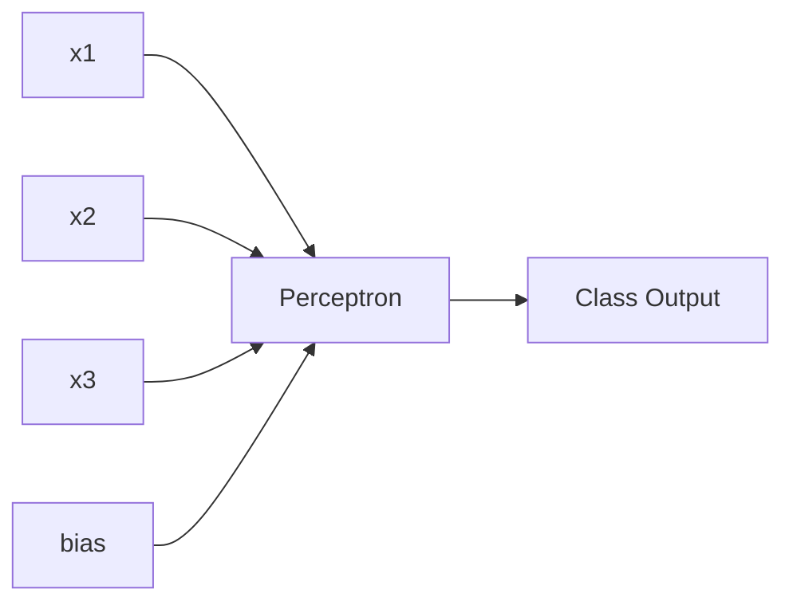
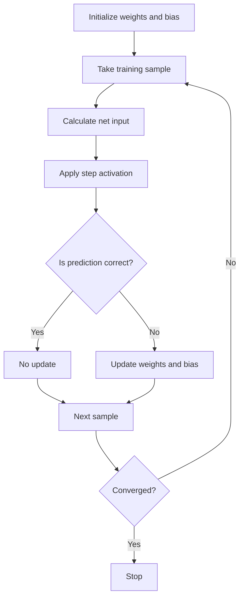
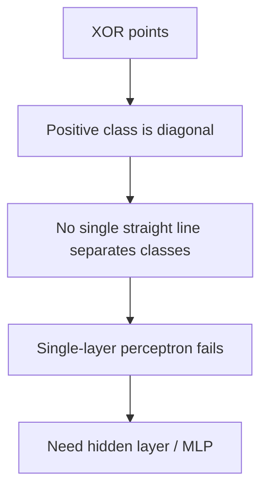
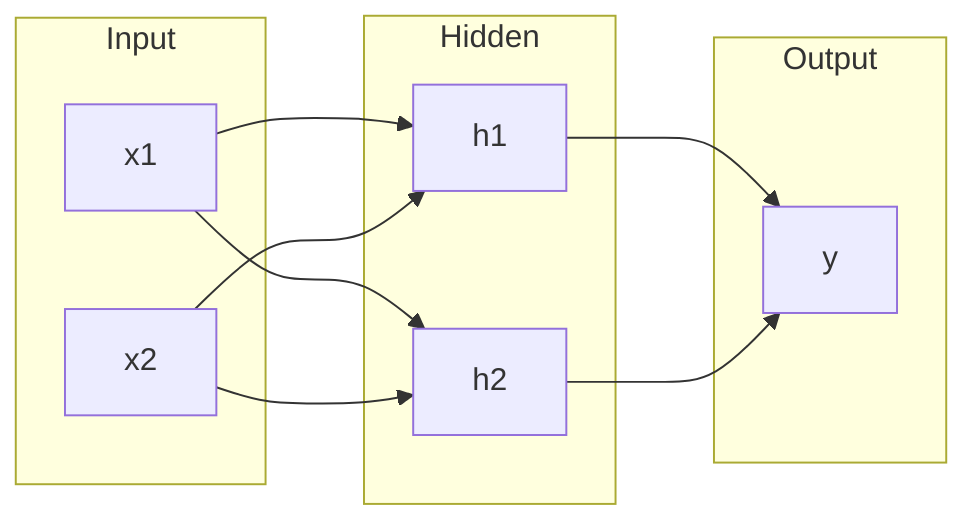
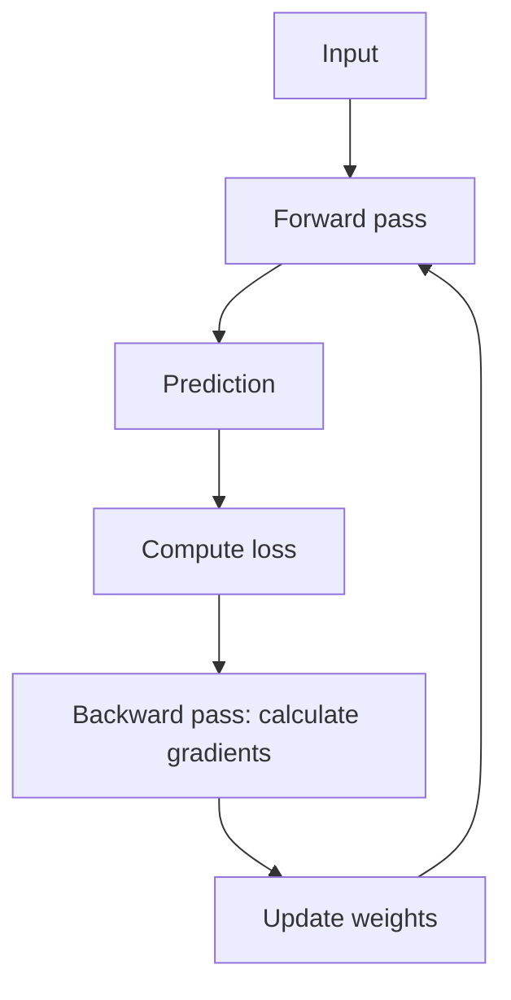
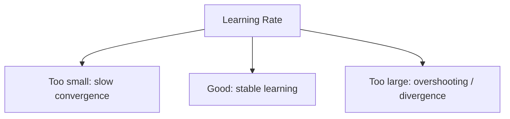

# Unit 3 — The Perceptron, Backpropagation and Variants

## 1. Unit Overview

This unit connects the early **single-layer perceptron** to the more powerful **multilayer perceptron (MLP)** trained using **backpropagation**.

---

## 2. Single-Layer Perceptron

A perceptron is a binary classifier.

It computes:

$$
net = \sum_{i=1}^{n} w_i x_i + b
$$

Then applies a step activation:

$$
y =
\begin{cases}
1, & net \geq 0\\
0, & net < 0
\end{cases}
$$

### Architecture

### Decision boundary

For two inputs:

$$
w_1x_1+w_2x_2+b=0
$$

This is a straight line. Points on one side are class 1, and points on the other side are class 0.

---

## 3. Perceptron Learning Algorithm

The perceptron updates weights when prediction is wrong.

### Update rule

$$
w_i(new)=w_i(old)+\eta(t-y)x_i
$$

$$
b(new)=b(old)+\eta(t-y)
$$

Where:
- $t$ = target output
- $y$ = predicted output
- $\eta$ = learning rate

### Algorithm

---

## 4. Perceptron Convergence Theorem

The theorem states:

> If the training data is linearly separable, then the perceptron learning algorithm will converge in a finite number of steps.

### Meaning
If a straight line/hyperplane can separate the classes, the perceptron will eventually find suitable weights.

### Important condition
The theorem applies only to linearly separable data.

---

## 5. Limitations of Single-Layer Perceptron

1. Can solve only linearly separable problems.
2. Cannot solve XOR.
3. Uses hard threshold, so gradient-based training is difficult.
4. Cannot learn complex non-linear boundaries.
5. Works poorly for multi-level feature extraction.

### XOR problem

| $x_1$ | $x_2$ | XOR |
|---|---:|---:|
| 0 | 0 | 0 |
| 0 | 1 | 1 |
| 1 | 0 | 1 |
| 1 | 1 | 0 |

---

## 6. Delta Rule

The delta rule is a gradient-based learning strategy used with differentiable activation functions.

It minimizes squared error:

$$
E = \frac{1}{2}(t-y)^2
$$

Weight update:

$$
\Delta w_i = \eta(t-y)f'(net)x_i
$$

If activation is linear, $f'(net)=1$:

$$
\Delta w_i = \eta(t-y)x_i
$$

### Why is delta rule important?
The perceptron rule only says update when wrong. Delta rule uses the amount of error and gradient direction, making it suitable for continuous outputs and backpropagation.

---

## 7. Multilayer Perceptron Network

An MLP has one or more hidden layers.

### Why hidden layers?
Hidden layers transform the input space. This allows the network to learn non-linear decision boundaries.

### Exam line
A multilayer perceptron overcomes the limitation of a single-layer perceptron by using hidden layers and differentiable activation functions.

---

## 8. Backpropagation Network

Backpropagation is the main algorithm for training MLPs.

It computes gradients layer by layer using the chain rule.

### Main phases

1. Forward pass
2. Error calculation
3. Backward pass
4. Weight update

---

## 9. Backpropagation Mathematics

For a neuron:

$$
net_j = \sum_i w_{ij}x_i + b_j
$$

$$
y_j=f(net_j)
$$

Loss for one output:

$$
E=\frac{1}{2}(t-y)^2
$$

Output layer error term:

$$
\delta = (t-y)f'(net)
$$

Weight update:

$$
\Delta w_{ij}=\eta \delta_j x_i
$$

$$
w_{ij}(new)=w_{ij}(old)+\Delta w_{ij}
$$

For hidden layer neuron:

$$
\delta_j = f'(net_j)\sum_k \delta_k w_{jk}
$$

### Meaning
A hidden neuron does not have direct target output. Its error is calculated from the weighted error of neurons in the next layer.

---

## 10. Activation Functions in Backpropagation

Backpropagation needs differentiable activation functions.

| Activation | Formula | Derivative |
|---|---|---|
| Sigmoid | $f(x)=\frac{1}{1+e^{-x}}$ | $f(x)(1-f(x))$ |
| Tanh | $f(x)=\tanh(x)$ | $1-\tanh^2(x)$ |
| ReLU | $f(x)=\max(0,x)$ | 1 if $x>0$, else 0 |

---

## 11. Weight Initialization

Weights should usually be small random values.

### Why not initialize all weights to same value?
If all weights are same, all neurons learn the same feature. This is called symmetry problem.

### Common methods
- Small random initialization
- Xavier/Glorot initialization
- He initialization for ReLU networks

| Method | Best for | Idea |
|---|---|---|
| Small random | Simple networks | Break symmetry |
| Xavier | Sigmoid/tanh | Keep variance stable |
| He | ReLU | Compensate for inactive negative side |

---

## 12. Effect of Learning Rate

Learning rate controls how much weights change.

### Exam explanation
If learning rate is too high, error may oscillate and fail to converge. If it is too low, training becomes very slow and may get stuck.

---

## 13. Variants of Backpropagation Algorithm

| Variant | Main idea | Advantage |
|---|---|---|
| Batch backpropagation | Update after all samples | Stable |
| Stochastic backpropagation | Update after each sample | Faster, noisy exploration |
| Mini-batch backpropagation | Update after small batch | Most commonly used |
| Momentum BP | Adds previous update direction | Reduces oscillation |
| Adaptive learning rate | Changes $\eta$ during training | Better convergence |
| RPROP | Uses gradient sign, not magnitude | Faster for some problems |
| Conjugate gradient | More advanced search direction | Fewer iterations |
| Levenberg-Marquardt | Second-order approximation | Fast for small/medium networks |

### Momentum formula

$$
\Delta w(t)=\eta \delta x+\alpha \Delta w(t-1)
$$

Where $\alpha$ is momentum coefficient.

---

## 14. Applications of Backpropagation

- Pattern recognition
- Image classification
- Speech recognition
- Medical diagnosis
- Financial prediction
- Function approximation
- Forecasting
- Control systems

---

## 15. Solved Example 1 — Perceptron Weight Update

### Problem
Given:

$$
x_1=1,\quad x_2=0
$$

Initial weights:

$$
w_1=0.2,\quad w_2=-0.1,\quad b=0.1
$$

Learning rate:

$$
\eta=0.5
$$

Target:

$$
t=0
$$

Use step activation with threshold 0.

### Step 1: Calculate net

$$
net=w_1x_1+w_2x_2+b
$$

$$
net=(0.2)(1)+(-0.1)(0)+0.1=0.3
$$

### Step 2: Predict

Since $net \geq 0$:

$$
y=1
$$

### Step 3: Calculate error term

$$
t-y=0-1=-1
$$

### Step 4: Update weights

$$
w_1(new)=0.2+0.5(-1)(1)=-0.3
$$

$$
w_2(new)=-0.1+0.5(-1)(0)=-0.1
$$

$$
b(new)=0.1+0.5(-1)=-0.4
$$

### Final answer

$$
w_1=-0.3,\quad w_2=-0.1,\quad b=-0.4
$$

### Why?
The perceptron wrongly predicted 1 instead of 0, so weights are adjusted to reduce the activation for this input.

---

## 16. Solved Example 2 — Delta Rule Update

### Problem
Given:
- Input $x=2$
- Weight $w=0.5$
- Target $t=1$
- Linear activation $y=wx$
- Learning rate $\eta=0.1$

Find updated weight.

### Step 1: Calculate output

$$
y=wx=(0.5)(2)=1
$$

### Step 2: Calculate error

$$
t-y=1-1=0
$$

### Step 3: Delta update

For linear activation:

$$
\Delta w=\eta(t-y)x
$$

$$
\Delta w=0.1(0)(2)=0
$$

### Final answer

$$
w(new)=0.5
$$

### Why?
The prediction is already correct, so no weight change is needed.

---

## 17. Solved Example 3 — Backpropagation for One Output Neuron

### Problem
A neuron has:
- Inputs: $x_1=1$, $x_2=2$
- Weights: $w_1=0.1$, $w_2=0.2$
- Bias: $b=0$
- Target: $t=1$
- Learning rate: $\eta=0.5$
- Sigmoid activation

Find one update step.

### Step 1: Calculate net

$$
net=(0.1)(1)+(0.2)(2)+0
$$

$$
net=0.1+0.4=0.5
$$

### Step 2: Calculate sigmoid output

$$
y=\frac{1}{1+e^{-0.5}}\approx 0.6225
$$

### Step 3: Calculate error term

For sigmoid:

$$
f'(net)=y(1-y)
$$

$$
f'(net)=0.6225(1-0.6225)=0.2350
$$

$$
\delta=(t-y)f'(net)
$$

$$
\delta=(1-0.6225)(0.2350)
$$

$$
\delta=0.0887
$$

### Step 4: Update weights

$$
\Delta w_1=\eta \delta x_1=0.5(0.0887)(1)=0.04435
$$

$$
\Delta w_2=0.5(0.0887)(2)=0.0887
$$

### Step 5: New weights

$$
w_1(new)=0.1+0.04435=0.14435
$$

$$
w_2(new)=0.2+0.0887=0.2887
$$

### Final answer

$$
w_1=0.14435,\quad w_2=0.2887
$$

### Why?
The output is less than target, so weights increase to produce a larger output next time.

---

## 18. Unit 3 Quick Revision

| Concept | Key point |
|---|---|
| Perceptron | Single-layer binary classifier |
| Perceptron rule | $w_i=w_i+\eta(t-y)x_i$ |
| Convergence theorem | Converges if data is linearly separable |
| XOR limitation | Not linearly separable |
| Delta rule | Gradient-based update |
| MLP | Has hidden layers |
| Backpropagation | Uses chain rule to compute gradients |
| Learning rate | Controls update size |
| Momentum | Uses previous update to smooth learning |
