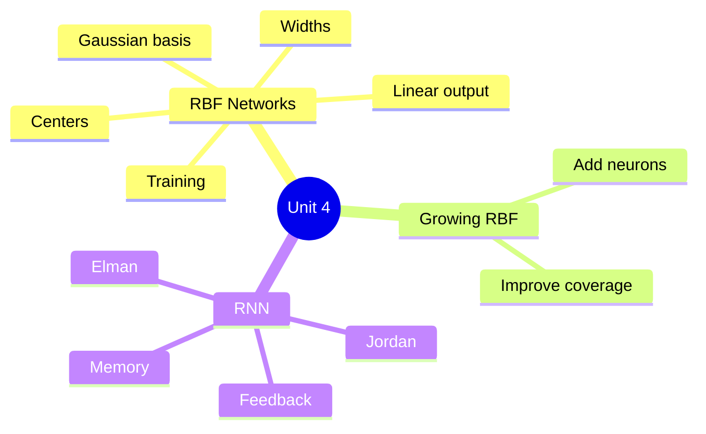
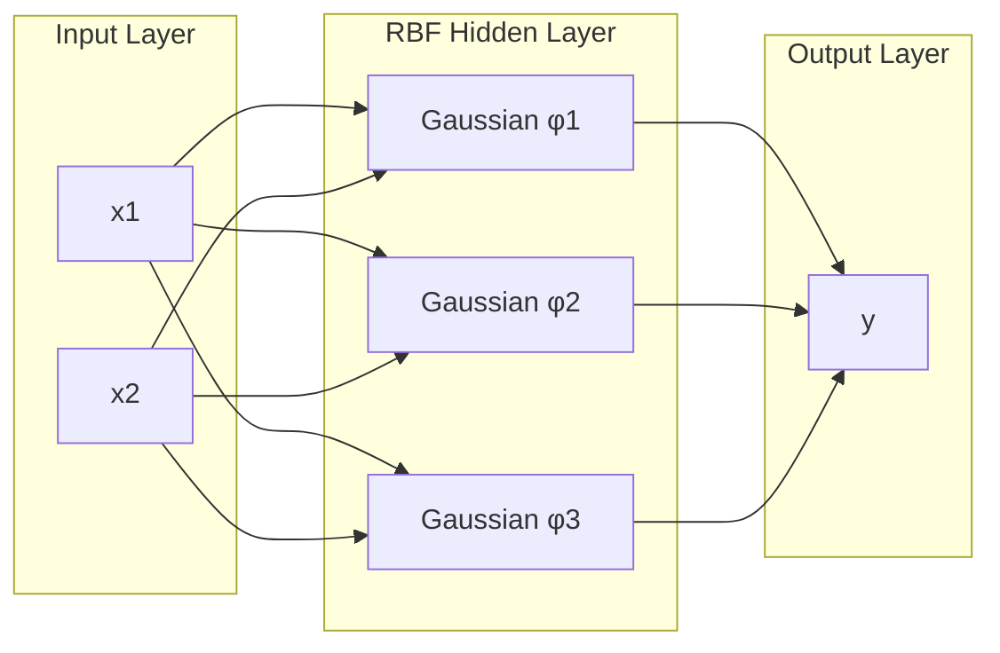
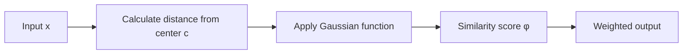
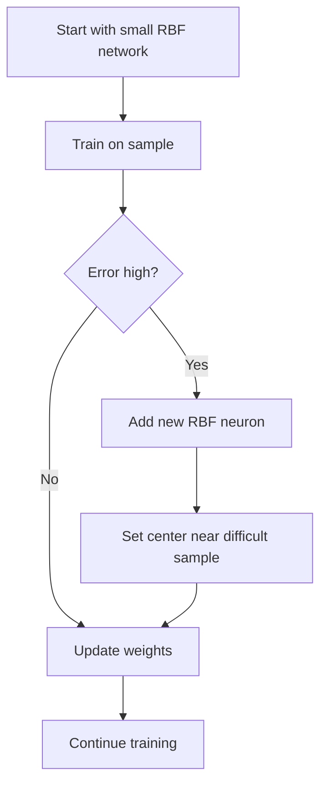
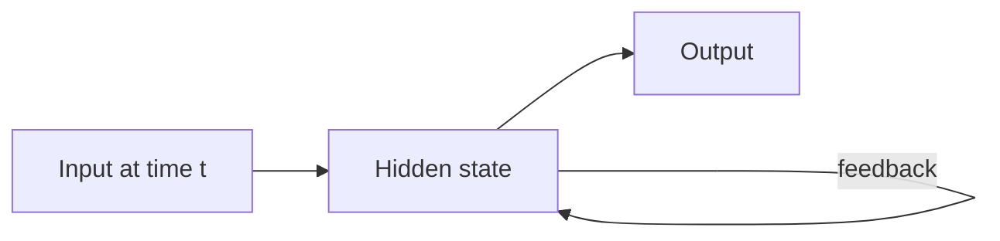
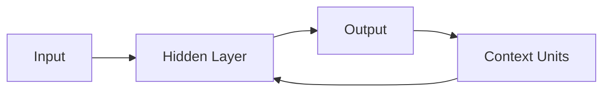
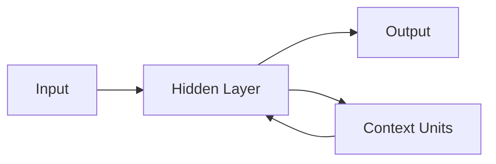
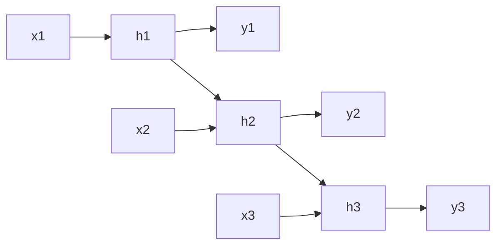

# Unit 4 — Radial Basis Function Neural Networks and Recurrent Neural Networks

## 1. Unit Overview

This unit covers:
1. Radial Basis Function Neural Networks (RBFNN)
2. Information processing in RBF neurons
3. Training strategies for RBF networks
4. Growing RBF networks
5. Comparison of RBF and MLP
6. Recurrent Neural Networks: Jordan and Elman networks

---

## 2. Radial Basis Function Neural Network

An RBF network is a feedforward neural network with:
1. Input layer
2. Hidden RBF layer
3. Output layer

The hidden layer uses radial basis functions, usually Gaussian functions.

---

## 3. Components of RBF Network

| Component | Meaning |
|---|---|
| Input vector | Data sample |
| Center | Prototype point for each RBF neuron |
| Distance measure | Usually Euclidean distance |
| Width/spread | Controls area of influence |
| RBF activation | Converts distance into similarity |
| Output weights | Combine hidden neuron responses |

---

## 4. Information Processing in RBF Network

RBF networks process data based on similarity to centers.

### Main idea

If input is close to a center, that hidden neuron gives high activation.

If input is far from a center, activation is low.

### Gaussian radial basis function

$$
\phi_i(x)=\exp\left(-\frac{||x-c_i||^2}{2\sigma_i^2}\right)
$$

Where:
- $x$ = input vector
- $c_i$ = center of $i^{th}$ RBF neuron
- $\sigma_i$ = width/spread
- $||x-c_i||$ = distance between input and center

### Output

$$
y = \sum_{i=1}^{m} w_i \phi_i(x) + b
$$

---

## 5. Information Processing in RBF Neurons

### Distance calculation

For two-dimensional input:

$$
||x-c||=\sqrt{(x_1-c_1)^2+(x_2-c_2)^2}
$$

### Important interpretation

| Distance from center | RBF activation |
|---|---|
| Small distance | High activation |
| Large distance | Low activation |
| Exactly at center | Maximum activation = 1 |

---

## 6. Analytical Thoughts Before Training

Before training an RBF network, decide:

1. How many centers are needed?
2. Where should centers be placed?
3. What should be the width $\sigma$?
4. What distance function should be used?
5. Which output training method should be used?

### Center selection methods
- Randomly choose training samples
- K-means clustering
- Supervised selection
- Growing method

### Width selection
Common formula:

$$
\sigma = \frac{d_{max}}{\sqrt{2m}}
$$

Where:
- $d_{max}$ = maximum distance between centers
- $m$ = number of centers

---

## 7. Equation System and Gradient Strategies for Training

RBF training often happens in two stages:

### Stage 1: Choose centers and widths
Usually unsupervised:
- K-means for centers
- Distance-based formula for widths

### Stage 2: Learn output weights
Usually supervised:
- Least squares
- Gradient descent

### Matrix form

For $N$ training samples and $m$ hidden neurons:

$$
\Phi W = T
$$

Where:
- $\Phi$ = hidden layer activation matrix
- $W$ = output weight vector/matrix
- $T$ = target vector/matrix

Least squares solution:

$$
W = (\Phi^T\Phi)^{-1}\Phi^T T
$$

Gradient update:

$$
w_i(new)=w_i(old)+\eta(t-y)\phi_i(x)
$$

---

## 8. Growing RBF Networks

A growing RBF network starts with few neurons and adds new RBF neurons when needed.

### Why grow?
Fixed number of centers may be insufficient. Growing networks adapt their structure.

### Advantages
- Adapts complexity automatically.
- Adds neurons only where needed.
- Useful for non-uniform data distribution.

### Limitation
- Can become too large.
- Needs pruning or stopping condition.

---

## 9. Enhancements in Radial Basis Networks

Common enhancements:

| Enhancement | Purpose |
|---|---|
| Adaptive width | Better local coverage |
| Center pruning | Remove useless neurons |
| Regularization | Avoid overfitting |
| Normalized RBF | Make activations comparable |
| Growing/pruning | Dynamic structure |
| Hybrid training | Combine clustering and gradient learning |

Normalized RBF output:

$$
\hat{\phi}_i = \frac{\phi_i}{\sum_j \phi_j}
$$

---

## 10. Comparison of RBF Networks and Multilayer Perceptrons

| Feature | RBF Network | MLP |
|---|---|---|
| Hidden activation | Radial basis/Gaussian | Sigmoid, tanh, ReLU |
| Learning nature | Local approximation | Global approximation |
| Training | Often two-stage | Backpropagation |
| Hidden neuron meaning | Center/prototype | Feature detector |
| Speed | Often faster | Can be slower |
| Generalization | Local | Global |
| Interpretability | More interpretable centers | Less interpretable |
| Number of neurons | May need more | Can be compact |

### Local vs global visualization

<b>RBF</b> 
Each neuron responds strongly only near its center.  
Input close to center → high activation 
Input far away → low activation

<b>MLP</b> 
A hidden neuron can affect a large part of the input space.  
Learns global boundaries through layered transformations.

---

## 11. Recurrent Neural Networks

A recurrent neural network has feedback connections. This gives it memory.

### Why RNN?
Feedforward networks treat inputs independently. RNNs can use previous information.

Useful for:
- Time series
- Speech
- Text
- Sequential sensor data
- Dynamic systems

---

## 12. Jordan Network

A Jordan network feeds the output back into context units.

### Key idea
The network remembers previous outputs.

### Use
Good when previous output strongly affects next prediction.

Example:
- Sequence classification
- Control systems

---

## 13. Elman Network

An Elman network feeds the hidden layer output back into context units.

### Key idea
The network remembers previous hidden states.

### Difference from Jordan network

| Feature | Jordan Network | Elman Network |
|---|---|---|
| Feedback from | Output layer | Hidden layer |
| Memory stores | Previous outputs | Previous hidden states |
| More internal memory | Lower | Higher |
| Common use | Output-dependent sequences | General sequence learning |

---

## 14. Training Recurrent Neural Networks

RNN training is harder than feedforward training because outputs depend on previous states.

Common method:
- Backpropagation Through Time (BPTT)

### BPTT idea

Unroll the network across time and apply backpropagation.

### Challenges
- Vanishing gradients
- Exploding gradients
- Long training time
- Difficulty learning long-term dependencies

---

## 15. Solved Example 1 — RBF Activation

### Problem
Input:

$$
x = [2,3]
$$

RBF center:

$$
c = [1,1]
$$

Width:

$$
\sigma=2
$$

Find Gaussian RBF activation.

### Step 1: Calculate squared distance

$$
||x-c||^2=(2-1)^2+(3-1)^2
$$

$$
||x-c||^2=1^2+2^2=5
$$

### Step 2: Apply Gaussian RBF

$$
\phi(x)=\exp\left(-\frac{||x-c||^2}{2\sigma^2}\right)
$$

$$
\phi(x)=\exp\left(-\frac{5}{2(2)^2}\right)
$$

$$
\phi(x)=\exp\left(-\frac{5}{8}\right)
$$

$$
\phi(x)\approx \exp(-0.625)\approx 0.535
$$

### Final answer

$$
\phi(x)\approx 0.535
$$

### Why?
The input is moderately close to the center, so activation is neither near 1 nor near 0.

---

## 16. Solved Example 2 — RBF Output

### Problem
A network has two RBF hidden neurons:

$$
\phi_1=0.8,\quad \phi_2=0.3
$$

Output weights:

$$
w_1=1.5,\quad w_2=-0.5
$$

Bias:

$$
b=0.2
$$

Find output.

### Step 1: Use output formula

$$
y=w_1\phi_1+w_2\phi_2+b
$$

### Step 2: Substitute values

$$
y=(1.5)(0.8)+(-0.5)(0.3)+0.2
$$

$$
y=1.2-0.15+0.2
$$

$$
y=1.25
$$

### Final answer

$$
y=1.25
$$

### Why?
The first RBF neuron has high activation and positive weight, so it strongly increases output.

---

## 17. Solved Example 3 — Simple RNN State Update

### Problem
Given simple RNN state:

$$
h_t = \tanh(W_xx_t + W_hh_{t-1})
$$

Values:

$$
W_x=0.5,\quad W_h=0.2,\quad x_t=2,\quad h_{t-1}=0.5
$$

Find $h_t$.

### Step 1: Calculate net input

$$
net = W_xx_t + W_hh_{t-1}
$$

$$
net=(0.5)(2)+(0.2)(0.5)
$$

$$
net=1+0.1=1.1
$$

### Step 2: Apply tanh

$$
h_t=\tanh(1.1)
$$

$$
h_t \approx 0.800
$$

### Final answer

$$
h_t\approx 0.800
$$

### Why?
The current input and previous memory both contribute to the new hidden state.

---

## 18. Unit 4 Quick Revision

| Concept | Key point |
|---|---|
| RBF network | Uses distance-based hidden neurons |
| Center | Prototype location |
| Width | Controls spread of activation |
| Gaussian RBF | $\exp(-||x-c||^2/2\sigma^2)$ |
| RBF training | Choose centers, widths, output weights |
| Growing RBF | Adds neurons when error is high |
| RBF vs MLP | RBF local, MLP global |
| RNN | Has feedback/memory |
| Jordan network | Output feedback |
| Elman network | Hidden feedback |
| BPTT | Backpropagation through time |
