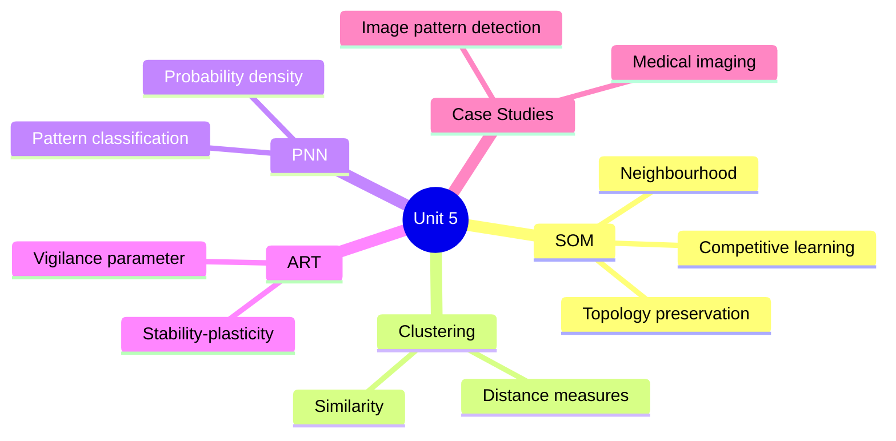
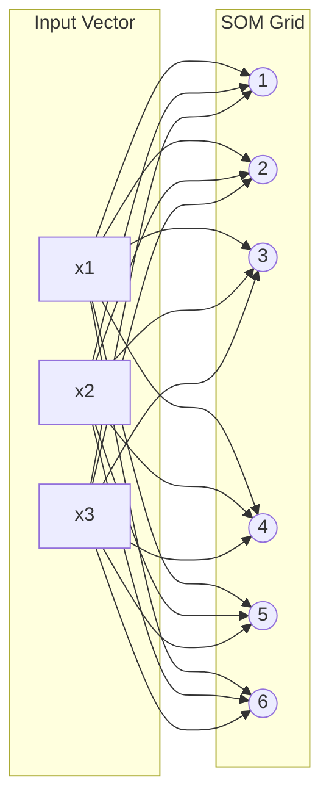
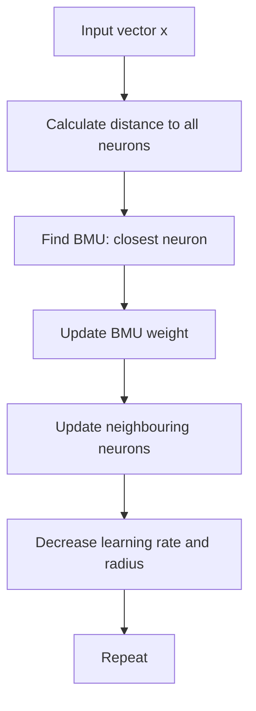
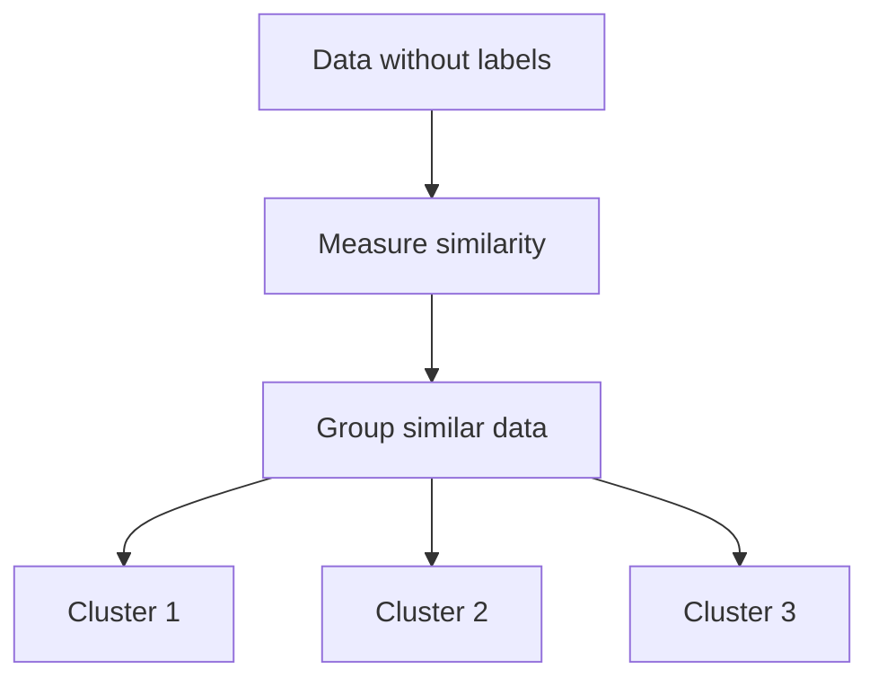
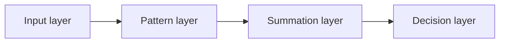
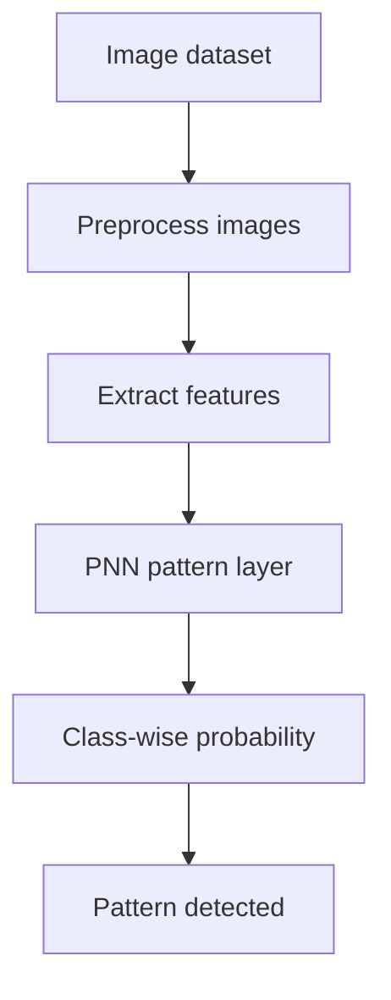
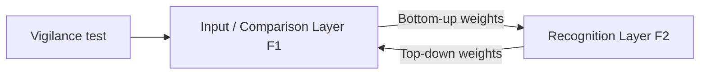
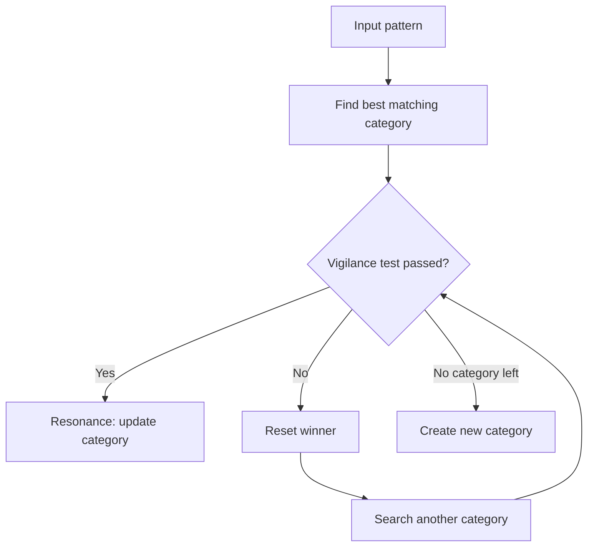
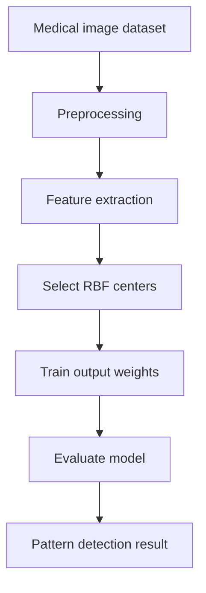

# Unit 5 — Unsupervised Learning Network Paradigms and Applications Case Studies

## 1. Unit Overview

This unit focuses on unsupervised neural networks and application-based models.

Main topics:
1. Self-Organizing Feature Maps (SOM)
2. Cluster analysis
3. Neural networks for prediction
4. Topology and distance functions
5. Learning rates and neighbourhoods
6. Probabilistic Neural Networks (PNN)
7. Adaptive Resonance Theory (ART)
8. RBFNN case study for medical imaging

---

## 2. Self-Organizing Feature Map

A Self-Organizing Map (SOM) is an unsupervised neural network that maps high-dimensional input data to a low-dimensional grid, usually 2D.

It preserves topology, meaning similar inputs are placed close together on the map.

### Architecture

---

## 3. Structure of SOM

A SOM has:
1. Input layer
2. Output grid/map layer
3. Weight vector for each map neuron

Each map neuron has a weight vector of same dimension as input.

If input is:

$$
x=[x_1,x_2,\dots,x_n]
$$

Then each SOM neuron has:

$$
w_j=[w_{j1},w_{j2},\dots,w_{jn}]
$$

---

## 4. Training of SOM

SOM uses competitive learning.

### Training steps

1. Initialize weight vectors.
2. Present input vector.
3. Calculate distance between input and each neuron weight.
4. Find Best Matching Unit (BMU).
5. Update BMU and its neighbours.
6. Reduce learning rate and neighbourhood radius over time.

### BMU formula

$$
BMU = \arg\min_j ||x-w_j||
$$

### Weight update

$$
w_j(t+1)=w_j(t)+\eta(t)h_{cj}(t)[x-w_j(t)]
$$

Where:
- $c$ = BMU
- $h_{cj}$ = neighbourhood function
- $\eta(t)$ = learning rate
- $x$ = input vector

---

## 5. Topology Function

The topology function defines the shape and neighbourhood relation of SOM neurons.

Common topologies:
- Rectangular grid
- Hexagonal grid
- Linear grid

### Visual

<b>Rectangular topology</b> 
⬜ ⬜ ⬜ 
⬜ ⬜ ⬜ 
⬜ ⬜ ⬜

<b>Linear topology</b> 
⬜ — ⬜ — ⬜ — ⬜

---

## 6. Distance and Topology Functions

### Common distance functions

| Distance        | Formula                    | Meaning                |     |     |     |     |     |     |     |     |
| --------------- | -------------------------- | ---------------------- | --- | --- | --- | --- | --- | --- | --- | --- |
| Euclidean       | $\sqrt{\sum_i(x_i-w_i)^2}$ | Straight-line distance |     |     |     |     |     |     |     |     |
| Manhattan       | $\sum_i x_i-w_i$           | City-block distance    |     |     |     |     |     |     |     |     |
| Cosine distance | $1-\frac{x\cdot x w }      | irection similarity    |     |     |     |     | w   |     | }$  | D   |

### Neighbourhood functions

Gaussian neighbourhood:

$$
h_{cj}(t)=\exp\left(-\frac{d_{cj}^2}{2\sigma^2(t)}\right)
$$

Where $d_{cj}$ is distance between BMU $c$ and neuron $j$ on the map grid.

---

## 7. Relationship Between Learning Rate and Neighbourhood

At the beginning:
- High learning rate
- Large neighbourhood
- Broad organization

Later:
- Low learning rate
- Small neighbourhood
- Fine-tuning

### Decay formula example

$$
\eta(t)=\eta_0 e^{-t/\tau}
$$

$$
\sigma(t)=\sigma_0 e^{-t/\tau}
$$

---

## 8. Applications of SOM

| Application | Use |
|---|---|
| Customer segmentation | Group similar users |
| Image compression | Reduce color space |
| Document clustering | Organize text |
| Medical data analysis | Find disease patterns |
| Fraud detection | Detect abnormal clusters |
| Visualization | Convert high-dimensional data to 2D map |

---

## 9. Cluster Analysis

Clustering groups similar samples together.

### Basic idea

### Cluster quality
Good clusters have:
- High similarity within cluster
- Low similarity between clusters

### SOM as clustering tool
Each SOM neuron can represent a cluster center. Data points mapped to the same BMU belong to similar groups.

---

## 10. Neural Networks Used for Prediction

Neural networks can learn patterns from historical data and predict future or unknown values.

Examples:
- Sales forecasting
- Weather prediction
- Stock movement
- Medical diagnosis
- Traffic prediction

### Prediction flow

---

## 11. Probabilistic Neural Network

A Probabilistic Neural Network (PNN) is a supervised classification network based on probability density estimation.

It uses Parzen window estimation and Bayes decision theory.

### Architecture

### Layers

| Layer | Function |
|---|---|
| Input layer | Receives feature vector |
| Pattern layer | Computes similarity to training samples |
| Summation layer | Sums class probabilities |
| Decision layer | Chooses class with highest probability |

### Gaussian pattern function

$$
\phi_i(x)=\exp\left(-\frac{||x-x_i||^2}{2\sigma^2}\right)
$$

### Classification rule

$$
Class(x)=\arg\max_k P(C_k|x)
$$

---

## 12. PNN for Image Pattern Detection

In image pattern detection:
1. Convert image into feature vector.
2. Use training images as pattern neurons.
3. Compute similarity using Gaussian function.
4. Sum similarities class-wise.
5. Choose class with highest probability.

### Advantages
- Fast training
- Good for classification
- Probabilistic output
- Handles noisy data

### Limitations
- Requires large memory
- Slower prediction if many training samples
- Sensitive to spread parameter $\sigma$

---

## 13. Adaptive Resonance Theory

Adaptive Resonance Theory (ART) solves the stability-plasticity dilemma.

### Stability-plasticity dilemma

| Term | Meaning |
|---|---|
| Stability | Remember old learned patterns |
| Plasticity | Learn new patterns |
| Dilemma | Learning new patterns can overwrite old ones |

ART tries to learn new information without forgetting old categories.

---

## 14. Structure of ART Network

Basic ART has:
1. Input/comparison layer
2. Recognition/category layer
3. Bottom-up weights
4. Top-down weights
5. Vigilance parameter

### Bottom-up and top-down learning

| Direction | Meaning |
|---|---|
| Bottom-up | Input layer to category layer |
| Top-down | Category layer to input layer |

---

## 15. ART Learning Process

### Steps

1. Present input pattern.
2. Calculate match with existing categories.
3. Choose winning category.
4. Perform vigilance test.
5. If match is good, update category.
6. If match is poor, reset and search another category.
7. If no category matches, create new category.

### Vigilance parameter

$$
0 \leq \rho \leq 1
$$

- High $\rho$ → strict matching → more categories
- Low $\rho$ → loose matching → fewer categories

---

## 16. Extensions: ART2 and ART3

| Model | Handles | Notes |
|---|---|---|
| ART1 | Binary input patterns | Original ART |
| ART2 | Continuous analog input | Suitable for real-valued data |
| ART3 | More biologically inspired | Includes chemical transmitter-like mechanisms |

---

## 17. RBFNN Development Using Medical Imaging Dataset

RBFNN can be used for medical image pattern detection.

### Example task
Detect whether a medical image patch is:
- Normal
- Tumor/nodule
- Abnormal pattern

### Development pipeline

### Preprocessing may include
- Resize images
- Normalize pixel values
- Remove noise
- Segment region of interest
- Extract texture/shape/intensity features

### Why RBFNN works here
RBF neurons act like prototypes of image patterns. If a new image feature vector is close to a tumor-like prototype, that RBF neuron activates strongly.

---

## 18. Solved Example 1 — SOM BMU

### Problem
Input vector:

$$
x=[1,2]
$$

Two SOM neurons have weights:

$$
w_1=[1,1]
$$

$$
w_2=[4,5]
$$

Find the BMU using Euclidean distance.

### Step 1: Distance to neuron 1

$$
d_1=\sqrt{(1-1)^2+(2-1)^2}
$$

$$
d_1=\sqrt{0+1}=1
$$

### Step 2: Distance to neuron 2

$$
d_2=\sqrt{(1-4)^2+(2-5)^2}
$$

$$
d_2=\sqrt{9+9}=\sqrt{18}=4.24
$$

### Step 3: Choose minimum distance

$$
d_1 < d_2
$$

So BMU is neuron 1.

### Final answer

$$
BMU=w_1
$$

### Why?
SOM chooses the neuron whose weight vector is closest to input.

---

## 19. Solved Example 2 — SOM Weight Update

### Problem
Input:

$$
x=[2,4]
$$

BMU weight:

$$
w=[1,3]
$$

Learning rate:

$$
\eta=0.5
$$

Assume neighbourhood function:

$$
h=1
$$

Find updated weight.

### Step 1: Use SOM update rule

$$
w(new)=w(old)+\eta h[x-w(old)]
$$

### Step 2: Calculate difference

$$
x-w=[2,4]-[1,3]=[1,1]
$$

### Step 3: Multiply by learning rate

$$
\eta h[x-w]=0.5(1)[1,1]=[0.5,0.5]
$$

### Step 4: Update weight

$$
w(new)=[1,3]+[0.5,0.5]
$$

$$
w(new)=[1.5,3.5]
$$

### Final answer

$$
w=[1.5,3.5]
$$

### Why?
The BMU weight moves closer to the input vector.

---

## 20. Solved Example 3 — ART Vigilance Test

### Problem
Input pattern has 6 active features. Matching category shares 4 active features.

Use vigilance:

$$
\rho=0.6
$$

Check if category is accepted.

### Step 1: Calculate match ratio

$$
Match=\frac{shared\ active\ features}{input\ active\ features}
$$

$$
Match=\frac{4}{6}=0.667
$$

### Step 2: Compare with vigilance

$$
0.667 \geq 0.6
$$

So vigilance test passes.

### Final answer
The category is accepted.

### Why?
The match is strong enough according to the vigilance threshold.

---

## 21. Solved Example 4 — PNN Class Decision

### Problem
A PNN gives class scores:

$$
P(C_1|x)=0.25
$$

$$
P(C_2|x)=0.65
$$

$$
P(C_3|x)=0.10
$$

Find predicted class.

### Step 1: Apply decision rule

$$
Class(x)=\arg\max_k P(C_k|x)
$$

### Step 2: Compare scores

Highest probability is:

$$
P(C_2|x)=0.65
$$

### Final answer

$$
Class=C_2
$$

### Why?
PNN selects the class with maximum posterior probability.

---

## 22. Unit 5 Quick Revision

| Concept | Key point |
|---|---|
| SOM | Maps high-dimensional data to 2D grid |
| BMU | Closest neuron to input |
| SOM update | BMU and neighbours move toward input |
| Topology | Arrangement of map neurons |
| Learning rate decay | Large early, small later |
| PNN | Probability-based classifier |
| ART | Learns without catastrophic forgetting |
| Vigilance | Controls category strictness |
| ART1 | Binary input |
| ART2 | Continuous input |
| RBFNN case study | Prototype-based pattern detection |
