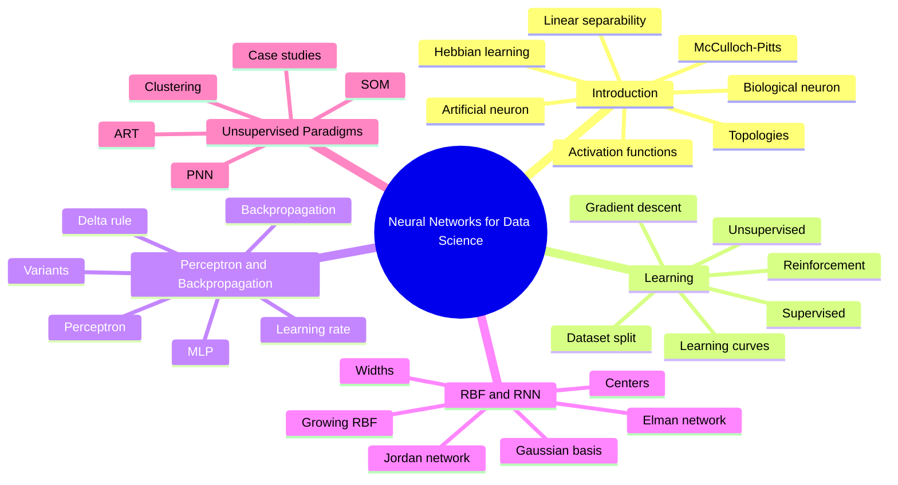

# TEE7157 — Neural Networks for Data Science Detailed Notes

> [!info] Obsidian-friendly pack
> - Mermaid diagrams are used for visual learning.
> - Formulas use `$$ ... $$`.
> - Numericals use **Final Answer First → Steps Later**, as requested.
> - Separate numerical practice files are included for **Backpropagation** and **RBF Networks**.

## Unit Files
1. [[Unit 1 - Introduction to Neural Networks - Detailed]]
2. [[Unit 2 - Learning in Neural Networks - Detailed]]
3. [[Unit 3 - Perceptron Backpropagation and Variants - Detailed]]
4. [[Unit 4 - RBF and Recurrent Neural Networks - Detailed]]
5. [[Unit 5 - Unsupervised Learning Networks and Case Studies - Detailed]]

## Numerical Files
1. [[Backpropagation Numericals - Final Answer First]]
2. [[RBF Numericals - Final Answer First]]

