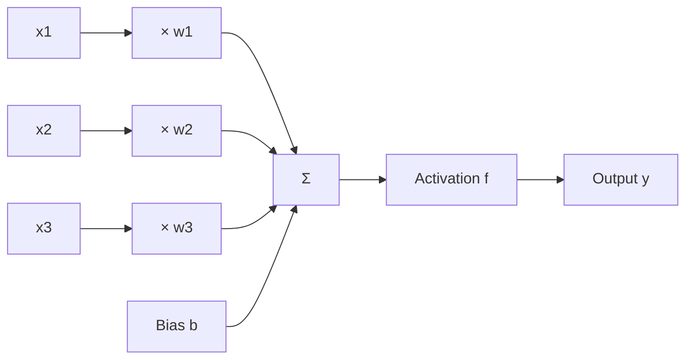
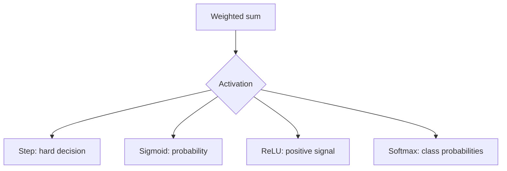
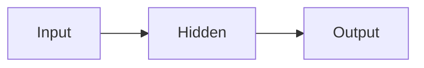
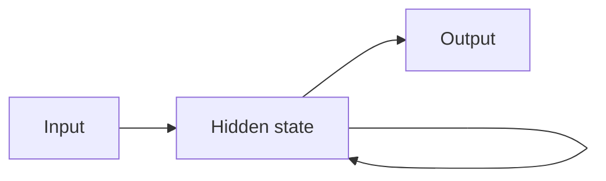
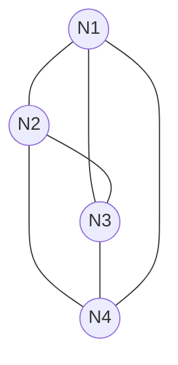
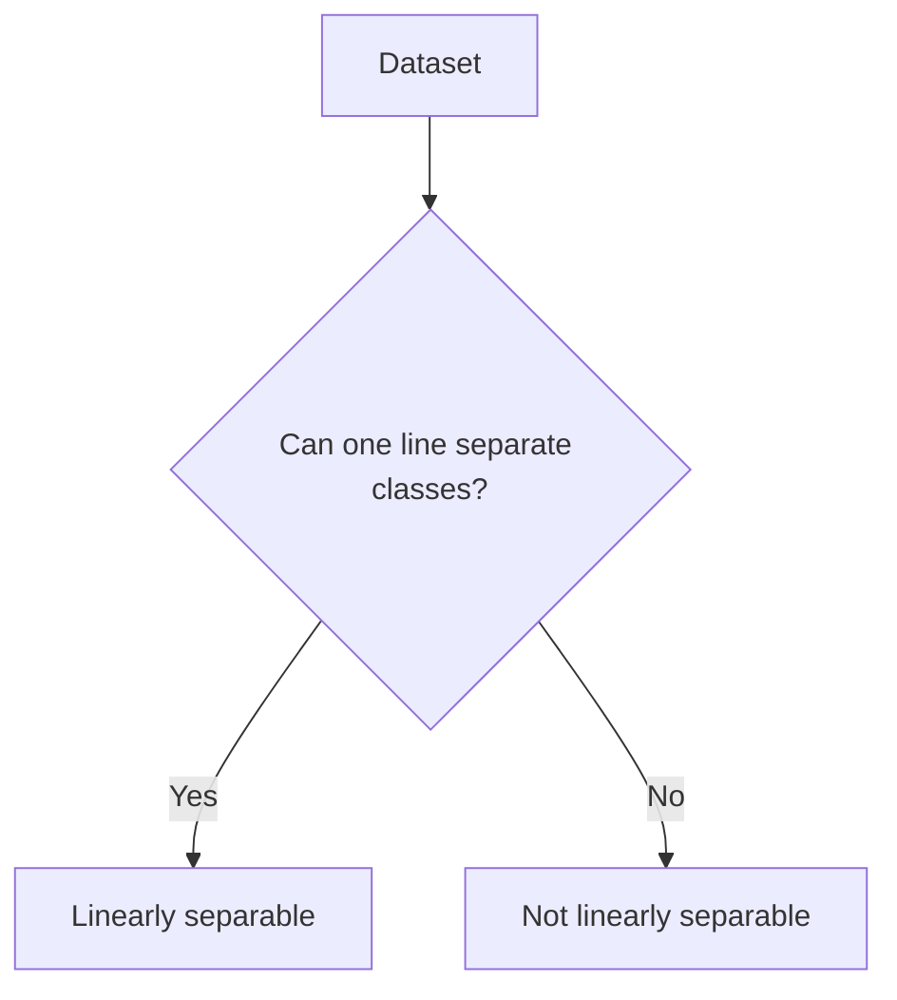

# Unit 1 — Introduction to Neural Networks - Detailed

## 1. Artificial Neural Network

> [!important] Definition
> An **Artificial Neural Network (ANN)** is a computational model inspired by the human brain. It contains interconnected artificial neurons that learn patterns by adjusting weights and biases.

A neural network learns a mapping:

$$
f:X \rightarrow Y
$$

Example mappings:

| Problem | Input | Output |
|---|---|---|
| Image classification | Image pixels | Class label |
| Medical diagnosis | Scan features | Disease / no disease |
| Prediction | Past values | Future value |
| Pattern recognition | Feature vector | Pattern class |

### Why ANN is useful

ANNs are used when:
1. Rules are difficult to manually write.
2. The relationship between input and output is non-linear.
3. Data is noisy or incomplete.
4. The model must generalize to unseen examples.

---

## 2. Biological Neuron

A biological neuron is the basic unit of the nervous system.

| Biological component | Function | ANN equivalent |
|---|---|---|
| Dendrites | Receive signals | Inputs |
| Synapse | Connection strength | Weight |
| Cell body | Combines signals | Summation unit |
| Nucleus | Controls activity | Processing control |
| Axon | Carries output | Output pathway |

### Exam explanation
A neuron receives multiple signals, combines them, and fires if the signal is strong enough. An artificial neuron does the same using weighted sum and activation function.

---

## 3. Artificial Neuron

An artificial neuron computes:

$$
net = \sum_{i=1}^{n} w_ix_i + b
$$

$$
y=f(net)
$$

Where:
- $x_i$ = input
- $w_i$ = weight
- $b$ = bias
- $f$ = activation function
- $y$ = output

### Weight
Weight controls the importance of input.

| Weight type | Meaning |
|---|---|
| Positive weight | Input supports output |
| Negative weight | Input suppresses output |
| Zero weight | Input has no effect |

### Bias
Bias shifts the decision boundary. Without bias, the decision boundary may be forced through origin.

---

## 4. ANN Terminologies

### Propagation Function
Combines inputs and weights.

$$
net=\sum w_ix_i+b
$$

### Activation Function
Transforms net input into output.

### Output Function
Produces final neuron output. Often same as activation output.

### Learning Rule
Updates weights:

$$
w_{new}=w_{old}+\Delta w
$$

---

## 5. Activation Functions

| Function | Formula | Range | Use |
|---|---|---|---|
| Step | $1$ if $x\geq\theta$, else $0$ | 0/1 | Perceptron |
| Linear | $f(x)=x$ | Any real value | Regression |
| Sigmoid | $f(x)=\frac{1}{1+e^{-x}}$ | 0 to 1 | Binary probability |
| Tanh | $f(x)=\tanh(x)$ | -1 to 1 | Hidden layers |
| ReLU | $f(x)=\max(0,x)$ | 0 to $\infty$ | Deep learning |
| Softmax | $\frac{e^{z_i}}{\sum e^{z_j}}$ | probabilities | Multi-class output |

### Why activation is needed
Without non-linear activation, a multilayer network behaves like a single linear layer.

---

## 6. Network Topologies

### Feedforward Network
Data flows in one direction.

### Recurrent Network
Has feedback, so it can remember previous states.

### Completely Linked Network
Every neuron connects to every other neuron.

---

## 7. Synchronous vs Asynchronous Activation

| Type | Definition | Example use |
|---|---|---|
| Synchronous | All neurons update at same time | Parallel simulations |
| Asynchronous | One/few neurons update at a time | Recurrent systems |

---

## 8. McCulloch-Pitts Neuron

> [!important] Definition
> The McCulloch-Pitts neuron is a binary threshold neuron. It takes binary inputs and gives binary output.

$$
y=
\begin{cases}
1, & \sum x_i \geq \theta\\
0, & \sum x_i < \theta
\end{cases}
$$

### AND gate with threshold 2

| $x_1$ | $x_2$ | Sum | Output |
|---|---:|---:|---:|
| 0 | 0 | 0 | 0 |
| 0 | 1 | 1 | 0 |
| 1 | 0 | 1 | 0 |
| 1 | 1 | 2 | 1 |

### OR gate with threshold 1

| $x_1$ | $x_2$ | Sum | Output |
|---|---:|---:|---:|
| 0 | 0 | 0 | 0 |
| 0 | 1 | 1 | 1 |
| 1 | 0 | 1 | 1 |
| 1 | 1 | 2 | 1 |

---

## 9. Linear Separability

A problem is linearly separable if classes can be separated by one straight line, plane, or hyperplane.

$$
w_1x_1+w_2x_2+b=0
$$

### XOR is not linearly separable

| $x_1$ | $x_2$ | XOR |
|---|---:|---:|
| 0 | 0 | 0 |
| 0 | 1 | 1 |
| 1 | 0 | 1 |
| 1 | 1 | 0 |

A single-layer perceptron fails on XOR.

---

## 10. Hebbian Learning

> [!important] Definition
> Hebbian learning strengthens the connection between neurons that activate together.

Statement:

> Neurons that fire together wire together.

Formula:

$$
\Delta w_i=\eta x_iy
$$

$$
w_i(new)=w_i(old)+\eta x_iy
$$

---

## 11. Solved Example — Neuron Output

### Final Answer

$$
net=1.1,\quad y=1
$$

### Problem

$$
x=[1,0,1],\quad w=[0.5,-0.4,0.8],\quad b=-0.2
$$

Step activation with threshold 0.

### Steps

$$
net=(0.5)(1)+(-0.4)(0)+(0.8)(1)-0.2
$$

$$
net=1.1
$$

Since $net\geq0$:

$$
y=1
$$

---

## 12. Solved Example — Hebbian Update

### Final Answer

$$
w_1=0.5,\quad w_2=-0.5
$$

### Problem

$$
w_1=0,\quad w_2=0,\quad x=[1,-1],\quad y=1,\quad \eta=0.5
$$

### Steps

$$
\Delta w_1=0.5(1)(1)=0.5
$$

$$
\Delta w_2=0.5(-1)(1)=-0.5
$$

So:

$$
w_1=0.5,\quad w_2=-0.5
$$
