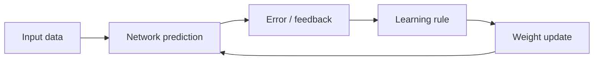
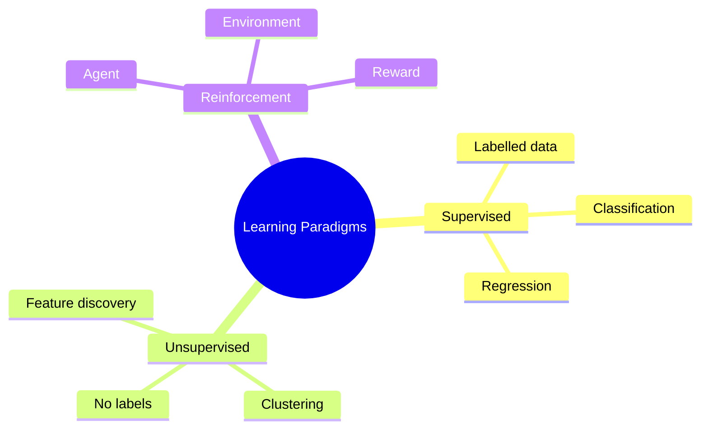
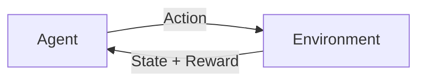
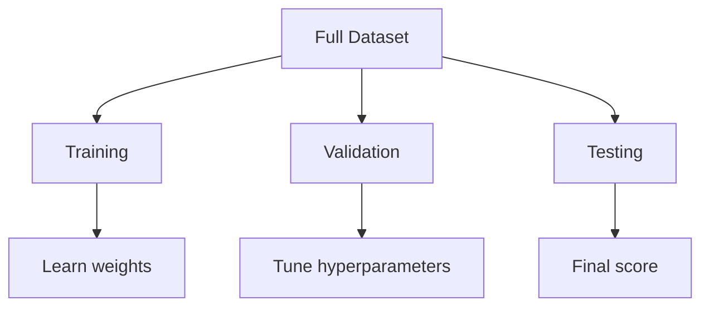
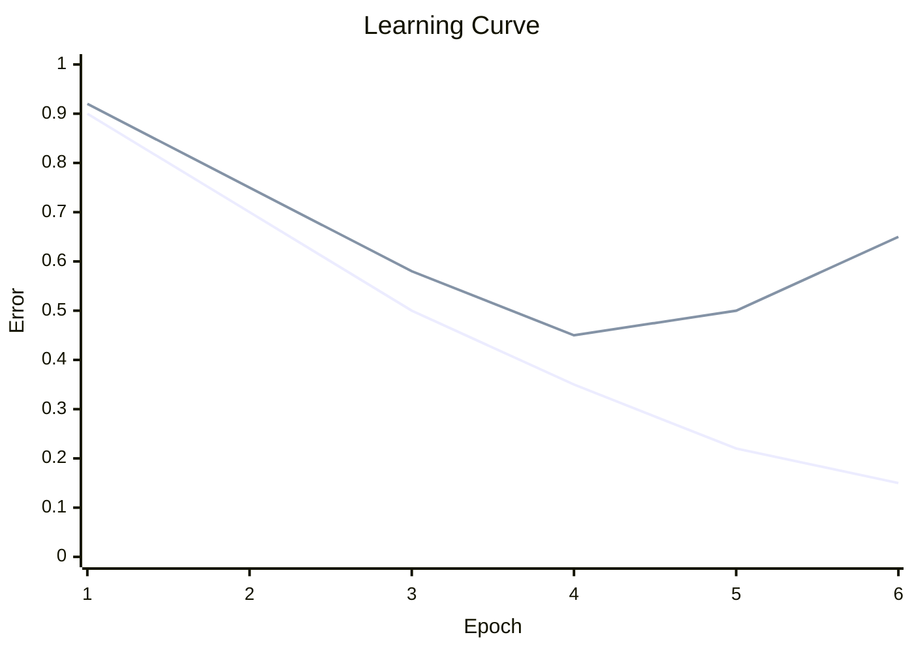

# Unit 2 — Learning in Neural Networks - Detailed

## 1. Learning

> [!important] Definition
> Learning in neural networks is the process of adjusting weights and biases so that the model improves its performance on a task.

General update:

$$
w_{new}=w_{old}+\Delta w
$$

---

## 2. Learning Paradigms

---

## 3. Supervised Learning

> [!important] Definition
> Supervised learning uses labelled examples where each input has a known target output.

Training pair:

$$
(x,t)
$$

Where:
- $x$ = input
- $t$ = target

Error:

$$
E=\frac{1}{2}(t-y)^2
$$

Applications:
- Classification
- Regression
- Medical diagnosis
- Spam detection
- Image recognition

---

## 4. Unsupervised Learning

> [!important] Definition
> Unsupervised learning discovers hidden structure in data without target labels.

It is used for:
- Clustering
- Feature extraction
- Dimensionality reduction
- Anomaly detection

Examples:
- SOM
- ART
- Autoencoders
- Competitive networks

---

## 5. Reinforcement Learning

> [!important] Definition
> Reinforcement learning trains an agent to choose actions by giving reward or punishment.

| Term | Meaning |
|---|---|
| Agent | Learner |
| Environment | External world |
| State | Current situation |
| Action | Decision |
| Reward | Feedback |
| Policy | Strategy |

---

## 6. Offline and Online Learning

| Feature | Offline Learning | Online Learning |
|---|---|---|
| Data | Full dataset available | Data arrives continuously |
| Update | Batch-based | Sample/mini-batch based |
| Stability | More stable | More adaptive |
| Use | Fixed datasets | Streaming data |

### Offline learning
Used when dataset is already collected.

### Online learning
Used when model must adapt continuously.

---

## 7. Training Patterns and Teaching Inputs

A training pattern is a sample used for training.

Supervised sample:

$$
(x,t)
$$

Unsupervised sample:

$$
x
$$

Teaching input means target output $t$.

---

## 8. Dataset Split

Dataset is split into:

| Set | Purpose |
|---|---|
| Training | Update weights |
| Validation | Tune hyperparameters |
| Testing | Final evaluation |

Typical split:

$$
70:15:15
$$

or

$$
80:10:10
$$

### Implications
- Too little training data causes underfitting.
- No validation set makes tuning unreliable.
- Using test set during tuning causes biased results.

---

## 9. Learning Curves

> [!important] Definition
> A learning curve shows how training and validation error change across epochs.

| Pattern | Diagnosis |
|---|---|
| Both errors high | Underfitting |
| Training low, validation high | Overfitting |
| Both low | Good fit |
| Oscillation | Learning rate too high |
| Slow decrease | Learning rate too low |

---

## 10. Gradient Optimization

> [!important] Definition
> Gradient descent is an optimization method that updates weights in the direction that reduces error.

Loss:

$$
E=\frac{1}{2}(t-y)^2
$$

Update:

$$
w_{new}=w_{old}-\eta\frac{\partial E}{\partial w}
$$

Where:
- $\eta$ = learning rate
- $\frac{\partial E}{\partial w}$ = gradient

### Why negative gradient?
The gradient points toward increasing error. To reduce error, move opposite to it.

---

## 11. Types of Gradient Descent

| Type | Update after | Advantage | Limitation |
|---|---|---|---|
| Batch | Whole dataset | Stable | Slow |
| Stochastic | One sample | Fast | Noisy |
| Mini-batch | Small batch | Balanced | Needs batch size |

---

## 12. Hebbian Learning Rule

$$
\Delta w_i=\eta x_iy
$$

$$
w_i(new)=w_i(old)+\eta x_iy
$$

Hebbian learning is associative. It increases weights for co-active input-output pairs.

---

## 13. Solved Example — Dataset Split

### Final Answer

| Set | Samples |
|---|---:|
| Training | 1400 |
| Validation | 300 |
| Testing | 300 |

### Problem
Dataset has 2000 samples. Split into 70%, 15%, 15%.

### Steps

$$
Training=0.70(2000)=1400
$$

$$
Validation=0.15(2000)=300
$$

$$
Testing=0.15(2000)=300
$$

---

## 14. Solved Example — Gradient Descent

### Final Answer

$$
w_{new}=3.2
$$

### Problem

$$
E(w)=w^2,\quad w=4,\quad \eta=0.1
$$

### Steps

$$
\frac{dE}{dw}=2w=8
$$

$$
w_{new}=w-\eta\frac{dE}{dw}
$$

$$
w_{new}=4-0.1(8)=3.2
$$
