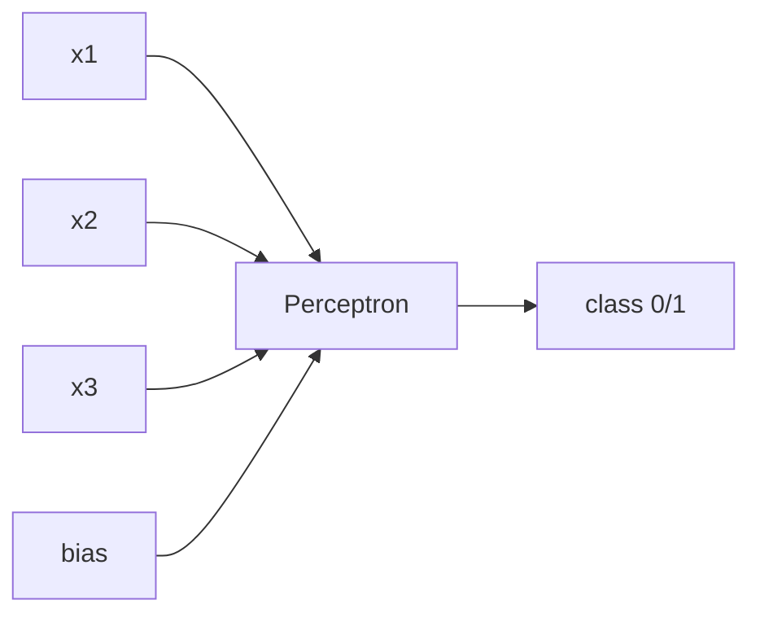
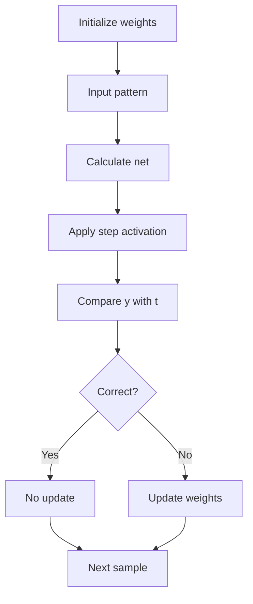
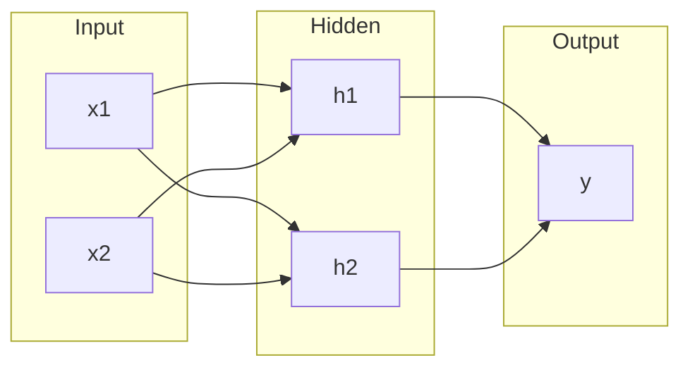
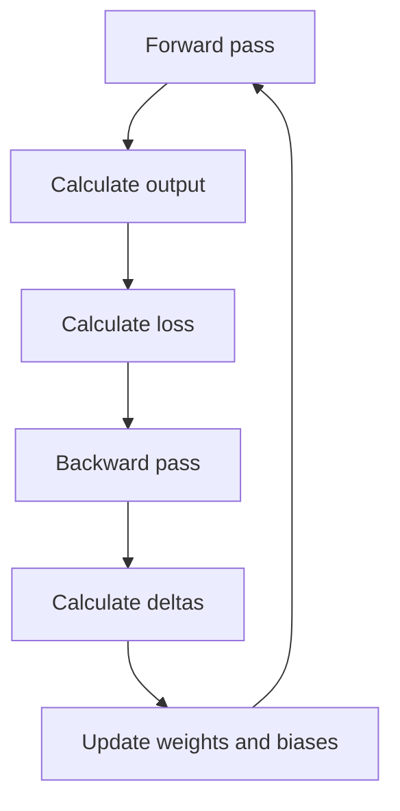
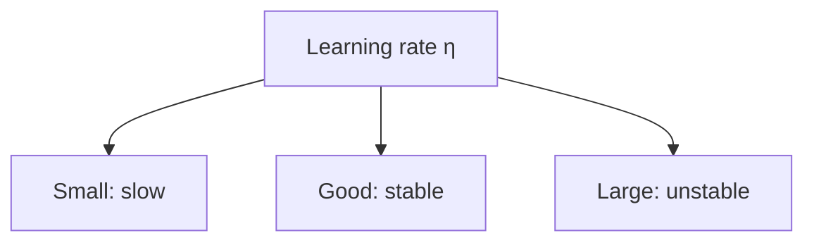

# Unit 3 — Perceptron, Backpropagation and Variants - Detailed

## 1. Unit Flow

---

## 2. Perceptron

> [!important] Definition
> A perceptron is a single-layer neural network used for binary classification.

Net input:

$$
net=\sum_{i=1}^{n}w_ix_i+b
$$

Output:

$$
y=
\begin{cases}
1, & net\geq0\\
0, & net<0
\end{cases}
$$

---

## 3. Perceptron Learning Algorithm

Update:

$$
w_i(new)=w_i(old)+\eta(t-y)x_i
$$

Bias:

$$
b(new)=b(old)+\eta(t-y)
$$

---

## 4. Perceptron Convergence Theorem

> [!important] Definition
> If the training data is linearly separable, the perceptron learning algorithm converges in a finite number of steps.

### Meaning
If there is a line/hyperplane that separates classes perfectly, the perceptron can find suitable weights.

### Limitation
If the data is not linearly separable, the algorithm may never converge.

---

## 5. Limitations of Single-layer Perceptron

1. Solves only linearly separable problems.
2. Cannot solve XOR.
3. Uses non-differentiable step function.
4. Cannot learn complex feature hierarchy.
5. Cannot model complex non-linear boundaries.

### XOR issue

| $x_1$ | $x_2$ | XOR |
|---|---:|---:|
| 0 | 0 | 0 |
| 0 | 1 | 1 |
| 1 | 0 | 1 |
| 1 | 1 | 0 |

No single line separates XOR classes.

---

## 6. Delta Rule

> [!important] Definition
> The delta rule is a gradient-based learning rule that minimizes squared error using differentiable activation functions.

Error:

$$
E=\frac{1}{2}(t-y)^2
$$

Update:

$$
\Delta w_i=\eta(t-y)f'(net)x_i
$$

For linear activation:

$$
\Delta w_i=\eta(t-y)x_i
$$

---

## 7. Multilayer Perceptron

> [!important] Definition
> A Multilayer Perceptron is a feedforward network with one or more hidden layers.

Hidden layers allow non-linear transformation of input.

---

# 8. Backpropagation Deep Dive

> [!important] Definition
> Backpropagation is a supervised learning algorithm used to train multilayer neural networks by calculating gradients from output layer back to earlier layers.

## 8.1 Main Phases

## 8.2 Forward Pass

For hidden neuron:

$$
net_h=\sum_i w_{ih}x_i+b_h
$$

$$
h=f(net_h)
$$

For output neuron:

$$
net_o=\sum_h v_{ho}h+b_o
$$

$$
y=f(net_o)
$$

## 8.3 Error Function

$$
E=\frac{1}{2}(t-y)^2
$$

## 8.4 Output Delta

For sigmoid output:

$$
\delta_o=(t-y)y(1-y)
$$

More generally:

$$
\delta_o=(t-y)f'(net_o)
$$

## 8.5 Hidden Delta

A hidden neuron has no direct target. Its error is derived from next layer.

$$
\delta_h=h(1-h)\sum_o \delta_o v_{ho}
$$

## 8.6 Weight Updates

Hidden-to-output weight:

$$
v_{ho}(new)=v_{ho}(old)+\eta\delta_oh
$$

Input-to-hidden weight:

$$
w_{ih}(new)=w_{ih}(old)+\eta\delta_hx_i
$$

Bias:

$$
b(new)=b(old)+\eta\delta
$$

---

## 9. Why Backpropagation Uses Chain Rule

The error depends on output, output depends on weights, and hidden output also depends on earlier weights.

So:

$$
\frac{\partial E}{\partial w}
=
\frac{\partial E}{\partial y}
\cdot
\frac{\partial y}{\partial net}
\cdot
\frac{\partial net}{\partial w}
$$

This is the chain rule.

---

## 10. Weight Initialization

Weights should be small and random.

### Why not equal weights?
If all weights are equal, neurons learn the same thing. This is called symmetry problem.

| Method | Use |
|---|---|
| Small random | Basic networks |
| Xavier | Sigmoid/tanh |
| He | ReLU |

---

## 11. Learning Rate Effect

| Learning rate | Effect |
|---|---|
| Very small | Slow learning |
| Proper | Smooth convergence |
| Very large | Overshooting/divergence |

---

## 12. Variants of Backpropagation

| Variant | Meaning |
|---|---|
| Batch BP | Update after all samples |
| Stochastic BP | Update after each sample |
| Mini-batch BP | Update after small batch |
| Momentum BP | Adds previous update |
| Adaptive learning rate | Changes learning rate during training |
| RPROP | Uses sign of gradient |
| Levenberg-Marquardt | Fast second-order approximation |

Momentum:

$$
\Delta w(t)=\eta\delta x+\alpha\Delta w(t-1)
$$

---

## 13. Solved Example — One Output Backpropagation

### Final Answer

$$
y=0.6225,\quad \delta=0.0887
$$

$$
w_1(new)=0.14435,\quad w_2(new)=0.28870
$$

### Problem

$$
x_1=1,\quad x_2=2
$$

$$
w_1=0.1,\quad w_2=0.2,\quad b=0
$$

$$
t=1,\quad \eta=0.5
$$

Activation: sigmoid.

### Steps

$$
net=(0.1)(1)+(0.2)(2)=0.5
$$

$$
y=\frac{1}{1+e^{-0.5}}=0.6225
$$

$$
\delta=(1-0.6225)(0.6225)(1-0.6225)=0.0887
$$

$$
\Delta w_1=0.5(0.0887)(1)=0.04435
$$

$$
\Delta w_2=0.5(0.0887)(2)=0.08870
$$

$$
w_1=0.1+0.04435=0.14435
$$

$$
w_2=0.2+0.08870=0.28870
$$
