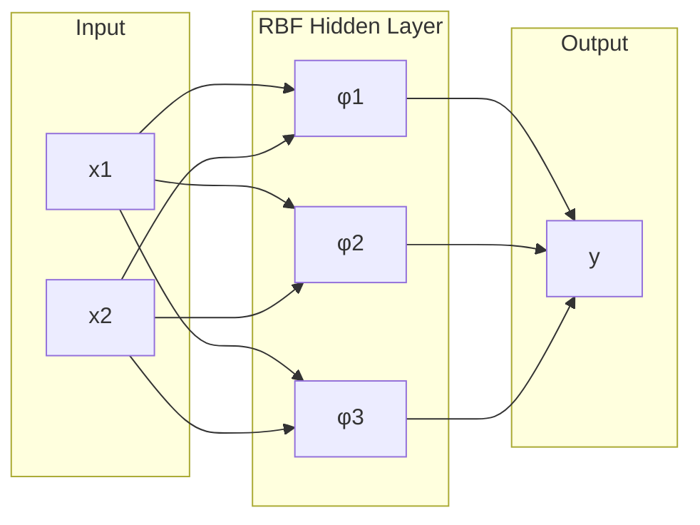
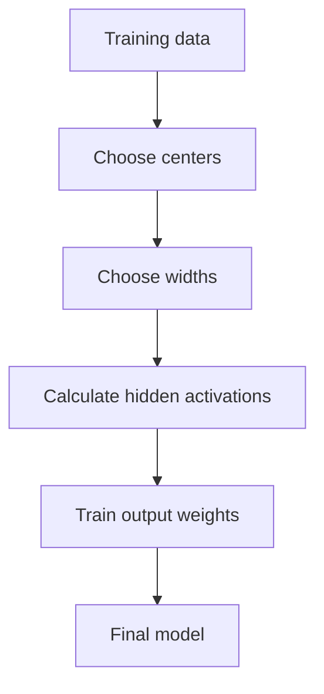
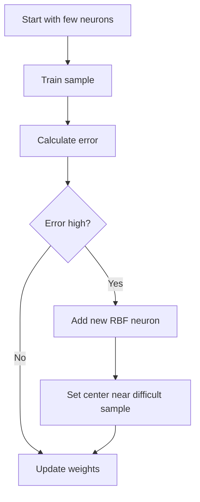
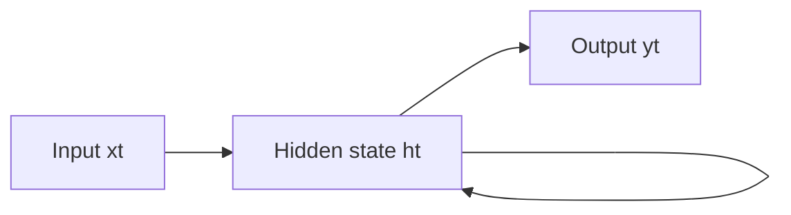
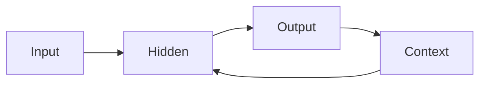
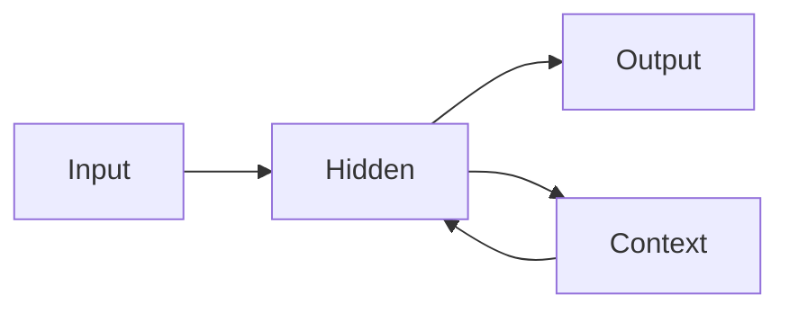

# Unit 4 — RBF and Recurrent Neural Networks - Detailed

## 1. Radial Basis Function Neural Network

> [!important] Definition
> An RBF network is a feedforward neural network whose hidden layer neurons use distance-based radial basis functions.

Architecture:

---

## 2. RBF Intuition

Each RBF neuron represents a center/prototype.

- Input close to center → high activation.
- Input far from center → low activation.

<b>RBF neuron = similarity detector</b> 
It does not calculate a weighted sum like MLP hidden neurons. It calculates distance from a center.

---

## 3. Components of RBF Network

| Component | Definition |
|---|---|
| Input vector $x$ | Data sample |
| Center $c_i$ | Prototype point |
| Width $\sigma_i$ | Spread/radius of influence |
| Distance | Difference between input and center |
| Basis function $\phi_i$ | Converts distance into activation |
| Output weights | Combine hidden activations |

---

## 4. Gaussian RBF

$$
\phi_i(x)=\exp\left(-\frac{||x-c_i||^2}{2\sigma_i^2}\right)
$$

Where:
- $x$ = input
- $c_i$ = center
- $\sigma_i$ = width
- $||x-c_i||$ = Euclidean distance

### Distance

$$
||x-c||=\sqrt{\sum_i(x_i-c_i)^2}
$$

### Activation interpretation

| Distance | Activation |
|---|---|
| 0 | 1 |
| Small | High |
| Large | Low |

---

## 5. RBF Output Layer

Output is usually linear:

$$
y=\sum_{i=1}^{m}w_i\phi_i(x)+b
$$

---

## 6. Training RBF Network

Training has two stages:

### Stage 1: Centers and widths
Can be chosen using:
- Random samples
- K-means clustering
- Supervised selection
- Growing method

### Stage 2: Output weights
Can be trained using:
- Least squares
- Gradient descent

---

## 7. Width Selection

Common formula:

$$
\sigma=\frac{d_{max}}{\sqrt{2m}}
$$

Where:
- $d_{max}$ = maximum distance between centers
- $m$ = number of centers

### Width effect

| Width | Effect |
|---|---|
| Small $\sigma$ | Narrow response, may overfit |
| Large $\sigma$ | Wide response, may underfit |

---

## 8. Gradient Training of Output Weights

Error:

$$
E=\frac{1}{2}(t-y)^2
$$

Weight update:

$$
w_i(new)=w_i(old)+\eta(t-y)\phi_i
$$

Bias:

$$
b(new)=b(old)+\eta(t-y)
$$

---

## 9. Matrix Training

$$
\Phi W=T
$$

Least squares:

$$
W=(\Phi^T\Phi)^{-1}\Phi^TT
$$

---

## 10. Growing RBF Network

> [!important] Definition
> A growing RBF network adds hidden neurons dynamically when current centers cannot model data well.

---

## 11. RBF vs MLP

| Feature | RBF | MLP |
|---|---|---|
| Hidden activation | Distance-based | Weighted sum based |
| Approximation | Local | Global |
| Training | Often two-stage | Backpropagation |
| Interpretability | Centers are meaningful | Harder |
| Speed | Can train faster | May train slower |

---

## 12. Recurrent Neural Networks

> [!important] Definition
> A recurrent neural network has feedback connections that allow memory of previous states.

State update:

$$
h_t=f(W_xx_t+W_hh_{t-1}+b)
$$

Output:

$$
y_t=g(W_yh_t)
$$

---

## 13. Jordan Network

Feedback comes from output layer.

---

## 14. Elman Network

Feedback comes from hidden layer.

| Feature | Jordan | Elman |
|---|---|---|
| Feedback source | Output | Hidden |
| Memory | Previous output | Previous hidden state |
| Use | Output-dependent sequence | General sequence learning |

---

## 15. Solved Example — RBF Activation

### Final Answer

$$
\phi(x)=0.535
$$

### Problem

$$
x=[2,3],\quad c=[1,1],\quad \sigma=2
$$

### Steps

$$
||x-c||^2=(2-1)^2+(3-1)^2=5
$$

$$
\phi(x)=\exp\left(-\frac{5}{2(2)^2}\right)=0.535
$$
