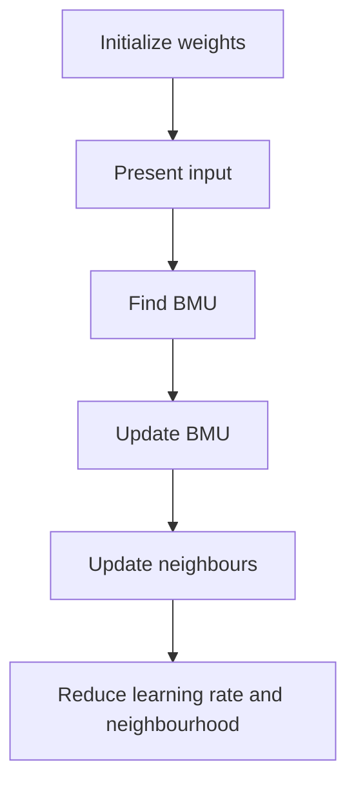
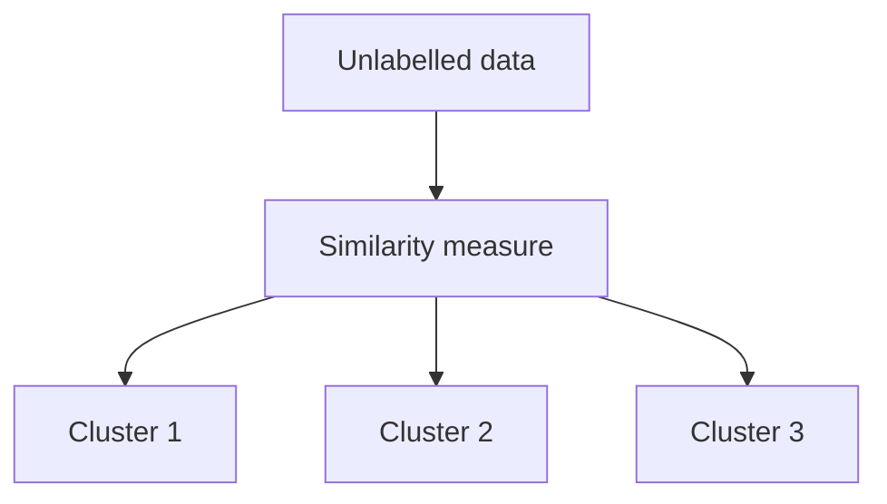
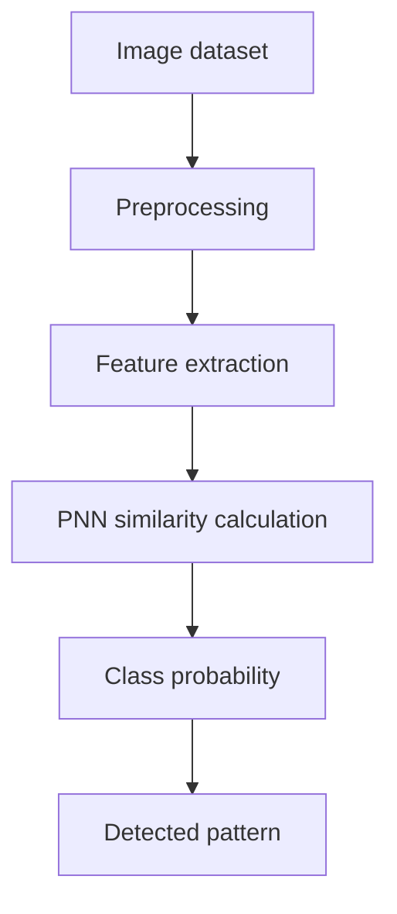
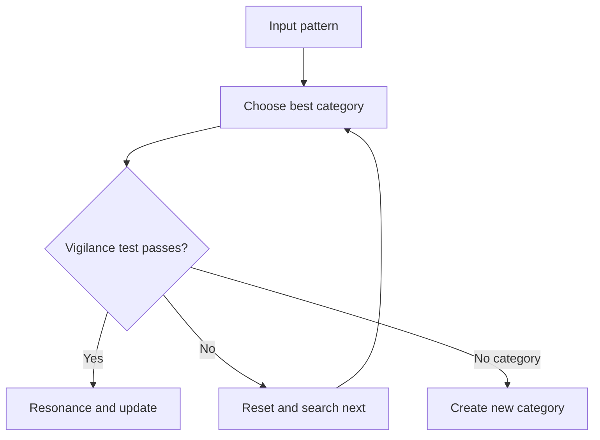
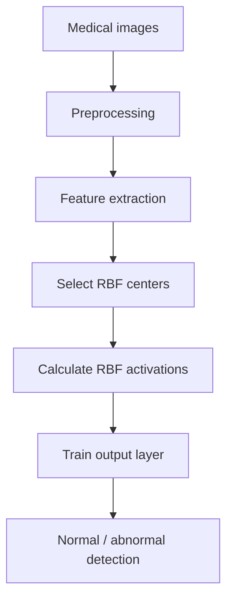

# Unit 5 — Unsupervised Learning Networks and Case Studies - Detailed

## 1. Self-Organizing Feature Map

> [!important] Definition
> A Self-Organizing Map (SOM) is an unsupervised neural network that maps high-dimensional data to a low-dimensional grid while preserving topology.

---

## 2. SOM Structure

A SOM has:
1. Input layer
2. Output grid
3. Weight vector for each neuron

If input is:

$$
x=[x_1,x_2,\dots,x_n]
$$

Each neuron has:

$$
w_j=[w_{j1},w_{j2},\dots,w_{jn}]
$$

---

## 3. Best Matching Unit

> [!important] Definition
> BMU is the neuron whose weight vector is closest to the input vector.

$$
BMU=\arg\min_j||x-w_j||
$$

---

## 4. SOM Training

Update:

$$
w_j(t+1)=w_j(t)+\eta(t)h_{cj}(t)[x-w_j(t)]
$$

---

## 5. Topology and Neighbourhood

Topology defines arrangement of neurons:
- Rectangular
- Hexagonal
- Linear

Gaussian neighbourhood:

$$
h_{cj}(t)=\exp\left(-\frac{d_{cj}^2}{2\sigma^2(t)}\right)
$$

Early training:
- Large neighbourhood
- High learning rate

Late training:
- Small neighbourhood
- Low learning rate

---

## 6. Cluster Analysis

> [!important] Definition
> Cluster analysis groups similar data points together without predefined class labels.

Good clusters have:
- High similarity within cluster
- Low similarity between clusters

---

## 7. Probabilistic Neural Network

> [!important] Definition
> PNN is a supervised classification network based on probability density estimation and Bayes decision theory.

Architecture:

Gaussian pattern function:

$$
\phi_i(x)=\exp\left(-\frac{||x-x_i||^2}{2\sigma^2}\right)
$$

Decision:

$$
Class(x)=\arg\max_kP(C_k|x)
$$

---

## 8. PNN for Image Pattern Detection

Pipeline:

Advantages:
- Fast training
- Probabilistic output
- Useful for classification

Limitations:
- Large memory
- Slow prediction for large data
- Sensitive to spread parameter

---

## 9. Adaptive Resonance Theory

> [!important] Definition
> ART is a neural network model that learns new patterns without forgetting old patterns.

### Stability-plasticity dilemma

| Term | Meaning |
|---|---|
| Stability | Keep old knowledge |
| Plasticity | Learn new information |
| Dilemma | New learning can overwrite old learning |

---

## 10. ART Structure

Vigilance:

$$
0\leq \rho \leq 1
$$

High vigilance:
- strict matching
- more categories

Low vigilance:
- loose matching
- fewer categories

---

## 11. ART Learning Process

---

## 12. ART Variants

| Model | Input |
|---|---|
| ART1 | Binary patterns |
| ART2 | Continuous/analog patterns |
| ART3 | More biologically inspired |

---

## 13. RBFNN Medical Imaging Case Study

RBFNN is useful because centers act as prototypes of visual patterns.

---

## 14. Solved Example — SOM BMU

### Final Answer

$$
BMU=w_1
$$

### Problem

$$
x=[1,2],\quad w_1=[1,1],\quad w_2=[4,5]
$$

### Steps

$$
d_1=\sqrt{(1-1)^2+(2-1)^2}=1
$$

$$
d_2=\sqrt{(1-4)^2+(2-5)^2}=4.24
$$

Since $d_1<d_2$, BMU is $w_1$.
